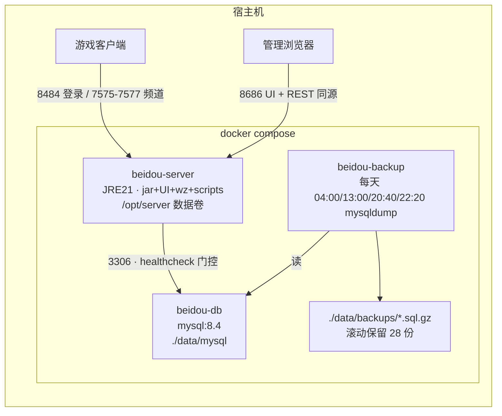

# BeiDou-Server Docker 部署

把整个项目（管理后台 UI + 服务端 jar + wz 数据 + 脚本）打成**一个自包含镜像**，配 MySQL 与定时备份，三条命令跑起一个私服。

## 架构



启动顺序三层保证：`beidou-db` 健康检查通过 → `beidou-server`/`beidou-backup` 才创建（`depends_on: service_healthy`）→ server 入口脚本再用 `nc` 探测数据库端口，兜底等待。

| 服务 | 镜像 | 说明 |
|---|---|---|
| beidou-server | 本仓库构建（三阶段：node 构建 UI → maven 构建 jar → JRE 运行时） | UI 嵌入 jar，8686 同源提供后台与 REST |
| beidou-db | mysql:8.4.0 | 库 `beidou` 由服务端启动时自动创建并跑 Flyway，无需初始化 SQL |
| beidou-backup | mysql:8.4.0（只用其 mysqldump 客户端） | 每 6 小时全库一致性快照，gzip 存 `./data/backups` |

## 快速开始

```bash
cd docker
docker compose up -d --build   # 首次构建 10-20 分钟（maven/yarn 拉依赖）
docker compose logs -f beidou-server   # 等 WZ 加载完、出现 LoginServer 监听
```

- **管理后台**：`http://localhost:8686`
- **游戏客户端**：登录服 `localhost:8484`（需要配套的 BeiDou 客户端）
- **状态**：`docker compose ps`（server 的 healthcheck 有 300s start_period，WZ 加载期间显示 health: starting 是正常的）

数据全部落在 `docker/data/` 下，删掉目录即完全重置：

```
docker/data/server/    # 服务端运行目录（首次启动从镜像拷出 650M：jar+配置+wz+scripts，可直接编辑）
docker/data/mysql/     # MySQL 数据
docker/data/backups/   # 数据库备份 *.sql.gz
```

## 端口

| 端口 | 用途 |
|---|---|
| 8686 | 管理后台 UI + REST API |
| 8484 | 登录服 |
| 7575-7577 | 频道（公式：`7575 + (频道号-1) + 世界号*100`；加频道/世界需同步扩 compose 端口段） |

**局域网联机**：把 compose 里 `--gms.service.wan-host=127.0.0.1` 改成宿主机局域网 IP（如 `192.168.1.100`），客户端用该 IP 连接。

## JVM 内存

compose 未设 `mem_limit`；`JAVA_OPTS` 默认 `-XX:MaxRAMPercentage=50.0 -Duser.timezone=Asia/Shanghai`，即**堆上限 = 宿主机内存 × 50%**（64G 机器 → 32G 上限）。这是上限不是预分配——G1 按需增长，典型负载实际占用 2-3G。

想固定堆：在 compose 里放开 `JAVA_OPTS: "-Xmx2G -Duser.timezone=Asia/Shanghai"`。想整体收紧：给服务加 `mem_limit: 4g`（百分比将相对该限额计算，50% → 堆 2G）。

## 数据库备份与恢复

**定时（自动）**：`beidou-backup` 常驻，启动立即备份一次，之后每天在 **04:00、13:00、20:40、22:20**（Asia/Shanghai）各备份一次（`--single-transaction` 一致性快照，不锁表），gzip 时间戳命名，滚动保留 28 份 ≈ 7 天。时间点是密度加权的：备份间隔与写入密度成反比——20:40 和 22:20 把晚高峰（19:00–24:00，5 小时）严格三等分，任意时刻崩溃最多丢约 1.7 小时的高峰进度；13:00 对切午高峰（12:00–14:00）；04:00 在全天低谷做每日归档基线。全天最大无备份间隔 9 小时，且落在凌晨/上午低密度段。想改时间点/份数调 compose 里的 `BACKUP_TIMES`/`BACKUP_KEEP`（容器重启会重新计算下一个时间点，不会漂移；停机错过的时间点不补）。

**手动（按需）**——升级镜像、做危险操作前「现在就要一份」：

```bash
cd docker
./backup.sh        # 等价于 docker compose run --rm -e BACKUP_INTERVAL=0 beidou-backup
```

**恢复**（会停服 → 删库重建 → 灌备份 → 重启，执行前请确认）：

```bash
./restore.sh data/backups/beidou-20260908-153000.sql.gz
```

**服务端数据卷备份**：`docker/data/server` 就在宿主机上，直接 `tar czf server-backup.tgz data/server` 即可；镜像内永久保留一份出厂 `/opt/server_backup`，想重置运行目录：停服后删掉 `data/server` 整个目录再 `docker compose up -d`（会重新初始化，**数据库不受影响**）。

## 常见问题

- **首次 `up` 很久没反应**：看 `docker compose logs -f beidou-server`；WZ 加载数分钟属正常；MySQL 首次初始化约 30s。
- **改了源码怎么更新**：`docker compose up -d --build`（pom/package.json 未变时依赖层走缓存，几分钟即可）。
- **改 wz / 脚本**：直接编辑 `docker/data/server/` 下的副本；脚本（NPC/任务等）按客户端粒度热重载，wz 改动需重启容器。注意升级镜像**不会**覆盖这些副本，重置方法见上。
- **改数据库密码**：需同步三处——`beidou-db` 的 `MYSQL_ROOT_PASSWORD`、`beidou-server` 的 command 凭证、`beidou-backup` 的 `DB_PASSWORD`。
- **从宿主机连数据库**：放开 `beidou-db` 的 `ports: 3306` 注释。
- **Monaco 编辑器空白**：UI 的代码编辑器运行时从 CDN 加载，离线环境不可用（不影响其他功能）。
- **深链接刷新 404**：UI 使用前端路由，直接刷新 `/dashboard/...` 等深链接可能 404，从入口 `/` 进入即可。

## 安全提醒

- **生产必须**：改 `jwt.secret`（`openssl rand -hex 10` 生成）、关 swagger（compose 里已留注释行），参考 [docs/04-代码审查报告.md](../docs/04-代码审查报告.md) P0-3。
- 默认数据库密码 `root/root` 仅供本机体验。
