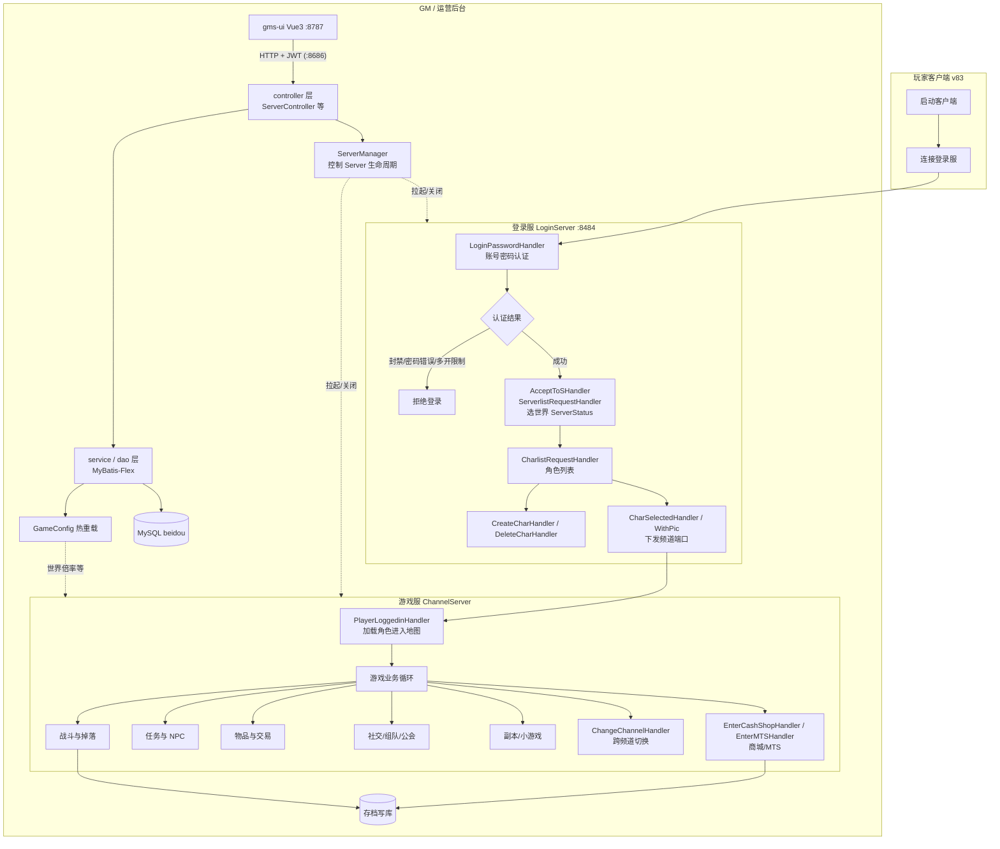

# 00 - 业务总览

## 项目是什么

BeiDou-Server 是一个 **冒险岛（MapleStory v83，GMS 协议）私服服务端**，基于 Cosmic（血统上溯至 HeavenMS / OdinMS）做汉化与优化。协议版本 `ServerConstants.VERSION = 83`。

- `gms-server/`：Java 21 + Spring Boot 3 + Netty 的游戏服务端，是业务主体。
- `gms-ui/`：Vue 3 管理后台（Arco Design Pro），构建后嵌入服务端 jar 同源发布。

一个 JVM 内同时运行两个引擎：Spring Boot（REST 端口 8686，JWT 鉴权）与 Netty 游戏服（`LoginServer` + `ChannelServer`，由 `org.gms.manager.ServerManager` 在 Spring 就绪后调用 `org.gms.net.server.Server.getInstance().init()` 拉起）。动态运营参数走 `org.gms.config.GameConfig`（`game_config` 表热重载）。

## 业务域总划分

| 业务域 | 说明 |
| --- | --- |
| 账号与登录 | 客户端连接、账号密码认证（BCrypt）、封禁校验、选世界/频道/角色进入游戏、跨频道切换 |
| 角色系统 | 角色创建、属性计算、技能学习与施放、升级经验、存档保存、改名/转区 |
| 物品与交易 | 背包物品栏、装备卷轴强化、NPC 商店、玩家交易、雇佣商店、点券商城、转蛋、快递 Duey、MTS |
| 战斗与掉落 | 普攻/魔法/远程伤害（`AbstractDealDamageHandler` 系）、怪物 AI 与生命值、掉落（`server/loot`、`DropService`） |
| 任务与 NPC | 任务状态机（`server/quest`）、NPC 对话脚本（`scripting/npc` + `scripts/npc`）、反应堆/传送门 |
| 社交 | 好友、组队（`world/Party`）、公会（`net/server/guild`）、联盟、家族（`Family`）、师徒、聊天 |
| 地图与副本 | 地图管理（`server/maps`）、事件副本（`scripting/event`、`EventInstanceManager`）、远征队（`expeditions`）、小游戏/CPQ（`minigame`、`partyquest`） |
| 命令 | 玩家/GM 文本命令（`client/command`、`CommandService`），`PlayerCommand`/`AdminCommand` 分发 |
| GM/后台 | REST API（`controller`/`service`/`dao`）+ gms-ui：账号管理、角色查询、配置热更、服务器生命周期控制 |
| 运维 | 服务器启停（`ServerController`）、`GameConfig` 热重载、i18n、定时任务（`TimerManager`）、日志 |

## 总业务流程图

玩家全链路一句话：客户端连登录服 → `LoginPasswordHandler` 认证 → 选世界（`ServerlistRequestHandler`）→ 选频道角色（`CharSelectedHandler` 下发频道 socket）→ 连频道服触发 `PlayerLoggedinHandler` 加载角色进图 → 各业务 handler 处理游戏内操作 → 定时/事件触发 `saveCharToDB` 持久化。GM 通过 gms-ui（HTTP:8686，JWT）操作 REST 接口管理账号/配置/服务器生命周期。

## 各业务域与代码包对应表

除特别说明外，路径均相对 `gms-server/src/main/java/org/gms/`。

| 业务域 | 关键包/类 | 说明 |
| --- | --- | --- |
| 账号与登录 | `net/netty/LoginServer`、`net/server/handlers/login/*`、`client/Client`（`login`/`finishLogin`）、`service/AuthService`、`service/AccountService`、`net/server/coordinator/session/SessionCoordinator` | 认证、PIN/PIC、多开防刷、会话协调 |
| 世界/频道 | `net/server/Server`、`net/server/world/World`、`net/server/channel/Channel`、`net/netty/ChannelServer` | 世界与频道管理、玩家存储 `PlayerStorage` |
| 角色 | `client/Character`、`client/creator/*`、`client/Job`、`client/Stat`、`client/SkillFactory`、`service/NameChangeService`、`service/WorldTransferService`、`service/CharacterService` | 角色实体（万行级核心类）、创建/成长/存档 |
| 物品 | `client/inventory/*`（`Inventory`/`Item`/`Equip`）、`server/maps/MapItem`、`service/InventoryService`、`service/ItemService` | 背包、装备、拾取 |
| 交易 | `server/Trade`、`server/maps/PlayerShop`、`server/maps/HiredMerchant`、`net/server/channel/handlers/PlayerInteractionHandler`、`server/Shop` + `ShopFactory`、`NPCShopHandler` | 玩家交易、个人商店、雇佣商人、NPC 商店 |
| 点券商城/MTS | `server/CashShop`、`CashOperationHandler`、`UseCashItemHandler`、`EnterCashShopHandler`、`MTSHandler`、`service/CashShopService`、`service/MtsService` | NX 点券消费、礼物、MTS 拍卖 |
| 转蛋/快递 | `server/gachapon/*`（`Gachapon` + 各城镇类）、`scripts/npc/gachapon*.js`、`client/processor/npc/DueyProcessor`、`DueyHandler`、`server/DueyPackage` | 转蛋机、Duey 快递 |
| 战斗掉落 | `net/server/channel/handlers/CloseRangeDamageHandler`、`MagicDamageHandler`、`RangedAttackHandler`、`AbstractDealDamageHandler`、`server/life/*`、`server/loot/*`、`service/DropService` | 伤害结算、怪物、掉落 |
| 任务/NPC | `QuestActionHandler`、`NPCTalkHandler`、`NPCMoreTalkHandler`、`server/quest/*`、`scripting/npc`、`scripting/quest`、`scripts/quest` | 任务状态、NPC 脚本对话 |
| 社交 | `BuddylistModifyHandler`、`PartyOperationHandler`、`GuildOperationHandler`、`AllianceOperationHandler`、`net/server/world/Party`、`net/server/guild/*`、`client/Family`、`MessengerHandler` | 好友/组队/公会/联盟/家族/聊天室 |
| 地图副本 | `ChangeMapHandler`、`server/maps/*`（`MapleMap`、`MapFactory`）、`scripting/event`、`net/server/coordinator/world/EventRecallCoordinator`、`server/expeditions`、`server/partyquest`、`server/minigame` | 地图、事件副本、远征、PQ、小游戏 |
| 命令 | `client/command/*`、`handlers/PlayerCommandHandler`、`AdminCommandHandler`、`service/CommandService` | 玩家命令与 GM 命令 |
| GM/后台 REST | `controller/*`、`service/*`、`dao/entity/*DO`、`dao/mapper/*`、`aop`、`config` | Spring 胶水层，gms-ui 的后端 |
| 运维 | `manager/ServerManager`、`config/GameConfig`、`util/TimerManager`（`server/TimerManager`）、`net/server/task` | 启停桥接、热配置、定时任务 |

> 更细的流程见后续篇章：01-账号与登录、02-角色系统、03-物品与交易。
