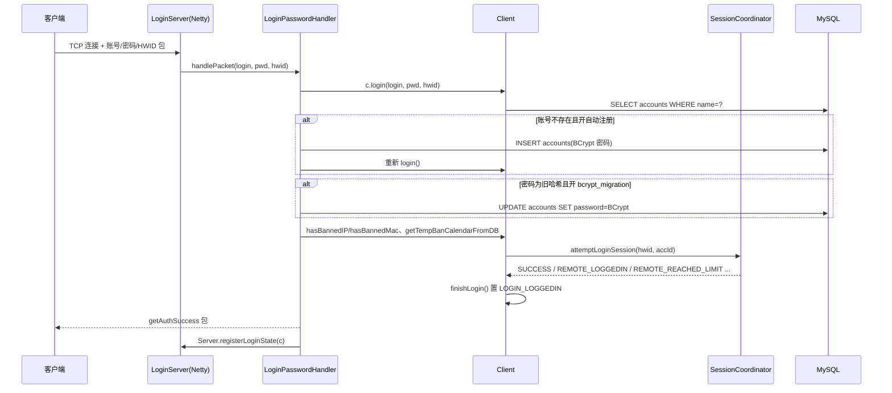
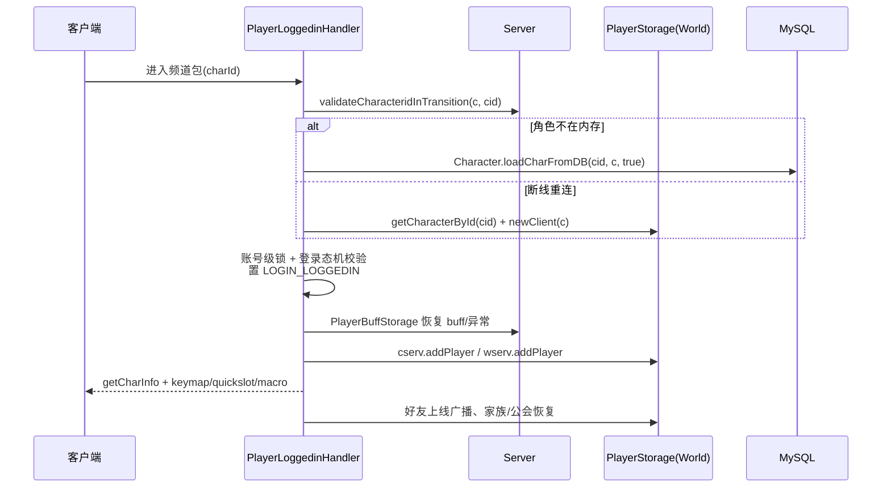
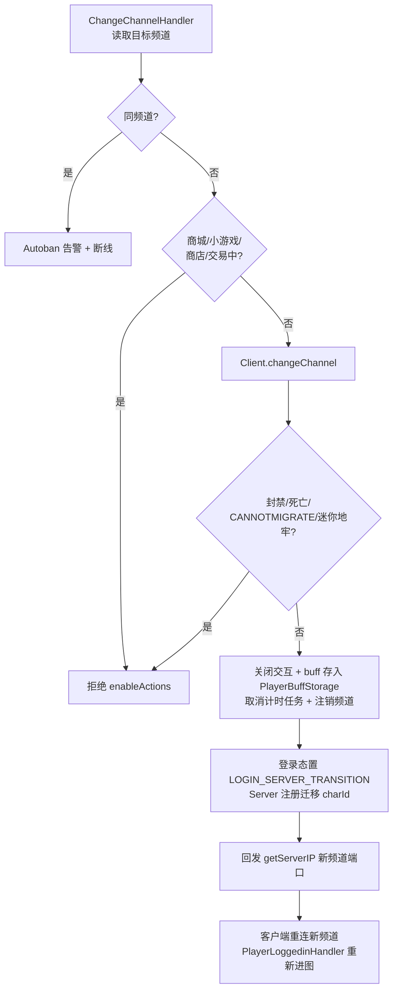

# 01 - 账号与登录

## 概述

本文描述玩家从客户端建立 TCP 连接到进入游戏世界（以及跨频道切换）的完整业务链路。核心参与者：Netty 登录服 `LoginServer`、登录阶段 handler（`net/server/handlers/login/`）、连接会话 `client/Client`、多开/会话协调器 `SessionCoordinator`、世界与频道对象（`net/server/world/World`、`net/server/channel/Channel`）。后台 REST 登录走 `service/AuthService`（JWT），与游戏客户端登录是两条独立通道。

源码根：`gms-server/src/main/java/org/gms/`（下文路径均相对此目录）。

## 1. 客户端连接与登录认证

### 业务规则

- 客户端先连登录服（`LoginServer`，Netty；`LoginServerInitializer` 装配包加密与分发）。
- `LoginPasswordHandler` 读取账号、密码与 HWID（机器指纹），调用 `Client.login()` 校验：
  - 单连接连续错误 5 次直接断会话（返回码 6）。
  - 账号被封禁（`banned=1`）返回 3；账号不存在返回 5——若 `GameConfig` 开启 `automatic_register` 则自动注册（密码用 `BCrypt.hashpw(..., gensalt(12))` 加密入库）。
  - 密码校验：优先 BCrypt（`$2$` 前缀 + `BCrypt.checkpw`）；兼容明文/SHA-1/SHA-512 旧哈希，开启 `bcrypt_migration` 时登录成功后自动改写为 BCrypt（返回码 -10/-23 表示待迁移/TOS 未同意）。
  - TOS 未同意返回 23，由 `AcceptToSHandler` 补流程；PIN/PIC 由 `RegisterPinHandler`/`RegisterPicHandler`/`CharSelectedWithPicHandler` 处理。
- 登录成功前还要过三道闸：IP/MAC 封禁（`Client.hasBannedIP/hasBannedMac`）、临时封禁（`getTempBanCalendarFromDB`）、多开检测（`SessionCoordinator.attemptLoginSession`，按 HWID/账号限制多客户端）。
- 全部通过后 `Client.finishLogin()` 把登录态置为 `LOGIN_LOGGEDIN`，回发 `getAuthSuccess`，并在 `Server.registerLoginState(c)` 注册。

### 负责类

- `net/netty/LoginServer` / `LoginServerInitializer`：登录服启动与 pipeline。
- `net/server/handlers/login/LoginPasswordHandler`：认证入口。
- `client/Client`：`login()`、`finishLogin()`、`hasBannedIP()`、`getTempBanCalendarFromDB()` 等。
- `net/server/coordinator/session/SessionCoordinator`、`Hwid`：多开/会话协调。
- `util/BCrypt`：密码哈希。
- 后台 REST 登录：`service/AuthService.getToken()`（`AccountService.checkPassword` 校验 + `JwtUtils` 发 JWT）。

### 流程图

### 关键源码路径

- `net/server/handlers/login/LoginPasswordHandler.java`
- `client/Client.java`（`login` 约 653 行、`finishLogin` 约 572 行）
- `service/AuthService.java`、`service/AccountService.java`
- `net/netty/LoginServer.java`、`LoginServerInitializer.java`

## 2. 选世界

### 业务规则

- 认证成功后客户端请求世界/频道列表：`ServerlistRequestHandler` 从 `Server.getInstance()` 的世界配置生成列表包；`ServerStatusRequestHandler` 返回世界负载（人数-创建者比例）。
- `AfterLoginSetGenderHandler`/`SetGenderHandler` 等补齐账号性别等状态；`AcceptToSHandler` 处理服务条款同意（写 `accounts.tos=1`）。

### 负责类与源码

- `net/server/handlers/login/ServerlistRequestHandler.java`、`ServerStatusRequestHandler.java`、`AcceptToSHandler.java`
- `net/server/Server.java`：世界/频道实例注册（`init()` 拉起各 `ChannelServer`）。

## 3. 选频道与选角进入游戏

### 业务规则

- `CharlistRequestHandler`：按账号+世界列出角色（受 `accounts.characterslots` 限制），进入 `LOGIN_SERVER_TRANSITION` 前置状态。
- `CheckCharNameHandler` 校验角色名可用性；`CreateCharHandler`/`DeleteCharHandler` 管理角色（详见 02-角色系统）。
- 选角：`CharSelectedHandler`（+PIC 版 `CharSelectedWithPicHandler`、全角色视图 `ViewAllCharSelected*`）调用 `Server.getInstance().getInetSocket(...)` 取目标频道 socket，回发 `PacketCreator.getServerIP(ip, port, charId)`，客户端随即重连该频道端口。
- 频道服收到首个包由 `PlayerLoggedinHandler` 处理（见下节）。

### 负责类与源码

- `net/server/handlers/login/CharlistRequestHandler.java`、`CharSelectedHandler.java`、`CheckCharNameHandler.java`、`CreateCharHandler.java`、`DeleteCharHandler.java`、`ViewAllChar*`
- `net/server/Server.java`（`getInetSocket`、`validateCharacteridInTransition`）

## 4. 进入游戏（PlayerLoggedinHandler）

### 业务规则

`PlayerLoggedinHandler` 是「角色真正进入频道」的入口，业务步骤（源码 `handlePacket`）：

1. 读取 `charId`，校验目标 `World`/`Channel` 存在（频道失效则回退 1 频或断开）。
2. 会话/HWID 校验：从 `SessionCoordinator.pickLoginSessionHwid` 取登录会话 HWID；`Server.validateCharacteridInTransition` 确认该角色确实处于登录服→频道服的迁移状态（防包编辑跳选角）。
3. 角色加载：玩家不在 `PlayerStorage` 中时 `Character.loadCharFromDB(cid, c, true)` 从 DB 装载；再以账号级锁（`attemptingLoginAccounts`）+ 登录态机（必须 `LOGIN_SERVER_TRANSITION`）防同账号重复登录，通过后置 `LOGIN_LOGGEDIN`。
4. 已在线重连（`newcomer=false`）走 `player.newClient(c)` 平滑接管旧连接。
5. 注入频道/世界：`cserv.addPlayer`、`wserv.addPlayer`；从 `PlayerBuffStorage` 恢复跨频道残留的 buff/异常状态。
6. 下发 `getCharInfo`（进图主包）、快捷键/精灵键/技能宏/自动药水键；GM 按 `use_auto_hide_gm` 自动隐身。
7. 社交状态恢复：好友列表上线广播（`wserv.loggedOn`/`multiBuddyFind`）、家族（`loadFamily`）、公会与联盟（`server.setGuildMemberOnline`）等。

### 流程图

### 关键源码路径

- `net/server/channel/handlers/PlayerLoggedinHandler.java`
- `client/Character.loadCharFromDB`
- `net/server/PlayerBuffStorage.java`、`net/server/PlayerStorage.java`

## 5. 跨频道切换（ChangeChannelHandler）

### 业务规则

- 目标频道与当前相同 → 触发 `AutobanFactory.GENERAL` 告警并断线（防包编辑）。
- 处于点券商城/小游戏/个人商店/交易中 → 拒绝切换（仅 `enableActions`）。
- 合法则进入 `Client.changeChannel(channel)`：
  - 前置校验：角色封禁、存活状态、地图 `FieldLimit.CANNOTMIGRATE`、迷你地牢（`MiniDungeonInfo.isDungeonMap`）内禁止。
  - 关闭一切社交/商店交互（`closePlayerInteractions`）、通知伴侣/组队。
  - buff/异常状态写入 `PlayerBuffStorage`（跨频道恢复用），取消所有计时器任务。
  - 角色从旧频道/世界注销（`setDisconnectedFromChannelWorld`），登录态回 `LOGIN_SERVER_TRANSITION`，`Server` 注册迁移中的 charId，最后回发 `getServerIP(新频道socket)`，客户端重连新频道并再次触发 `PlayerLoggedinHandler`（闭环）。

### 流程图

### 关键源码路径

- `net/server/channel/handlers/ChangeChannelHandler.java`
- `client/Client.changeChannel`（约 1500 行）
- `net/server/Server.java`（`getInetSocket`、`validateCharacteridInTransition`）

## 6. 断线与下线钩子

- `Client.disconnect` 触发角色存档、频道/世界注销、会话释放（`SessionCoordinator`）；改名/转区等「下线时应用」的延迟业务在此时机执行（见 `service/NameChangeService.applyNameChange`，由下线检测调用）。
- 相关：`client/Client.java`（`disconnect`）、`net/server/PlayerStorage.java`。
