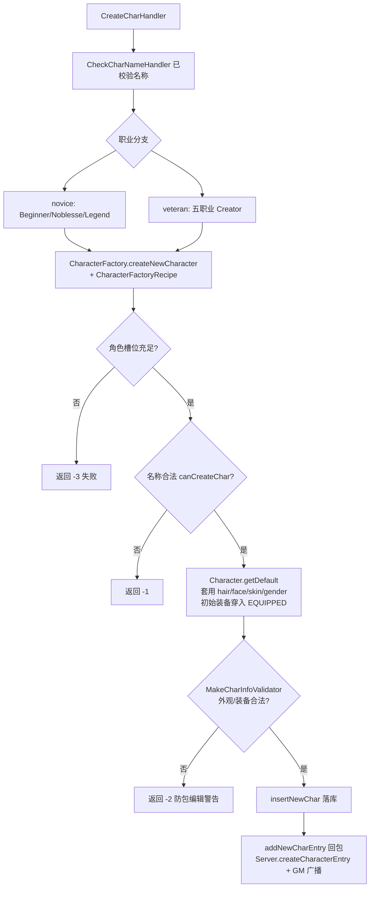
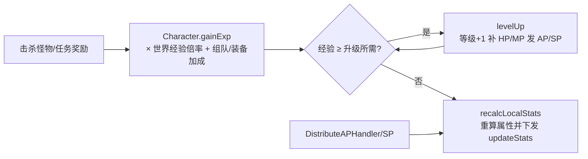
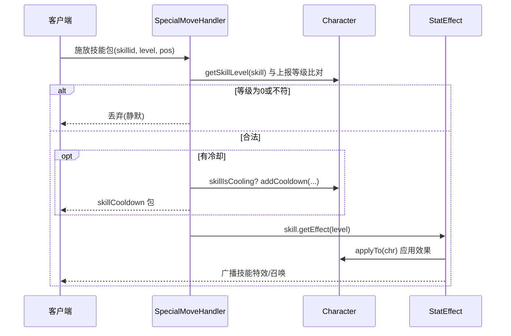
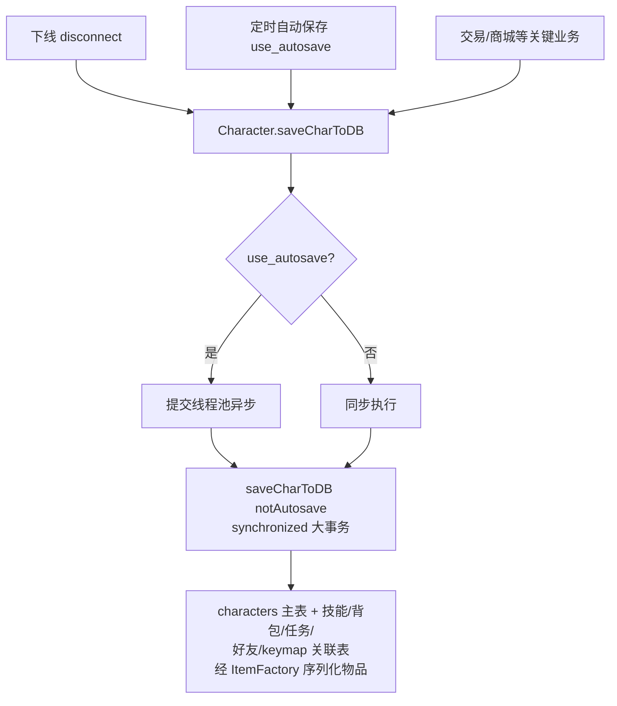
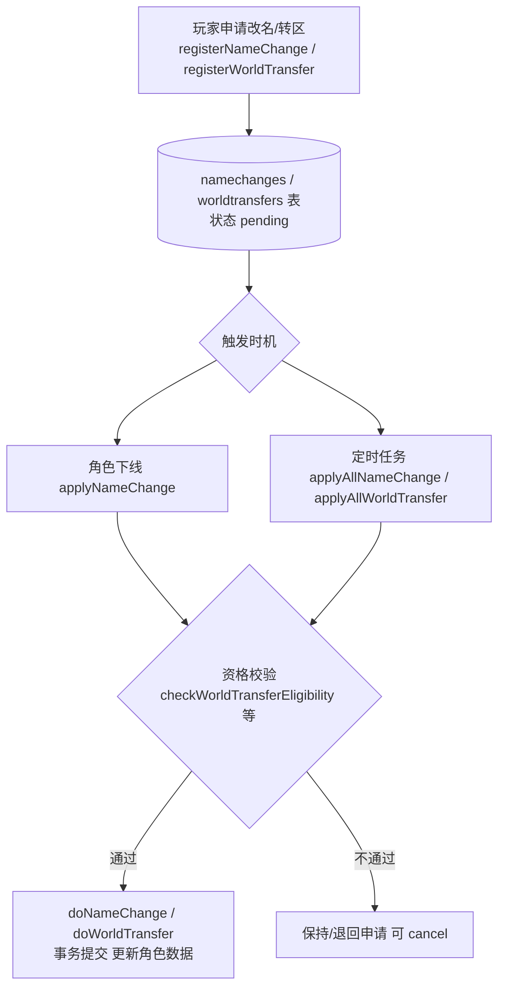

# 02 - 角色系统

## 概述

本文描述角色的完整生命周期：创建（含新手外观合法性校验）、属性与成长（AP/SP、升级经验）、技能学习与施放、存档保存、以及改名/转区等延迟生效服务。核心实体是 `client/Character`（万行级核心类，聚合了角色的一切状态与业务方法）。

源码根：`gms-server/src/main/java/org/gms/`（下文路径均相对此目录）。

## 1. 角色创建

### 业务规则

- 客户端在登录服发送创建请求：`CheckCharNameHandler` 先校验角色名（`Character.canCreateChar`：非法字符/重名/保留名），`CreateCharHandler` 按 职业 分发到 `client/creator` 下具体工厂。
- `client/creator/CharacterFactory.createNewCharacter` 统一流程：
  1. 角色槽位校验：按 `GameConfig.collective_chr_slot` 决定用账号共享槽（`c.getAvailableCharacterSlots`）还是按世界槽。
  2. 名称合法性 `Character.canCreateChar(name)`。
  3. 以 `Character.getDefault(c)` 建角色骨架，套用发型 `hair`、脸型 `face`、肤色 `skin`、性别 `gender`，以及 `CharacterFactoryRecipe`（等级/职业/出生地图/初始装备：上衣/裤裙/鞋/武器，穿到 EQUIPPED 栏对应槽位 -5/-6/-7/-11）。
  4. **外观合法性校验**：`MakeCharInfoValidator.isNewCharacterValid` 依据 WZ 的 `MakeCharInfo` 数据验证发型/脸型/发色/装备是否属于该性别与职业可选项——防包编辑刷外观（不合法返回 -2 并记录警告日志）。
  5. `Character.insertNewChar(recipe)` 落库，回发 `addNewCharEntry`，并 `Server.createCharacterEntry` + GM 黄字广播。
- 新手职业工厂（出生点与初始装备不同）：`novice/BeginnerCreator`（战士系出生地）、`NoblesseCreator`（骑士团）、`LegendCreator`（战神）；老玩家直接建高级职业时走 `veteran/`（`WarriorCreator`、`MagicianCreator`、`BowmanCreator`、`ThiefCreator`、`PirateCreator`，配好等级/技能/装备的 recipe）。

### 负责类

- 入口：`net/server/handlers/login/CreateCharHandler`、`CheckCharNameHandler`
- 工厂：`client/creator/CharacterFactory`、`CharacterFactoryRecipe`、`MakeCharInfo`、`MakeCharInfoValidator`、`client/creator/novice/*`、`client/creator/veteran/*`
- 落库：`Character.insertNewChar`

### 流程图

### 关键源码路径

- `client/creator/CharacterFactory.java`（`createNewCharacter`）
- `client/creator/MakeCharInfo.java`、`MakeCharInfoValidator.java`
- `net/server/handlers/login/CreateCharHandler.java`

## 2. 属性计算与成长（stats / AP / 升级）

### 业务规则

- 属性集中在 `client/Stat` 枚举与 `Character` 的字段；`Character.recalcLocalStats()`（约 7147 行）重算本地基础属性（装备加成、技能被动、buff 参与合成），返回 `List<Pair<Stat, Integer>>` 差量并下发 `updateStats` 包。
- 手动加 AP：`DistributeAPHandler`（力量/敏捷/智力/运气/HP/MP 分配，含洗血等上限校验）；`AutoAssignHandler` 支持自动分配。加 SP：`DistributeSPHandler`（校验技能是否在本职业树 `GameConstants.isInJobTree`、前置技能、SP 余量）。
- 升级：怪物经验经 `Character.gainExp(...)`（多重载，含组队经验、装备加成 `equip` 比例），内部走 `gainExpInternal` 累计，跨级循环调用 `levelUp`：提升等级、按职业补 HP/MP、发 AP/SP，并 `recalcLocalStats`。世界倍率（`GameConfig` 的 `exp_rate` 等）在经验结算处生效。

### 负责类

- `client/Stat`、`client/Job`、`client/Character`（`gainExp`/`gainExpInternal`/`levelUp`/`recalcLocalStats`）
- `net/server/channel/handlers/DistributeAPHandler`、`DistributeSPHandler`、`AutoAssignHandler`
- `client/processor/stat`（属性计算辅助）

### 流程图

### 关键源码路径

- `client/Character.java`（`gainExp` 约 2927 行起、`recalcLocalStats` 约 7147 行）
- `net/server/channel/handlers/DistributeAPHandler.java`、`DistributeSPHandler.java`

## 3. 技能学习与施放

### 业务规则

- 技能静态数据由 `SkillFactory.getSkill(skillid)` 从 WZ 加载为 `client/Skill`，等级效果封装为 `server/StatEffect`（`skill.getEffect(level)`）。
- 学习：`DistributeSPHandler` 加点（技能书/能手册等道具技能经 `UseCashItemHandler`/item 脚本处理）；技能宏 `client/SkillMacro` 由 `sendMacros` 下发。
- 施放：`SpecialMoveHandler` 是主动技能统一入口：
  1. Autoban 时间戳埋点（防高频包）。
  2. 读取 skillid/skillLevel，与服务器侧 `chr.getSkillLevel(skill)` 比对，等级不符直接丢弃（防包编辑）。
  3. 特例：道场能量技能（`skillid % 10000000 == 1010/1011`）需满 10000 能量；怪物磁铁按目标 mobOid 逐个拉仇恨；MP Recovery 等专属分支。
  4. 冷却：`effect.getCooldown() > 0` 时查 `chr.skillIsCooling`，未冷却则下发 `skillCooldown` 包并 `addCooldown` 记录（意志技能可按 `use_fast_reuse_hero_will` 缩短 60 倍）。
  5. 最终 `effect.applyTo(chr)` 应用 buff/召唤/伤害效果并广播特效。
- 攻击技能伤害则走 `CloseRangeDamageHandler`/`MagicDamageHandler`/`RangedAttackHandler`（继承 `AbstractDealDamageHandler`，战斗篇详述）。

### 负责类

- `client/SkillFactory`、`client/Skill`、`server/StatEffect`
- `net/server/channel/handlers/SpecialMoveHandler`、`DistributeSPHandler`
- `client/SkillMacro`（技能宏）

### 流程图

### 关键源码路径

- `net/server/channel/handlers/SpecialMoveHandler.java`
- `client/SkillFactory.java`、`client/Skill.java`、`server/StatEffect.java`

## 4. 存档保存（saveCharToDB 链路）

### 业务规则

- `Character.saveCharToDB()` 是无参入口：开启 `use_autosave` 时转成异步任务提交线程池执行，否则同步 `saveCharToDB(true)`。
- `saveCharToDB(boolean notAutosave)` 为 `synchronized`，一个大事务把角色的属性、技能、背包（经 `client/inventory/ItemFactory` 序列化装备/物品/宠物）、任务、好友、keymap 等全部写回 `characters` 及关联表；日志按 `notAutosave` 区分「玩家下线存档」与「自动存档」文案。
- 触发时机：玩家正常下线（`Client.disconnect` → `Character.saveCharToDB()`）、定时自动保存、跨频道切换前的注销流程，以及若干关键业务（交易完成、商城购买等）后的即时保存。

### 负责类

- `client/Character.saveCharToDB` / `saveCharToDB(boolean)`
- `client/inventory/ItemFactory`（物品序列化）
- `net/server/task`、`server/TimerManager`（定时任务调度）

### 流程图

### 关键源码路径

- `client/Character.java`（`saveCharToDB` 约 7601-7617 行）
- `client/inventory/ItemFactory.java`

## 5. 改名与转区

### 业务规则（均为「注册申请 → 角色下线/定时任务时生效」的延迟模式）

- **改名 `NameChangeService`**：
  - `registerNameChange(chr, newName)`：校验新名可用后登记 `namechanges` 表（状态 pending）。
  - `applyNameChange(characterId, characterName)`：角色下线时检测并触发；`applyAllNameChange()` 由定时任务批量扫描 pending 记录。
  - `doNameChange`：`@Transactional`，改 `characters.name` 并更新申请状态；`cancelPendingNameChange` 支持撤销。
- **转区 `WorldTransferService`**：
  - `registerWorldTransfer(chr, newWorld)` 登记申请；`applyAllWorldTransfer` 定时扫描。
  - `checkWorldTransferEligibility` 做资格校验（如目标世界可达、角色不在公会/组队中等限制条件）。
  - `doWorldTransfer`（`@Transactional`）：迁移角色的世界归属及关联数据；`cancelPendingWorldTransfer` 撤销。

### 负责类

- `service/NameChangeService`、`service/WorldTransferService`（依赖 `dao` 层 `NamechangesDO`/`WorldtransfersDO` 与 Mapper）
- 触发点：下线钩子 + `net/server/task` 定时任务

### 流程图

### 关键源码路径

- `service/NameChangeService.java`、`service/WorldTransferService.java`
- `dao/entity/NamechangesDO`、`WorldtransfersDO`
