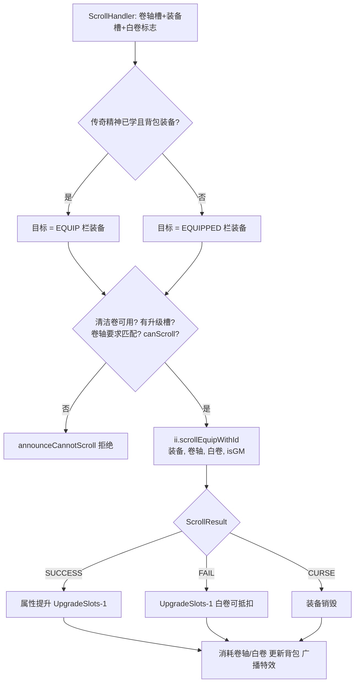
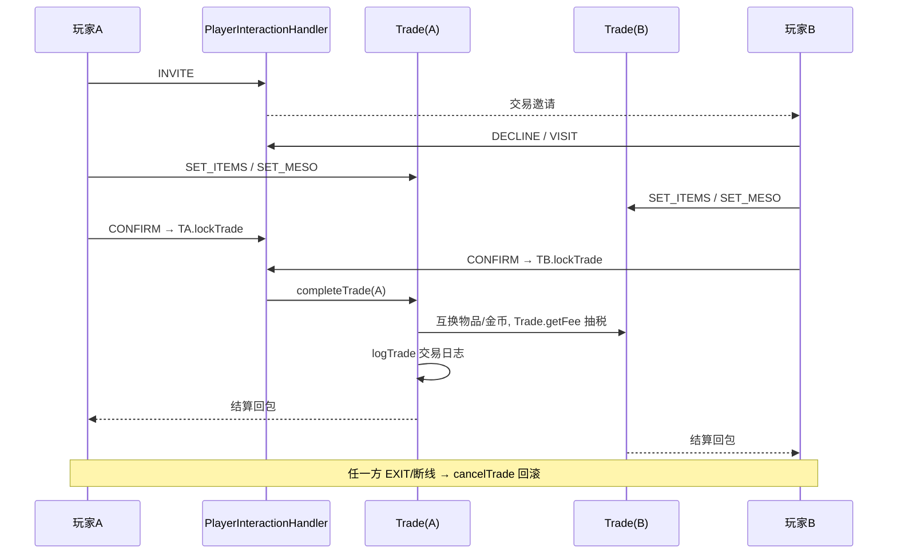
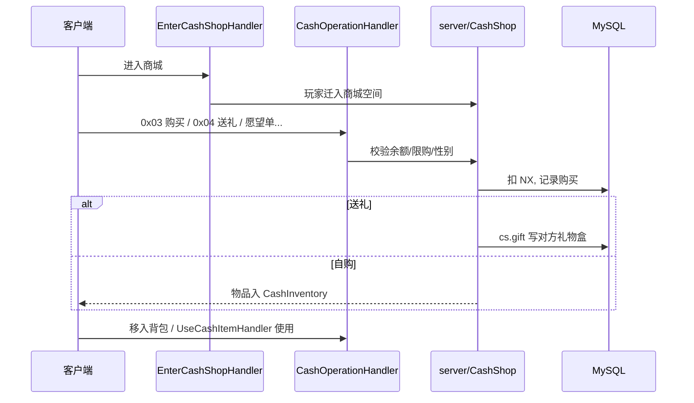
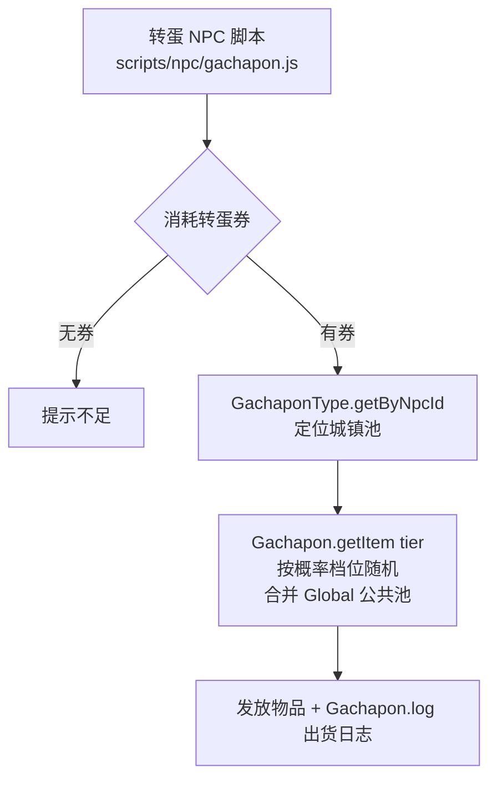

# 03 - 物品与交易

## 概述

本文描述物品相关的全部业务：背包物品栏管理、装备与卷轴强化、NPC 商店、玩家面对面交易、个人/雇佣商店、点券商城（CashShop）、转蛋机、Duey 快递和 MTS 交易系统。物品体系的底层是 `client/inventory` 包（`Item`/`Equip`/`Inventory`），交易类业务大多经由 `PlayerInteractionHandler` 按 Action 分发。

源码根：`gms-server/src/main/java/org/gms/`（下文路径均相对此目录）。

## 1. 背包与物品栏（inventory 包）

### 业务规则

- 每个角色持有四类背包（`InventoryType`：EQUIP 装备/USE 消耗/ETC 其他/SETUP 设置/CASH 点券），容量上限存在角色数据中，`Inventory` 负责槽位管理与 `ModifyInventory` 差量更新包。
- 常用操作 handler：`ItemMoveHandler`（槽位移动/拆分）、`InventoryMergeHandler`（整理合并）、`InventorySortHandler`（排序）、`ItemPickupHandler`（捡取地面 `MapItem`，校验归属/过期/背包满）、`MesoDropHandler`（丢金币）、`UseItemHandler` 等消耗类。
- 装备实体 `Equip` 继承 `Item`，携带强化属性（升级次数 `UpgradeSlots`、卷轴计数、潜能等）；物品静态数据来自 `server/ItemInformationProvider`（WZ）。
- 物品与 DB 的序列化统一走 `ItemFactory`（存档/读档）。

### 负责类与源码

- `client/inventory/Inventory.java`、`Item.java`、`Equip.java`、`InventoryType.java`、`ModifyInventory.java`、`ItemFactory.java`
- `net/server/channel/handlers/ItemMoveHandler.java`、`ItemPickupHandler.java`、`InventoryMergeHandler.java`、`InventorySortHandler.java`、`MesoDropHandler.java`
- `server/maps/MapItem.java`（地面掉落物）、`service/InventoryService.java`

## 2. 装备与卷轴强化（ScrollHandler）

### 业务规则

`ScrollHandler.handlePacket` 读取卷轴槽位、装备槽位与标志位：

- 支持白卷（`ws & 2`，找 `ItemId.WHITE_SCROLL` 防失败掉级）与「传奇精神」技能（`SkillFactory.getSkill(1003)`，学了该技能才能对背包内装备用卷，槽位语义从 EQUIPPED 切到 EQUIP）。
- 前置校验：清洁卷轴（Clean Slate）需 `ii.canUseCleanSlate`；普通卷需装备还有 `UpgradeSlots ≥ 1`；`getScrollReqs` 匹配装备 ID；`canScroll` 校验卷轴与装备类型兼容（混沌/清洁卷豁免）。
- 结果由 `ItemInformationProvider.scrollEquipWithId` 判定，返回 `Equip.ScrollResult`：`SUCCESS`（属性提升、升级次数-1）、`FAIL`（次数-1）、`CURSE`（装备被诅咒销毁，`scrolled == null`）。
- 结束后消耗卷轴/白卷，更新装备并广播特效；GM 有成功加成（`chr.isGM()` 传入判定）。

### 流程图

### 关键源码路径

- `net/server/channel/handlers/ScrollHandler.java`
- `server/ItemInformationProvider.java`（`scrollEquipWithId`、`getScrollReqs`）
- `client/inventory/Equip.java`（`ScrollResult`）

## 3. NPC 商店（Shop / NPCShopHandler）

### 业务规则

- NPC 对话脚本（`scripts/npc/*.js`）调用 `cm.openShop(shopId)` 打开商店（经 `ShopFactory.getShop`）；`NPCTalkHandler`/`NPCMoreTalkHandler` 负责对话推进。
- `NPCShopHandler` 按模式分发：**mode 0 = 购买**（`Shop.buy`：校验商店、槽位、数量、金币与背包容量、收购价倍率）、**mode 1 = 出售**（`Shop.sell`：按 `InventoryType` 槽位出售，金币 = 单价 × 数量 × 出售倍率）、**mode 2 = 充能**（`Shop.recharge`：给飞镖/子弹类可充值道具补满）。
- `ShopItem` 描述单个货架条目（ itemId、价格、数量）；`ShopFactory` 从 DB/WZ 缓存商店实例。

### 负责类与源码

- `net/server/channel/handlers/NPCShopHandler.java`
- `server/Shop.java`、`ShopItem.java`、`ShopFactory.java`
- `service/ShopService.java`（后台管理用）、`scripting/npc/NPCConversationManager`（`openShop`）

## 4. 玩家交易（Trade / PlayerInteractionHandler）

### 业务规则

- `PlayerInteractionHandler` 是统一入口，交易相关 Action：`INVITE`（邀请）、`DECLINE`、`VISIT`（进入交易窗）、`SET_ITEMS`（放入物品）、`SET_MESO`（放入金币）、`CONFIRM`（确认，双方确认后完成）、`EXIT`（取消）。
- 服务器侧状态由 `server/Trade` 维护（两个 `Trade` 实例互为 `partner`）：
  - `addItem`/`setMeso` 校验背包可退空间、单边物品 ≤ 上限等。
  - 任一方 `CONFIRM` 后 `lockTrade` 锁定，不能再改动；双方确认即 `completeTrade(chr)`：按 `getFee(meso)` 抽交易税，互换物品与金币，写交易日志（`logTrade`），双方 `setTrade(null)`。
  - `cancelTrade(chr, result)`：任何一方退出/断线时回滚物品金币。
- 同一 handler 还承载小游戏（OMOK/MATCH_CARD 的 `READY/START/MOVE_OMOK/SELECT_CARD` 等）与个人商店、雇佣商人的操作（见下节），按 `Action` 枚举区分。

### 流程图

### 关键源码路径

- `server/Trade.java`（`getFee`/`completeTrade`/`cancelTrade`）
- `net/server/channel/handlers/PlayerInteractionHandler.java`（Action 分发，约 63 行起）

## 5. 个人商店与雇佣商店（HiredMerchant）

### 业务规则

- **个人商店 `server/maps/PlayerShop`**：`OPEN_STORE` 动作开店，店主上架 `PlayerShopItem`（含售价），其他玩家 `VISIT` 进入、`BUY` 购买；店主离线则店关闭。
- **雇佣商店 `server/maps/HiredMerchant`**（店主可离线）：
  - `HiredMerchantRequest` handler 处理开店请求（需持有雇佣商人道具）；商店作为地图对象 `AbstractMapObject` 常驻地图。
  - 买家经 `PlayerInteractionHandler` 的 `BUY/MERCHANT_BUY` 进入 `HiredMerchant.buy`：扣金币、给物品、计入店主营收（线程安全广播 `broadcastToVisitorsThreadsafe`）。
  - 店主管理操作：`MERCHANT_MESO`（`withdrawMesos` 取钱）、`ADD_ITEM/PUT_ITEM` 上架、`REMOVE_ITEM`/`TAKE_ITEM_BACK`（`takeItemBack` 下架）、`VIEW_VISITORS`（访客记录 `PastVisitor`）、`VIEW_BLACKLIST`/`ADD_TO_BLACKLIST`/`REMOVE_FROM_BLACKLIST` 黑名单、`MERCHANT_ORGANIZE` 整理、`CLOSE_MERCHANT`（`closeOwnerMerchant`）、`BAN_PLAYER`/`EXPEL` 踢人。
  - `FredrickHandler` 处理与仓库 NPC Fredrick 的交互（领取雇佣商店收益/离线货物）。`forceClose`/`closeForBan` 处理强制关闭与封禁场景。

### 关键源码路径

- `server/maps/HiredMerchant.java`、`PlayerShop.java`、`PlayerShopItem.java`
- `net/server/channel/handlers/HiredMerchantRequest.java`、`FredrickHandler.java`
- `PlayerInteractionHandler` 中 `OPEN_STORE/BUY/MERCHANT_*` 分支

## 6. 点券商城（CashShop / CashOperationHandler）

### 业务规则

- 进入：`EnterCashShopHandler` 把玩家迁入商城虚拟空间（`server/CashShop` 维护 NX 余额、愿望单、礼物盒、已购物品）；`TouchingCashShopHandler`/`CashShopSurpriseHandler` 处理心跳与惊喜蛋。
- `CashOperationHandler` 按子动作分发：
  - `0x03`/`0x1E` = **购买**：经 `CashShopService`/商城数据校验 NX（枫点/点券）余额、限购、性别，购买后入 `CashInventory`。
  - `0x04` = **送礼**：查目标角色（`CharacterService`），`cs.gift(targetId, senderName, message, sn)` 把礼物放进对方礼物盒（对方上线/进商城时领取）；结婚/友情戒指类购买会连带给伴侣发对戒（`cs.gift(partner...)`，且校验双方性别需不同）。
  - 其他动作：愿望单增删、商城物品移入角色背包、优惠券（`CouponCodeHandler` 兑换 NX 码，`NxCodeService`/`NxCouponService`）。
- 点券道具的实际效果（双倍卡、改名卡、宠物等）由 `UseCashItemHandler` 使用时触发。

### 流程图

### 关键源码路径

- `server/CashShop.java`、`service/CashShopService.java`
- `net/server/channel/handlers/CashOperationHandler.java`、`EnterCashShopHandler.java`、`UseCashItemHandler.java`、`CouponCodeHandler.java`

## 7. 转蛋（gachapon 包）

### 业务规则

- `server/gachapon/Gachapon` 单例维护各城镇转蛋池：`Henesys`、`Ellinia`、`Perion`、`KerningCity`、`Sleepywood`、`MushroomShrine`、`ShowaSpaMale/Female`、`NewLeafCity`、`Ludibrium`、`ElNath`、`NautilusHarbor` + `Global`（公共池）。
- `GachaponType.getByNpcId(npcId)` 由 NPC 定位转蛋池；`getItem(tier)` 按 tier（按概率分档：普通/稀有/极品）随机出货，城镇池与 Global 池按权重合并抽取。
- 玩家在转蛋 NPC（`scripts/npc/gachapon.js`、`gachaponold.js`、`gachaponRemote.js` 等）用转蛋券兑换，`Gachapon.log(player, itemId, map)` 记录出货日志；`service/GachaponService` 供后台查询统计。

### 流程图

### 关键源码路径

- `server/gachapon/Gachapon.java`、`GachaponItems.java` 及各城镇类
- `scripts/npc/gachapon*.js`、`service/GachaponService.java`

## 8. 快递 Duey 与 MTS

### 业务规则

- **Duey 快递**：`DueyHandler` 收包后按 `client/processor/npc/DueyProcessor.Actions` 分发：`TOSERVER_RECV_ITEM`（打开收件箱）、`TOSERVER_SEND_ITEM`（寄送：选目标角色、付款、把 `server/DueyPackage` 挂到收件人）、`TOSERVER_REMOVE_PACKAGE`（丢弃）、`TOSERVER_CLAIM_PACKAGE`（领取包裹，校验背包空间后入库）。离线角色包裹存 DB，上线提示领取。
- **MTS（Maple Trading System，拍卖行）**：`EnterMTSHandler` 进入 MTS 空间；`MTSHandler` 处理上架/搜索/购买/下架等操作，挂单由 `server/MTSItemInfo` 描述、`service/MtsService` 提供 DB 读写；交易货币为 NX。

### 关键源码路径

- `net/server/channel/handlers/DueyHandler.java`、`client/processor/npc/DueyProcessor.java`、`server/DueyPackage.java`
- `net/server/channel/handlers/EnterMTSHandler.java`、`MTSHandler.java`、`server/MTSItemInfo.java`、`service/MtsService.java`
