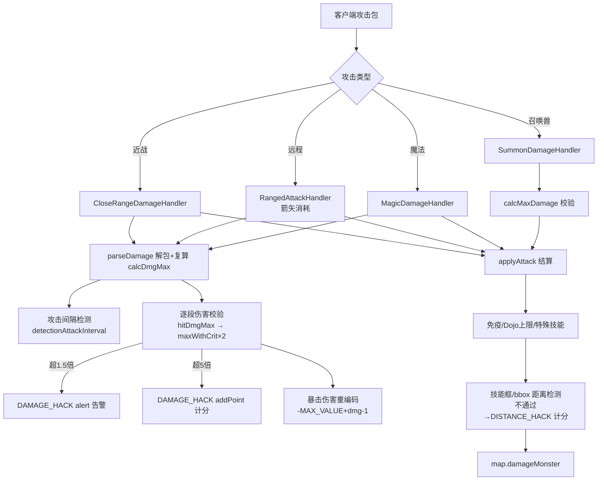
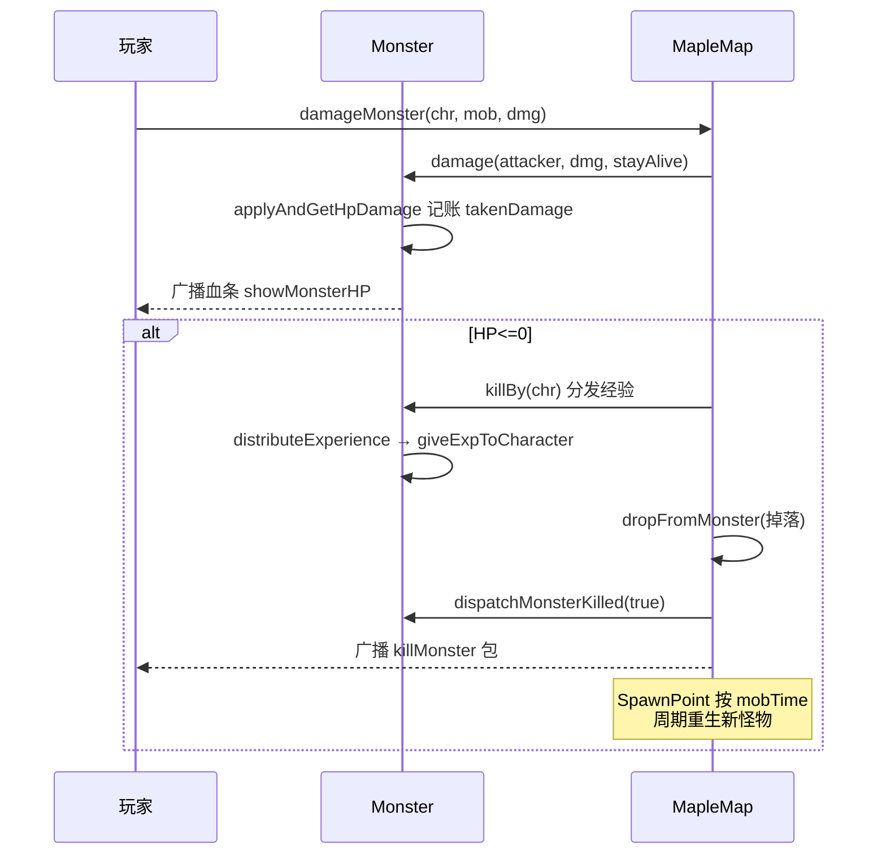
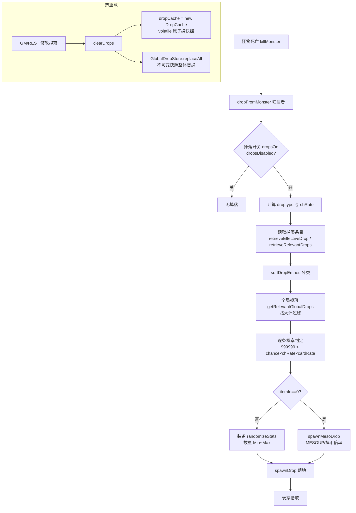
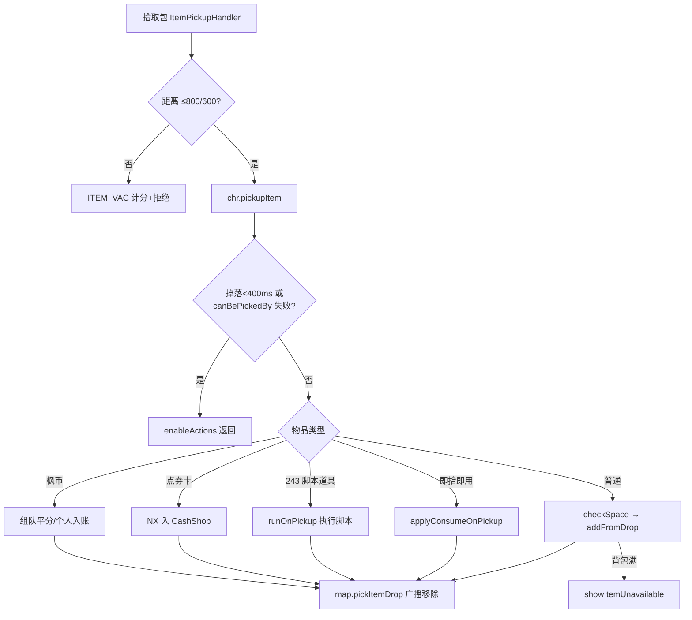
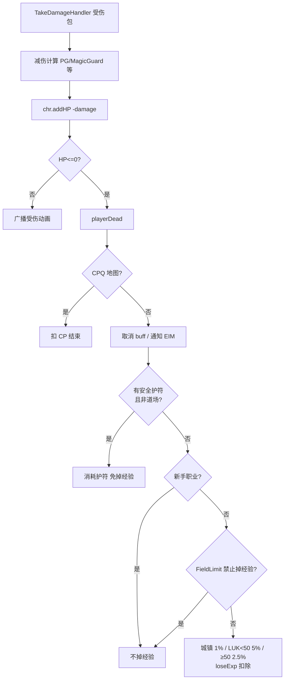
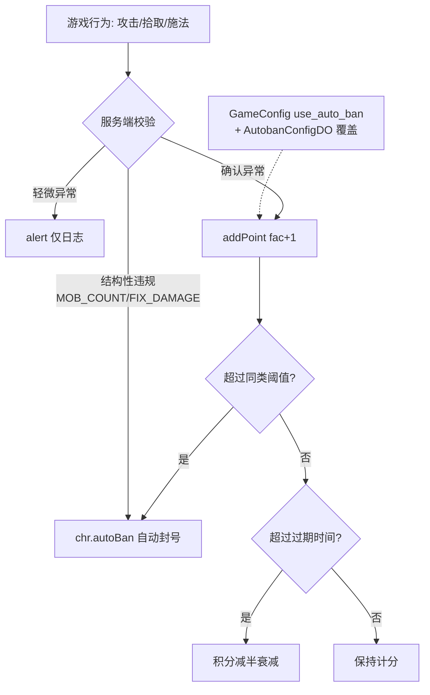

# 04 - 战斗与掉落

## 概述

本章覆盖 BeiDou-Server（MapleStory v83）战斗闭环的全部业务流程：玩家对怪物造成伤害（近战/远程/魔法/召唤兽）、伤害合法性与最大伤害修正（含暴击解码）、怪物生命管理与死亡结算、经验分发、掉落物生成（怪物掉落表 + 全局掉落 + 热重载）、道具/金币拾取、玩家死亡与掉经验，以及贯穿以上流程的自动封禁检测（autoban）。

核心结论先行：

- 伤害数值由**客户端计算**、服务端**校验**：`AbstractDealDamageHandler.parseDamage` 按官方公式复算 `calcDmgMax`，超限即触发 `AutobanFactory.DAMAGE_HACK`；命中判定与结算在 `applyAttack`。
- 暴击伤害在包内以**负数编码**（`-Integer.MAX_VALUE + damage - 1`），服务端用 `decodeDamage`（`encodedDamage & Integer.MAX_VALUE`）还原，近期 commit `ecc8a0019`「修复暴击伤害解码少一点伤害」修掉了旧实现 `+= Integer.MAX_VALUE` 少算 1 点的问题。
- 掉落数据来自数据库 `drop_data` / `drop_data_global` 表，由 `MonsterInformationProvider` 缓存；近期 commit `d10b544b8`「修复掉落热重载并发问题」把缓存重构为不可变快照（`DropCache` / `GlobalDropSnapshot`），`clearDrops()` 直接整体替换引用，实现无锁热重载。

---

## 1. 伤害计算流程（AbstractDealDamageHandler 系）

### 业务规则

所有玩家攻击包共用一个抽象基类，按攻击类型分为四个具体 handler：

| Handler | 攻击类型 | `parseDamage` 参数 |
| --- | --- | --- |
| `CloseRangeDamageHandler` | 近战 | `ranged=false, magic=false` |
| `RangedAttackHandler` | 远程（弓/弩/标飞/火枪） | `ranged=true, magic=false`，额外处理箭矢/子弹消耗与 `SLIDE_SHADOW` 等特殊技能分支 |
| `MagicDamageHandler` | 魔法 | `ranged=false, magic=true`，变形状态下禁止攻击（`isMorphWithoutAttack` 直接断开连接） |
| `SummonDamageHandler` | 召唤兽攻击 | 独立解包 `SummonAttackEntry`，按召唤技能效果用 `calcMaxDamage` 校验后调用 `map.damageMonster` |

`parseDamage` 的最大伤害复算流程（服务端权威校验基准 `calcDmgMax`）：

1. **基础公式分支**：魔法（`TotalMagic`/`TotalInt`）、Lucky Seven/Triple Throw（LUK×5）、Dragon Roar、Venom 系各自有专属公式，其余走 `chr.calculateMaxBaseDamage(getTotalWatk())`。
2. **魔法增幅**：冰/火/炎术/龙系的「魔法增幅」按技能 `y` 值放大；`Cleric.HEAL` 用 INT/LUK 换算公式。技能伤害按 `effect.getMatk()` / `effect.getDamage()` 百分比缩放；`Hermit.SHADOW_MESO` 用 `moneyCon * 10 * 1.5`。
3. **斗气（Combo）**：普通/进阶斗气按当前斗气数加成；终结技（Finisher）按豆数 ×1.2~×2.5。
4. **能量满槽（EnergyCharge=15000）**、**全 buff 伤害加成合计**（`getAllBudds` 中每个 `effect.getDamage()-100` 累加）、**新手教程地图 +80000**。
5. **暴击资格** `canCrit`：弓手/飞侠/夜行者/风灵/战神 3-4 转/拳师职业天然可暴击；** Sharp Eyes（精确火眼）** 使任何职业可暴击，且按当前技能等级的 `y` 值（而非写死 1.4）放大 `calcDmgMax`。
6. **每目标每段校验**：`hitDmgMax` 在 `calcDmgMax` 基础上叠加：Barrage 第 4 段起 ×2^(n-3)、影子分身后半段 ×0.5、元素属性（技能元素 vs `MonsterStats` 的 `ElementalEffectiveness`，WEAK ×1.5）、骑士属性充能（×1.05+level×0.015，圣属性 ×1.2+）、`Snipe` 固定 195000~199999、竹枪类放宽到 Boss 30% HP 上限。
7. **暴击编码**：`maxWithCrit = hitDmgMax * 2`；`damage > maxWithCrit*1.5` 仅告警（`alert`），`> *5` 计分（`addPoint`）。暴击伤害重编码为 `-Integer.MAX_VALUE + damage - 1` 回传客户端展示。
8. **攻击间隔检测** `detectionAttackInterval`：四层过滤（SKIP/PASSIVE 技能集合 → 网络抖动阈值 → per-skill 滑动窗口均值+变异系数 → 全局间隔），稳定高速才计 `ATTACK_INTERVAL` 分。

`applyAttack` 的结算规则：

- 前置：封号/地图归属限制（`map.isOwnershipRestricted`）直接返回；MP 不足记 `MPCON` 分；攻击目标数超过 `effect.getMobCount()` 直接 `MOB_COUNT` 自动封禁。
- 免疫：`MAGIC_IMMUNITY` / `WEAPON_IMMUNITY` 把该目标所有伤害置 1。
- 距离反挂机外挂检测：优先用技能攻击框（`StatEffect.hasBoundingBox/calculateBoundingBox`）与怪物 bbox 相交判定（`isWithinAttackBox`），未命中再用中心点距离 + 瞬移前/位移前坐标补偿（`chooseBestDistanceCheckSample`），按技能类型放宽阈值（远程 +400000、魔法 +200000、全屏技能豁免等）；超阈值记 `DISTANCE_HACK` 分并输出 BBOX 调试日志。
- 特殊技能逻辑：金钱爆炸引爆地上枫币、Pickpocket 掉枫币、吸血回 HP、Steal 偷道具（`retrieveRandomStealDrop`）、火/冰 Demon 临时元素弱点、Homing Beacon 标记、毒系 DoT、骑士充能元素弱化、Venom 叠 3 层、Mortal Blow 秒杀、圣域/寒冰风暴对非 Boss 直接削到 1 HP/秒杀、Dojo Boss 伤害上限 30% MaxHP。
- 反伤：`WEAPON_REFLECT` / `MAGIC_REFLECT` 对物理/魔法攻击者反弹 `PHYSICAL_AND_MAGIC_COUNTER` 的 X/Y 值伤害。
- 最终统一走 `map.damageMonster(player, monster, totDamageToOneMonster)`。

### 暴击解码修复（commit `ecc8a0019`）

v83 客户端对暴击伤害使用「负数补码」编码。旧代码 `eachd += Integer.MAX_VALUE` 在 `eachd < 0` 时比真实值少 1（如编码 `-2147482597` 解码应得 `499`，旧式得 `498`）。修复后统一：

```java
private static int decodeDamage(int encodedDamage) {
    return encodedDamage < 0 ? encodedDamage & Integer.MAX_VALUE : encodedDamage;
}
```

`applyAttack` 的伤害合计与 Pickpocket 枫币计算均改走 `decodeDamage`，保证暴击伤害不再少 1 点。

### 负责类

- `org.gms.net.server.channel.handlers.AbstractDealDamageHandler`（核心：`parseDamage` / `applyAttack` / `decodeDamage` / `detectionAttackInterval`）
- `CloseRangeDamageHandler` / `RangedAttackHandler` / `MagicDamageHandler` / `SummonDamageHandler`
- `org.gms.client.Character`（`calculateMaxBaseDamage`、攻击间隔窗口 `checkSkillWindow`）
- `org.gms.server.StatEffect`（技能效果、攻击框 `calculateBoundingBox`）

### 流程图



### 关键源码路径

- `gms-server/src/main/java/org/gms/net/server/channel/handlers/AbstractDealDamageHandler.java`
- `gms-server/src/main/java/org/gms/net/server/channel/handlers/CloseRangeDamageHandler.java`、`RangedAttackHandler.java`、`MagicDamageHandler.java`、`SummonDamageHandler.java`
- commit `ecc8a0019`（修复暴击伤害解码少一点伤害）

---

## 2. 怪物生命与死亡

### 业务规则

- **怪物创建**：`LifeFactory.getMonster(mid)` 从 `Mob.wz` 读取 `MonsterStats`（HP/MP/等级/是否 Boss/`revives` 复活链/`link` 怪属性复用），生成 `Monster` 实例；`MonsterInformationProvider` 缓存怪物动画时间、攻击信息、名称与 Boss 标记。
- **生命变更**：所有 HP 变更收敛到 `Monster.applyAndGetHpDamage(delta, stayAlive)`（synchronized + CAS `AtomicInteger hp`），已死怪物返回 null 直接短路。`damage(attacker, damage, stayAlive)` 加怪物锁后调用 `applyDamage`，后者负责：真实伤害入账（`takenDamage` 按玩家 AtomicLong 记账，用于经验分配与掉落归属）、广播 HP 血条（普通怪百分比小血条、Boss 大血条）、通知事件实例 `eim.addDamage` 与监听器 `dispatchMonsterDamaged`。
- **治疗**：`heal(hp, mp)` 走负 delta 的同一条路径，受 MaxHp 封顶，广播 `healMonster` 包；怪物 MobSkill（`MobSkillFactory`）的 HEAL 型技能与 PFM/Boss 定时回血均复用此方法。
- **死亡**：HP 归零后由 `MapleMap.killMonster(monster, chr, withDrops, animation)` 统一处理：`removeKilledMonsterObject` 防重复击杀 → 击杀高于自身 30 级的怪触发 `GENERAL` 告警 → CPQ 怪给 CP、Boss 死亡 buff 全图生效、扎昆手臂全部死亡后让主体变真实（`makeZakumReal`）→ `monster.killBy(chr)` 分发经验并取走掉落归属者 → `dropFromMonster` 掉落 → `dispatchMonsterKilled(true)`（触发事件实例/监听器/任务计数）→ 广播 `killMonster` 包。
- **经验分配**（`Monster.distributeExperience` → `giveExpToCharacter`）：按 `takenDamage` 比例分配个人经验与组队经验（`exp_split_common_mod`、MVP 加成、等级区间吸经验限制 `exp_split_level_interval`），乘算 Holy Symbol（`use_full_holy_symbol` 控制满额）、Showdown、个人经验倍率/怪物经验倍率、EXP buff、家族 buff；白色经验按伤害占比标准差阈值判定。附带家族声望（`family_rep_per_kill`）与任务击杀计数 `raiseQuestMobCount`。
- **重生**：`SpawnPoint.shouldSpawn()` 按 mobTime 周期由地图重生任务（`MapleMap` 3232 行附近）重新 `LifeFactory.getMonster` + `spawnMonster`；Boss 复活链走 `Monster.getRevives()` → `map.spawnRevives`（如扎昆手臂→本体、帕普拉图斯变身）。`mobTime == -1` 只强制生成一次不重生。

### 负责类

- `org.gms.server.life.LifeFactory`、`Monster`、`MonsterStats`、`MobSkillFactory`、`SpawnPoint`
- `org.gms.server.maps.MapleMap`（`killMonster`、`spawnMonster`、重生任务）
- `org.gms.server.life.MonsterInformationProvider`（怪物元信息缓存）

### 流程图



### 关键源码路径

- `gms-server/src/main/java/org/gms/server/life/Monster.java`（`applyAndGetHpDamage` ~370 行、`damage` ~408 行、`killBy` ~900 行、`giveExpToCharacter` ~732 行）
- `gms-server/src/main/java/org/gms/server/life/LifeFactory.java`（`getMonster` 552 行）
- `gms-server/src/main/java/org/gms/server/maps/MapleMap.java`（`killMonster` 1417 行、重生 3232 行附近）

---

## 3. 掉落系统

### 业务规则

- **数据来源**：怪物专属掉落 `drop_data`（`dropperid` 维度），全局掉落 `drop_data_global`（`continent` 大洲维度，`-1` 为全大陆）。条目结构 `MonsterDropEntry{itemId, chance, Minimum, Maximum, questid}`（`itemId=0` 表示枫币）；全局条目多一个 `continentid`。管理端可通过 `DropController` / `DropService`（REST）查询维护，GM 命令 `ReloadDropsCommand` 触发热重载。
- **热重载并发修复（commit `d10b544b8`）**：旧实现用多个可变 `HashMap` + `synchronized clearDrops()`，读取线程可能看到半清空状态。现改为：
  - `DropCache`：`volatile` 引用的不可变结构，内部全部 `ConcurrentHashMap`（`drops` / `dropsChancePool` / `extraMultiEquipDrops` / `hasNoMultiEquipDrops`）；`clearDrops()` 直接 `dropCache = new DropCache()` 原子换快照，旧快照读者继续安全读旧数据。
  - `GlobalDropStore` / `GlobalDropSnapshot`：全局掉落整体替换（`List.copyOf` 不可变），按 `mapId/100000000` 的大洲惰性分组缓存。
  - `MonsterDropEntry` / `MonsterGlobalDropEntry` 字段改 `final`（不可变条目）。
  - 窃取（Steal）改走新接口 `retrieveRandomStealDrop(monsterId)`，在快照上完成概率池随机，避免旧代码「先查池再查表」两步之间缓存被清导致越界。
- **掉落判定**（`MapleMap.dropFromMonster`）：
  1. 掉落类型 `droptype`：爆装 Boss=3（散开）、FFA 自由拾取=2、组队=1、普通=0。
  2. 掉率 `chRate`：非 Boss 用 `chr.getDropRate()`、Boss 用 `getBossDropRate()`，叠加 Showdown 与家族掉落 buff。
  3. 条目来源：开启 `use_spawn_relevant_loot` 时走 `Monster.retrieveRelevantDrops()`（按实际在场伤害玩家过滤任务掉落，`LootManager` 合并），否则 `MonsterInformationProvider.retrieveEffectiveDrop`；后者还负责「同装备多连掉」（`use_multiple_same_equip_drop`，按 Min~Max 数量复制条目）。
  4. `sortDropEntries` 把条目分为普通掉落 / 当前玩家可见任务掉落 / 他人任务掉落，逐条 `Randomizer.nextInt(999999) < chance × chRate × cardRate` 判定；枫币掉落叠加 MESOUP buff 与 `getMesoRate()`。
  5. 位置以怪物坐标左右交替铺开（普通 25px、爆装 40px 间隔），经 `calcDropPos` 校正后 `spawnDrop` / `spawnMesoDrop` 落地。

### 负责类

- `org.gms.server.life.MonsterInformationProvider`（`DropCache` / `GlobalDropStore` / `GlobalDropSnapshot` / `retrieveEffectiveDrop` / `retrieveRandomStealDrop` / `clearDrops`）
- `org.gms.server.life.MonsterDropEntry`、`MonsterGlobalDropEntry`
- `org.gms.server.maps.MapleMap`（`dropFromMonster` / `dropItemsFromMonsterOnMap` / `dropGlobalItemsFromMonsterOnMap`）
- `org.gms.controller.DropController`、`org.gms.service.DropService`、GM 命令 `ReloadDropsCommand`

### 流程图



### 关键源码路径

- `gms-server/src/main/java/org/gms/server/life/MonsterInformationProvider.java`
- `gms-server/src/main/java/org/gms/server/maps/MapleMap.java`（658~800 行掉落逻辑）
- commit `d10b544b8`（修复掉落热重载并发问题）

---

## 4. 拾取

### 业务规则

- `ItemPickupHandler`：读取掉落物 OID，做**吸物外挂距离校验**（X 超过 800 或 Y 超过 600 直接 `ITEM_VAC` 计分并拒绝），然后交给 `Character.pickupItem(ob, petIndex)`（petIndex>-1 表示宠物拾取，宠物拾取另有 `PetLootHandler` 复用同一路径）。
- `Character.pickupItem` 规则：
  1. 掉落 400ms 内不可拾（防抢）；`MapItem.canBePickedBy` 校验归属（droptype=0 非归属者不可拾）。
  2. 自主拾取地图（`MapId.isSelfLootableOnly`，圣诞村树/家族 PQ）只允许拾自己丢的。
  3. 任务物品过滤：`needQuestItem(quest, itemId)` 不满足（未接任务/进度已够）则不可见不可拾。
  4. 枫币：同图组队平分；点券卡（`ItemId.isNxCard`）直接入账 CashShop（基础 100/250 × 数量，commit `4d30ee038` 支持数量相乘）；`243` 段「拾取即执行脚本」道具走 `ScriptedItem.runOnPickup`；`applyConsumeOnPickup` 处理即拾即用药品与怪物卡图鉴。
  5. 普通道具 `InventoryManipulator.checkSpace/addFromDrop` 入包，成功后 `map.pickItemDrop` 广播移除。
- 宠物拾取的额外加速/距离检测见 `PetLootHandler`（`PET_ITEM_VAC` / `FAST_ITEM_PICKUP` 计分）。

### 负责类

- `org.gms.net.server.channel.handlers.ItemPickupHandler`、`PetLootHandler`
- `org.gms.client.Character`（`pickupItem`）
- `org.gms.server.maps.MapItem`（拾取锁 `lockItem`、归属判定）

### 流程图



### 关键源码路径

- `gms-server/src/main/java/org/gms/net/server/channel/handlers/ItemPickupHandler.java`
- `gms-server/src/main/java/org/gms/client/Character.java`（`pickupItem` 2008 行起）

---

## 5. 玩家死亡与掉经验

### 业务规则

- 受伤入口 `TakeDamageHandler`：解析伤害来源（怪物攻击/MobSkill/魔法反射/坠落等），处理 PowerGuard/魔法盾/Aquila 屏障等减伤，最终 `chr.addHP(-damage)`；HP 归零触发 `playerDead()`。
- `Character.playerDead()` 规则：
  1. CPQ 地图：只扣 CP 不掉经验。
  2. 取消全部 buff 与异常状态、通知事件实例 `eim.playerKilled`。
  3. **安全护符**（`ItemId.SAFETY_CHARM` / 复活节道具）优先消耗、免掉经验（道场除外，`MapId.isDojo`）。
  4. 非新手（非 BEGINNER）且地图未设 `FieldLimit.NO_EXP_DECREASE`：经验惩罚 = 升级所需经验的 1%（城镇）或 5%（LUK<50）/2.5%（LUK≥50），`loseExp` 扣除（不降级，最低扣到当前值）。
  5. 取消变身/骑宠、离开椅子、恢复操作。
- `loseExp(loss, show, inChat, white)` 负责扣经验并广播；复活逻辑由客户端点击复活后走相应 handler（女皇祝福/复活技能等）。

### 负责类

- `org.gms.net.server.channel.handlers.TakeDamageHandler`
- `org.gms.client.Character`（`playerDead` 6830 行、`loseExp` 2958 行）

### 流程图



### 关键源码路径

- `gms-server/src/main/java/org/gms/net/server/channel/handlers/TakeDamageHandler.java`
- `gms-server/src/main/java/org/gms/client/Character.java`

---

## 6. 自动封禁检测（client/autoban）

### 业务规则

- 采用「**积分制**」而非单次封禁：`AutobanManager.addPoint(fac, reason)` 给某类违规 +1 分，超过该类阈值 `getEffectivePoints()` 时调用 `chr.autoBan(reason)` 自动封号；同类积分在过期时间（`getEffectiveExpiretime`）后减半衰减。GM 与已封号玩家不计分。
- 开关与阈值：`GameConfig` 的 `use_auto_ban` / `use_auto_ban_log`；`AutobanFactory` 各枚举可被数据库 `AutobanConfigDO` 覆盖（`isDisabled` / `getEffectivePoints` / `getEffectiveExpiretime`），支持按类型禁用与调参。
- 两级接口：`alert`（只记日志告警）与 `addPoint`（计分）。战斗链路上的典型埋点：

| 检测项 | 触发位置 | 阈值/过期 |
| --- | --- | --- |
| `DAMAGE_HACK` | `parseDamage` 伤害超复算上限 1.5×/5×、攻击段数超上限 | 15 分 / 1 分钟 |
| `DISTANCE_HACK` | `applyAttack` 攻击距离超技能框与阈值 | 10 分 / 2 分钟 |
| `MOB_COUNT` | 单次攻击目标数超技能上限 | 直接封禁 |
| `MPCON` | MP 不足以支付技能消耗 | 25 分 / 30 秒 |
| `ATTACK_INTERVAL` | `detectionAttackInterval` 四层攻击频率检测 | 60 分 / 60 秒 |
| `FIX_DAMAGE` | 固定伤害技能数值不符 | 直接封禁 |
| `ITEM_VAC` / `PET_ITEM_VAC` | 拾取距离异常 | 10 分 / 2 分钟 |
| `FAST_ATTACK` | WZ 缺动作的加速攻击 | 10 分 / 30 秒 |
| `GENERAL` | 击杀高于自身 30 级怪物（告警） | - |

- `AutobanManager` 还维护 miss godmode 检测（`addMiss/resetMisses`，连续同值 miss 超 6 次达 5 轮则 `sendPolice` 踢下线）与 spam 时间窗（`spam(type)/getLastSpam`，供聊天/攻击防刷屏）。

### 负责类

- `org.gms.client.autoban.AutobanFactory`（枚举定义阈值与 i18n 名称）
- `org.gms.client.autoban.AutobanManager`（积分/衰减/miss 检测）
- 各 handler 中的埋点（`AbstractDealDamageHandler`、`ItemPickupHandler`、`MapleMap.killMonster` 等）

### 流程图



### 关键源码路径

- `gms-server/src/main/java/org/gms/client/autoban/AutobanFactory.java`
- `gms-server/src/main/java/org/gms/client/autoban/AutobanManager.java`
