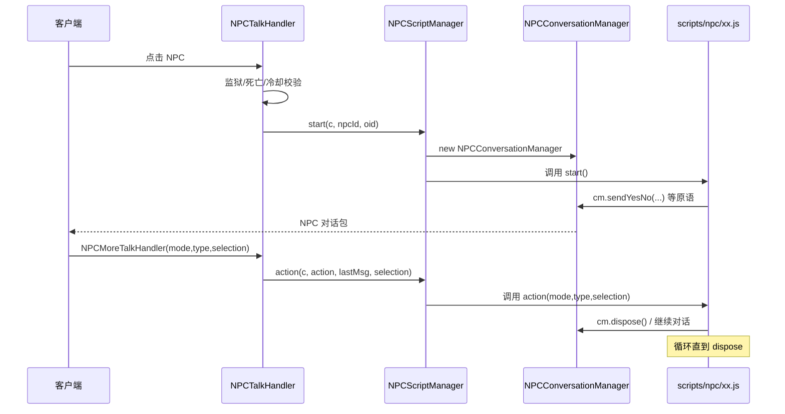
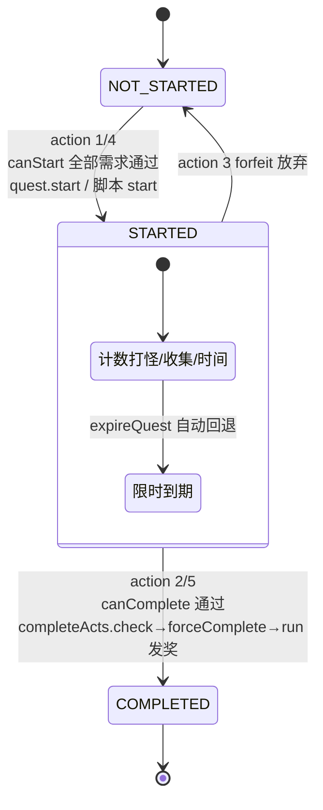
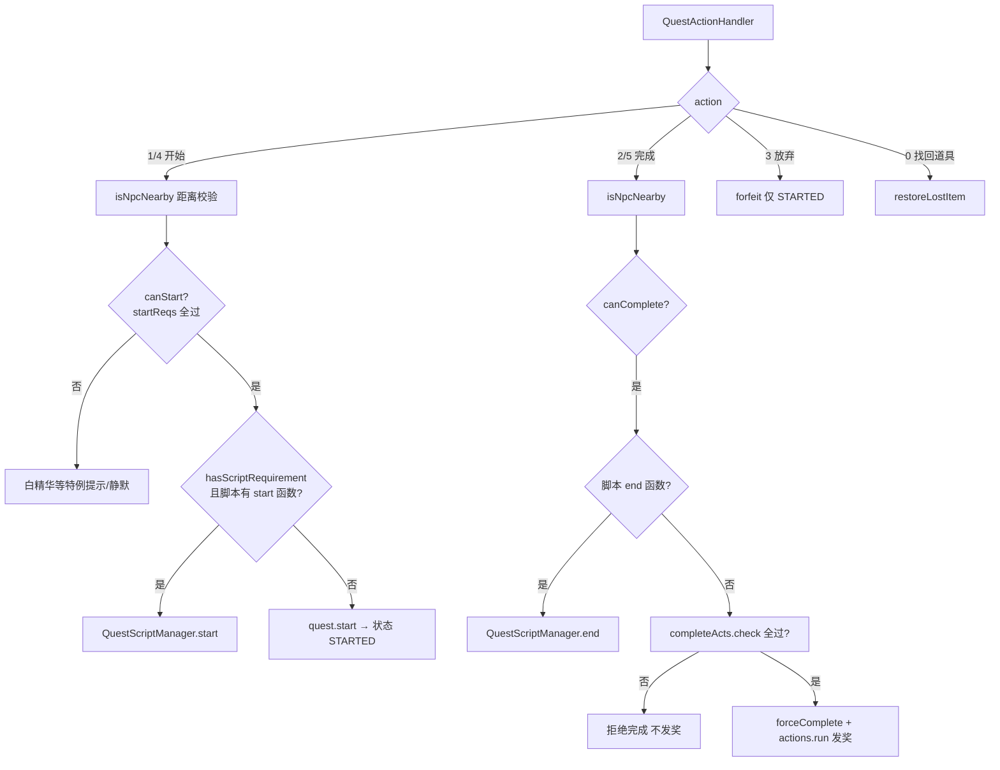
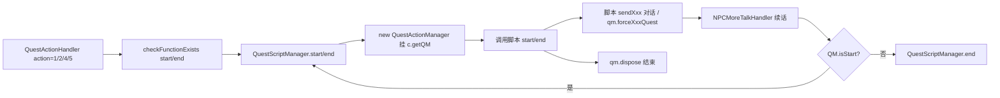
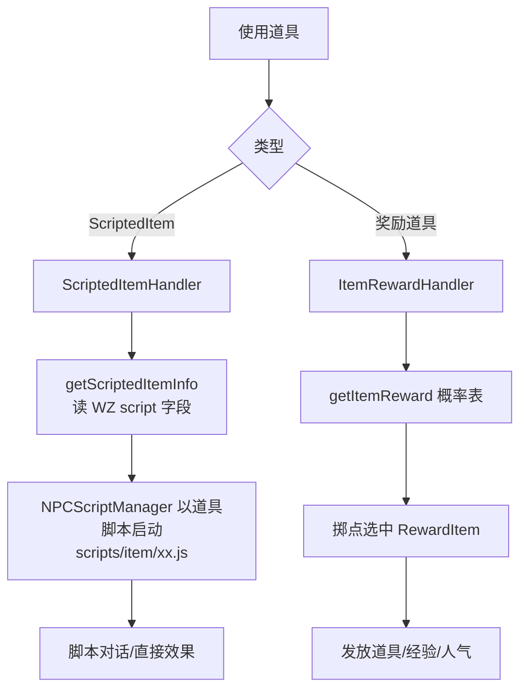
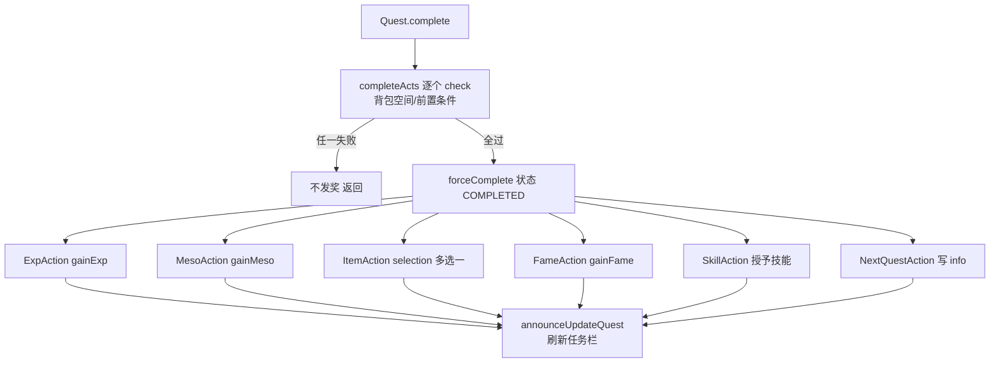

# 05 - 任务与 NPC

## 概述

本章覆盖 BeiDou-Server 中「玩家 ↔ NPC ↔ 任务」的全部交互链路：NPC 对话的脚本化驱动（`NPCTalkHandler` → `NPCScriptManager` → `NPCConversationManager` → `scripts/npc/*.js`）、任务系统的状态机与数据驱动校验（`server/quest` 包 41 个类、`QuestActionHandler`）、任务脚本（`scripts/quest/*.js` + `QuestScriptManager`）、道具脚本（使用型道具/拾取型脚本道具/奖励箱）以及任务奖励的发放。

核心结论先行：

- NPC 与任务的「对话」本质是 **GraalVM JS 脚本的状态机循环**：`cm.sendXxx()` 发对话包 → 客户端回 `NPCMoreTalkHandler` → `NPCScriptManager.action()` 重新进入脚本的 `action(mode, type, selection)`。
- 任务是否需要脚本由 WZ 数据决定：`Quest.hasScriptRequirement`。纯数据任务（打怪/收集/等级）直接走 `Quest.start/complete`；脚本任务走 `QuestScriptManager` 的 `start`/`end` 函数。
- 任务开始/完成的**前置校验**（`requirements` 包）与**奖励发放**（`actions` 包）都是可组合的策略类，`Quest` 持有 `startReqs/completeReqs/completeActs` 三组集合。

---

## 1. NPC 对话脚本链路

### 业务规则

- **入口 `NPCTalkHandler`**：
  1. 监狱地图（`MapId.JAIL`）不可使用脚本；死亡状态拒绝；NPC 冷却（`block_npc_race_condition` 毫秒）内拒绝，防连点竞态。
  2. 内置路由减少脚本数量：`Duey` 快递走 `DueyProcessor`；扭蛋机 ID 段共用 `gachapon` 脚本；「Maple TV」共用 `mapleTV`；转生系统 NPC（`rebirth_npc_id`，需 `use_rebirth_system`）共用 `rebirth`。
  3. 优先尝试 `NPCScriptManager.start(c, npcId, oid, null)` 加载 `scripts/npc/<npcId>.js`；脚本不存在时退化为纯商店 NPC（`npc.hasShop()` → `sendShop`），否则打日志「NPC not coded」。
  4. `PlayerNPC`（玩家排名 NPC，`PlayerNPCFactory` 生成）同样可挂脚本，未定制脚本的排名 NPC 走 `rank_user`。
- **脚本管理 `NPCScriptManager`**：每个 Client 挂一个 `NPCConversationManager`（`c.getCM()`）；`start` 时新建 CM 并调用脚本的 `start()` 函数，`action` 时把客户端回包（mode/type/selection）转调脚本的 `action()`。对话中不可重复开启（`getCM() != null || getQM() != null` 时直接 enableActions）。
- **对话原语 `NPCConversationManager`**（继承 `AbstractPlayerInteraction`）：`sendNext/sendPrev/sendYesNo/sendSimple/sendStyle/sendGetNumber/sendGetText` 等发送不同类型对话包（speaker 参数控制 NPC 头像侧），`dispose()` 结束对话释放脚本引擎上下文。
- **续话 `NPCMoreTalkHandler`**：读 `lastMsg`（上一条对话类型）与 `action`（0=关闭 1=继续）；`lastMsg==2` 时读取输入文本 `setGetText`；随后按「任务会话（QM）优先于普通会话（CM）」路由到 `QuestScriptManager.start/end` 或 `cmRouting` → `NPCScriptManager.action`。`action==0` 直接 `dispose()`。
- **脚本文件**：`gms-server/scripts/npc/`（英文基础）+ `gms-server/scripts-zh-CN/npc/`（中文覆盖）合并加载，约 717 个 NPC 脚本；公共函数在 `NPC Base.js`。

### 负责类

- `org.gms.net.server.channel.handlers.NPCTalkHandler`、`NPCMoreTalkHandler`、`NPCAnimationHandler`
- `org.gms.scripting.npc.NPCScriptManager`、`NPCConversationManager`
- `org.gms.scripting.AbstractPlayerInteraction`（脚本可用的游戏操作底座）
- `org.gms.server.life.NPC`、`PlayerNPC`、`PlayerNPCFactory`

### 流程图

### 关键源码路径

- `gms-server/src/main/java/org/gms/net/server/channel/handlers/NPCTalkHandler.java`、`NPCMoreTalkHandler.java`
- `gms-server/src/main/java/org/gms/scripting/npc/NPCScriptManager.java`、`NPCConversationManager.java`
- `gms-server/scripts/npc/`、`gms-server/scripts-zh-CN/npc/`

---

## 2. 任务系统（quest 包与状态机）

### 业务规则

任务状态由 `QuestStatus.Status` 枚举驱动：`NOT_STARTED → STARTED → COMPLETED`（失败/放弃回 `NOT_STARTED`，`forfeit`）。

- **`Quest` 单例缓存**：`Quest.getInstance(questid)` 从 `Quest.wz` 惰性解析并缓存任务元数据：起止 NPC、时间限制 `getTimeLimit`、info number（`getInstanceFromInfoNumber`）、`revives` 相关怪物列表 `getRelevantMobs`、同名日重复 `isSameDayRepeatable`、自动开始/自动完成（`isAutoStart` / `isAutoComplete`，由 WZ `autoStart/autoComplete` 或脚本存在性推断）。
- **校验策略（`requirements` 包，`QuestRequirementType` 驱动）**：`canStart` = 状态校验 `canStartQuestByStatus` + 全部 `startReqs.check(chr)`；`canComplete` = 状态 + 全部 `completeReqs.check(chr)`。需求类型包括：等级（Min/Max）、职业 `JobRequirement`、道具 `ItemRequirement`（含数量，`getStartItemAmountNeeded`）、打怪数 `MobRequirement`（`QuestMobCount` 计数，由 `Monster.giveExpToCharacter → raiseQuestMobCount` 累加）、金币 `MesoRequirement`、前置任务 `CompletedQuestRequirement`、技能 buff（含 BuffExcept）、宠物（驯服度/速度）、间隔 `IntervalRequirement`、到期 `EndDateRequirement`、进入地图 `FieldEnterRequirement`、info 进度 `InfoExRequirement`、怪物卡数量、脚本需求 `ScriptRequirement` 等。
- **`QuestActionHandler` 的 action 编号语义**：
  - `0` 找回丢失任务道具 `restoreLostItem`；
  - `1` 开始任务：先 `isNpcNearby` 距离校验（非自动任务要求玩家在 NPC 1200×800 范围内，防远程操控），`canStart` 通过后——有脚本需求且脚本存在 `start` 函数则走 `QuestScriptManager.start`，否则 `quest.start(player, npc)`；
  - `2` 完成任务：同样校验后走脚本 `end` 或 `quest.complete(player, npc, selection)`（selection 支持奖励多选一）；
  - `3` 放弃任务 `forfeit`（仅 STARTED 状态）；
  - `4`/`5` 脚本化开始/完成（`QuestScriptManager.start/end` 无条件调用）。
- **`Quest.start`**：校验通过后 `forceStart` → `chr.updateQuestStatus(STARTED)`，处理限时任务计时器（`getTimeLimit`，超时 `expireQuest`）与起始 NPC 的 info。
- **`Quest.complete`**：先逐个 `completeActs.check(chr, selection)`（如道具奖励是否放得下），任一失败则不发奖；然后 `forceComplete` 置 COMPLETED，再逐个 `a.run(chr, selection)` 发奖；有后续任务（`NextQuestAction`）时链式提示。
- **奖励策略（`actions` 包，`QuestActionType` 驱动）**：`ExpAction`（经验，走 `gainExp`）、`MesoAction`、`ItemAction`（道具/装备，支持 selection 选择）、`FameAction`（人气）、`SkillAction`（授予技能）、`BuffAction`、`NextQuestAction`（下一个任务 id）、`InfoAction`（写任务 info）、`PetSkillAction` / `PetTamenessAction` / `PetSpeedAction`（宠物三连）、`QuestAction`（嵌套触发其它任务状态）。
- **持久化**：任务状态、任务道具计数、info 均随角色存档写入 `quests` 相关表；勋章进度（`medal` 包，如 `VeteranHunterMedal`、`SpecialChallengeMedal`）复用怪物击杀事件。

### 负责类

- `org.gms.server.quest.Quest`（状态机核心）、`QuestRequirementType`、`QuestActionType`
- `org.gms.server.quest.requirements.*`（约 22 个校验策略）
- `org.gms.server.quest.actions.*`（14 个奖励策略）
- `org.gms.net.server.channel.handlers.QuestActionHandler`
- `org.gms.client.quest.QuestStatus`（角色侧任务状态）

### 流程图

### 关键源码路径

- `gms-server/src/main/java/org/gms/server/quest/Quest.java`（`canStart` 288 行、`complete` 336 行、`forfeit` 359 行）
- `gms-server/src/main/java/org/gms/net/server/channel/handlers/QuestActionHandler.java`
- `gms-server/src/main/java/org/gms/server/quest/requirements/`、`gms-server/src/main/java/org/gms/server/quest/actions/`

---

## 3. 任务脚本（scripts/quest）

### 业务规则

- 脚本任务由 `QuestScriptManager` 驱动：`scripts/quest/<questid>.js`（约 295 个）+ `scripts-zh-CN/quest/` 中文覆盖。会话对象是 `QuestActionManager`（继承 `NPCConversationManager`，多了 `gainExp/gainMeso` 等任务专用方法），挂在 `c.getQM()`。
- `checkFunctionExists(c, questid, npc, functionName)`：在脚本上下文里执行 `typeof this[start|end] === 'function'`，用于判定脚本是否实现了开始/完成函数，决定 `QuestActionHandler` 走脚本还是数据驱动路径。
- `QuestScriptManager.start/end` 有两个重载：初次进入（新建 QM 并调用脚本 `start()`/`end()`）与续话（把 `NPCMoreTalkHandler` 的 action/lastMsg/selection 转调脚本 `start(mode, type, selection)`/`end(...)`，注意这里的 mode/type 是对话状态而非开始/结束）。
- 脚本内部通过 `qm.forceStartQuest()/forceCompleteQuest()`、`qm.gainItem()/gainExp()` 等原语完成「脚本自定义条件」的任务流转；对话原语复用 NPC 的 `sendXxx` 系列。
- 脚本基类公共函数在 `scripts/quest/QUEST Base.js`。

### 负责类

- `org.gms.scripting.quest.QuestScriptManager`、`QuestActionManager`
- `gms-server/scripts/quest/`（含 `QUEST Base.js`）

### 流程图

### 关键源码路径

- `gms-server/src/main/java/org/gms/scripting/quest/QuestScriptManager.java`（`checkFunctionExists` 214 行）
- `gms-server/src/main/java/org/gms/scripting/quest/QuestActionManager.java`
- `gms-server/scripts/quest/`

---

## 4. 道具脚本

### 业务规则

- **使用型脚本道具**：`ScriptedItemHandler`（使用 243 段以外的可使用道具，如 `BeiDouSatelliteManual`、`killarmush`、`removethorns`）——从 `ItemInformationProvider.getScriptedItemInfo(itemId)` 取 `ScriptedItem`（WZ `info/script` 字段），经 `NPCScriptManager` 以道具脚本名启动会话（`isItemScript` 标记），脚本体在 `scripts/item/`。
- **拾取即执行**：`ScriptedItem.runOnPickup` 为真时，`Character.pickupItem` 中直接执行脚本不入包（见 04 章拾取节）。
- **奖励箱类**：`ItemRewardHandler`——`ItemInformationProvider.getItemReward(itemId)` 返回概率表 `List<RewardItem>`（WZ `reward` 节点），按 `Randomizer` 掷点选中 `RewardItem`，发放道具/经验/人气（`prob` 累计比较）；常见于任务奖励箱、活动礼包。
- 相关特化 handler：`SkillBookHandler`（技能书成功率）、`ScrollHandler`（卷轴强化）、`UseDeathItemHandler`（原地复活道具）等，均为道具脚本体系的补充。

### 负责类

- `org.gms.net.server.channel.handlers.ScriptedItemHandler`、`ItemRewardHandler`
- `org.gms.server.ItemInformationProvider`（`ScriptedItem` 内部类）
- `gms-server/scripts/item/`

### 流程图

### 关键源码路径

- `gms-server/src/main/java/org/gms/net/server/channel/handlers/ScriptedItemHandler.java`、`ItemRewardHandler.java`
- `gms-server/scripts/item/`

---

## 5. 任务奖励发放

### 业务规则

- 奖励由 `actions` 包的策略类在 `Quest.complete` 内顺序执行（`check` 先全部通过再 `run`，避免发一半失败）：
  - `ExpAction`：调用 `chr.gainExp`，吃服务器/个人经验倍率。
  - `MesoAction`：`chr.gainMeso`。
  - `ItemAction`：支持固定道具与 `selection` 二选一（如药水/卷轴二选一），装备经 `ItemInformationProvider` 随机属性生成。
  - `FameAction`：`chr.gainFame`。
  - `SkillAction`：直接授予/升级技能。
  - `NextQuestAction`：把下一任务 id 写入当前任务 info，客户端提示「下一步」。
  - `InfoAction`：写 `QuestStatus` 的 info 自定义数据。
  - 宠物系三个 action：驯服度/速度/技能。
- 完成后 `chr.announceUpdateQuest(DelayedQuestUpdate.INFO, ...)` 刷新客户端任务栏；`hasNextQuestAction()` 为假才发 INFO 更新。
- 领取型奖励（NPC 处领奖）走任务脚本的 `end()` 或 `Quest.complete(player, npc, selection)`，selection 即 `ItemAction` 的多选一索引。
- 找回丢失道具：`Quest.restoreLostItem` 按任务起始/完成道具表补发（action=0）。

### 负责类

- `org.gms.server.quest.actions.*`（见上表）
- `org.gms.client.Character`（`gainExp/gainMeso/gainFame`）

### 流程图

### 关键源码路径

- `gms-server/src/main/java/org/gms/server/quest/Quest.java`（`complete` 336~353 行）
- `gms-server/src/main/java/org/gms/server/quest/actions/`
