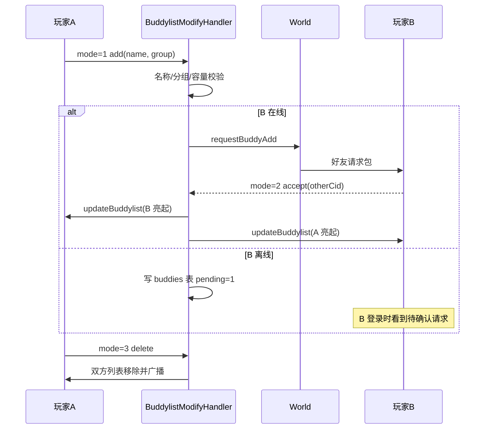
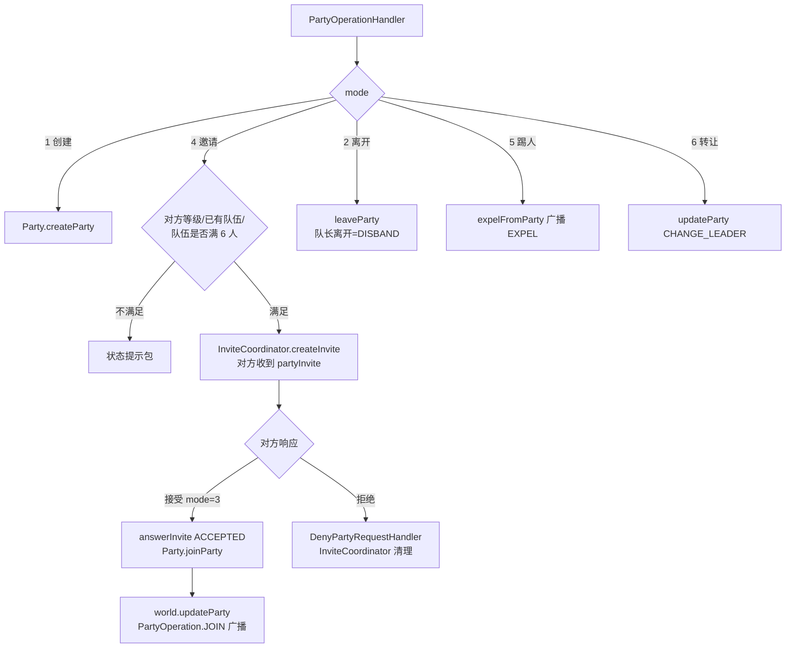
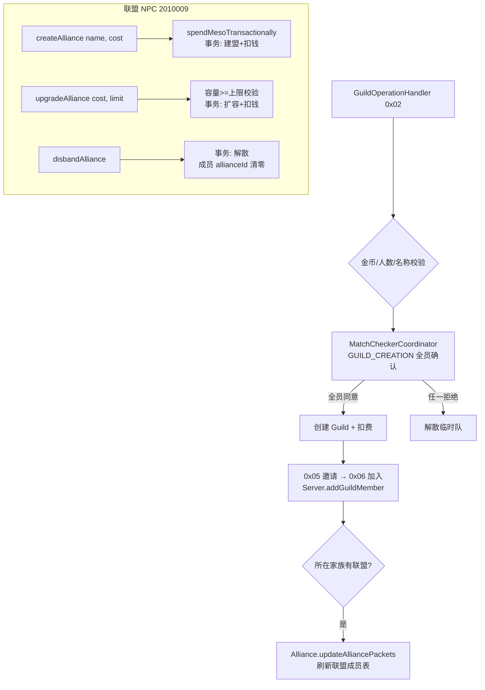
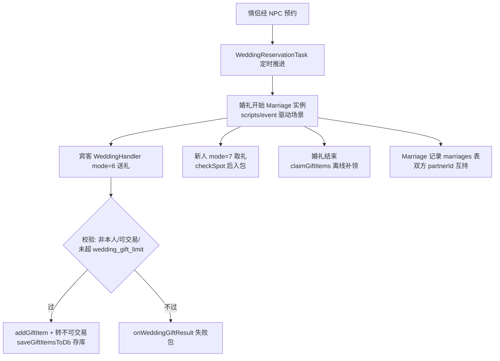
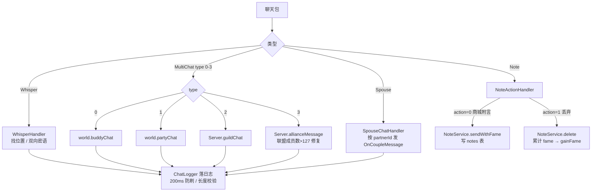
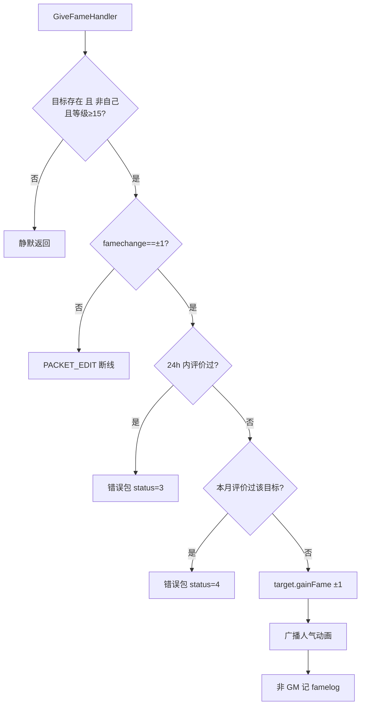
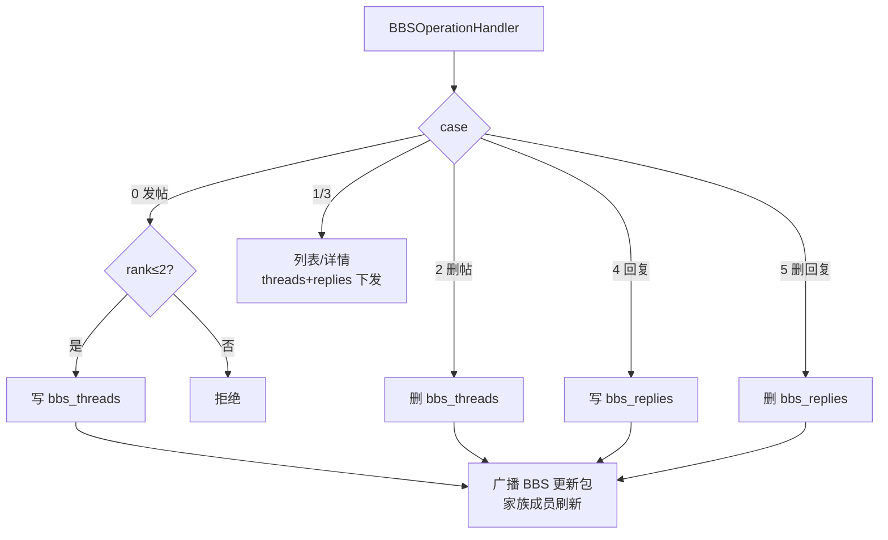

# 06 - 社交系统

## 概述

本章覆盖 BeiDou-Server 的玩家间社交业务：好友（BuddyList）、组队（Party）、家族与联盟（Guild / Alliance，含近期 commit `b185060df`「修复联盟容量与成员事务一致性」）、婚姻（Marriage / Wedding handler 系）、通信（密语 Whisper、群聊 MultiChat、夫妻频道 SpouseChat、离线便签 Note）、互评人气（GiveFame）以及家族社区布告栏（BBS）。

核心结论先行：

- 组队/家族/联盟的成员变更全部以 **World 级单例对象 + `PartyOperation` 广播** 为核心，跨频道可见；家族与联盟的持久化集中在 `Guild` / `Alliance` 的 synchronized 方法内完成。
- 联盟近期修复（`b185060df`）把「扣金币 + 业务变更」收敛为一个事务（`Character.spendMesoTransactionally`），并把容量判断从 `==` 改为 `>=`，`upgradeAlliance/createAlliance/disbandAlliance` 失败时不扣钱，成员增删与联盟表写入在同一 Flyway 修复脚本（`V1.11.6__fix_alliance_membership_transactions.sql`）保证的表结构上保持一致。
- 所有聊天通道都会经过 `ChatLogger` 落日志，并受 `AutobanManager.spam` 防刷与长度校验（超 `Byte.MAX_VALUE` 判 `PACKET_EDIT`）保护。

---

## 1. 好友（BuddyList）

### 业务规则

- 好友列表容量 `capacity`（初始 50，可通过商城扩容），条目 `BuddylistEntry`（角色 id/名称/分组 group/所在频道/可见性）；`BuddyList` 内部 `LinkedHashMap` + synchronized 保护，并维护 `pendingRequests` 待确认队列。
- `BuddylistModifyHandler` 的三个 mode：
  - **add（1）**：名称/分组长度校验（名称 2~13、分组 ≤16）→ 目标在线则经 `World.requestBuddyAdd` 直接给对方发请求包，目标离线则查库写 `buddies` 表 `pending=1` 记录（同时校验对方容量与是否已在列表）→ 无论对方是否确认，自己列表先放入「不可见」条目（对方确认后才亮起）。
  - **accept（2）**：从 `pendingRequests` 取出请求者，把自己插入对方列表（`BuddyList.put` 双向成对），更新双方 `updateBuddylist`/`buddyAddResult` 包；离线方靠登录时 `PlayerLoggedinHandler` 的 pending 记录补齐。
  - **delete（3）**：从双方列表移除并广播 `updateBuddylist`。
- 登录/换图/换频道时由 `Character` 的好友可见性更新流程把好友「亮/暗」广播给互为好友的在线玩家（`PacketCreator.updateBuddylist`、`buddyLogin/buddyLogout` 类消息）。

### 负责类

- `org.gms.client.BuddyList`、`BuddylistEntry`
- `org.gms.net.server.channel.handlers.BuddylistModifyHandler`
- `org.gms.net.server.world.World`（`requestBuddyAdd`、`buddyChat`）

### 流程图

### 关键源码路径

- `gms-server/src/main/java/org/gms/client/BuddyList.java`
- `gms-server/src/main/java/org/gms/net/server/channel/handlers/BuddylistModifyHandler.java`

---

## 2. 组队（Party）

### 业务规则

- 队伍上限 6 人（`party.getMembers().size() < 6`）；10 级以下入队受 `use_party_for_starters` 限制（低级只能与低级组队）。
- `PartyOperationHandler` 的 mode：1 创建、2 离开/解散（队长离开即解散）、3 接受邀请加入、4 邀请、5 踢人、6 转让队长。
- **邀请流程**：邀请先经 `InviteCoordinator.createInvite(InviteType.PARTY, ...)`（统一的邀请协调器，含超时失效）；对方接受后 `InviteCoordinator.answerInvite` 返回 `ACCEPTED` 才真正 `Party.joinParty`；自己没队伍时邀请会先 `Party.createParty`（临时队伍）。
- **`Party` 对象**：World 级（`net.server.world.Party`），`members`（`PartyCharacter` 快照）+ 公平锁；`histMembers` 记录历史加入序号（供组队副本/PQ 排序）；持队伍门（Door）表。所有成员变更通过 `World.updateParty(partyId, PartyOperation, target)` 统一广播（JOIN/LEAVE/EXPEL/DISBAND/CHANGE_LEADER/UPDATE 语义），每个在线成员收到成员列表与 HP 条更新。
- 组队还联动：经验分配（见 04 章 `distributePartyExperience`）、组队聊天（见本章通信节）、`PartySearchRegisterHandler`/`PartySearchStartHandler` 组队搜索注册（`coordinator/partysearch`）。

### 负责类

- `org.gms.net.server.world.Party`、`PartyCharacter`、`PartyOperation`
- `org.gms.net.server.channel.handlers.PartyOperationHandler`、`DenyPartyRequestHandler`
- `org.gms.net.server.InviteCoordinator`（邀请协调）

### 流程图

### 关键源码路径

- `gms-server/src/main/java/org/gms/net/server/world/Party.java`
- `gms-server/src/main/java/org/gms/net/server/channel/handlers/PartyOperationHandler.java`

---

## 3. 家族与联盟（Guild / Alliance）

### 业务规则

**家族（Guild）**——`GuildOperationHandler` 的关键 case：

- `0x02` 创建：需无家族、金币 ≥`create_guild_cost`、同图符合条件的组队成员 ≥`create_guild_min_partners`（同队且无家族）；名称合法后 `Party.createParty(mc, true)` 组建创建队，走 `MatchCheckerCoordinator.createMatchConfirmation(GUILD_CREATION, ...)` 全员确认制，而非单人直接创建。
- `0x05/0x06` 邀请/加入：`Guild.sendInvitation` → 目标确认 → `Server.addGuildMember`（rank=5 起步），若所在家族有联盟则 `Alliance.updateAlliancePackets` 刷新联盟成员表；`saveGuildStatus` 落库。
- `0x07/0x08` 退会/开除（rank≤2 才可开除）：`Server.leaveGuild / expelMember`，联动联盟数据。
- `0x0d/0x0e` 职位标题/成员rank 调整（rank1 才能设 rank≤2）；`0x0f` 换徽章（需在家族总部 `MapId.GUILD_HQ`、扣 `change_emblem_cost`、广播联盟徽标）；`0x10` 公告（≤100 字）。
- `0x1E` 创建确认应答：转发 `MatchCheckerCoordinator`，全员同意才真正建会（并自动扣创建费）。
- `Guild` 为 Server 级单例（`Server.getInstance().getGuild`），成员 `GuildCharacter`，广播走 `GuildPackets`；GP（家族点）随成员活动累计。

**联盟（Alliance）**——`AllianceOperationHandler` case：`0x01` 信息、`0x02` 离开、`0x03/0x04` 邀请公会加入/接受、`0x06` 开除公会、`0x07` 换盟主、`0x08/0x09` 公告/职位名、`0x0A` 等。联盟 NPC 为 2010009（`scripts/npc/2010009.js`），提供创建/扩容/解散。

**近期修复（commit `b185060df`「修复联盟容量与成员事务一致性」）**：

1. **容量判断**：脚本中 `getAllianceCapacity() == allianceLimit` 改为 `>=`，避免容量超上限后无法扩容的死锁场景；`Alliance.purchaseCapacity` 内部再次校验当前容量与 `maxCapacity`。
2. **金币事务一致**：新增 `Character.spendMesoTransactionally(cost, persistence)`——synchronized 内先校验余额，把扣费与业务持久化放进同一个数据库事务，成功后才发布新的内存余额；`createAlliance(name, creationCost)`、`upgradeAlliance(increaseCost, allianceLimit)`、`disbandAlliance` 全部改为「成功才扣钱」，脚本不再自行 `gainMeso(-cost)`。
3. **成员事务一致**：`Alliance.addGuildAndSave / removeGuildAndSave / removeGuildFromAlliance / disbandAlliance / changeLeader` 等 synchronized 方法把内存结构（guilds 列表、成员 `GuildCharacter` 的 allianceId/allianceRank）与 `alliances`/`alliance_guilds` 表写入绑定，配套 Flyway `V1.11.6__fix_alliance_membership_transactions.sql`；`Guild` 侧对应字段同步收敛，登录链路（`PlayerLoggedinHandler`）按联盟快照校正。
4. 联盟聊天溢出修复（`f76348dbe`）：成员数超 127 时 byte 溢出导致聊天失败，`MultiChatHandler` 已改 `Byte.toUnsignedInt` 并对 `numRecipients` 与包剩余字节数做校验。

### 负责类

- `org.gms.net.server.guild.Guild`、`GuildCharacter`、`GuildSummary`、`GuildPackets`、`GuildResponse`
- `org.gms.net.server.guild.Alliance`
- `org.gms.net.server.channel.handlers.GuildOperationHandler`、`AllianceOperationHandler`、`DenyGuildRequestHandler`、`DenyAllianceRequestHandler`
- `org.gms.client.Character`（`spendMesoTransactionally`）
- `org.gms.net.server.Server`（家族/联盟单例网关：`addGuildMember/leaveGuild/disbandGuild/allianceMessage`）

### 流程图

### 关键源码路径

- `gms-server/src/main/java/org/gms/net/server/channel/handlers/GuildOperationHandler.java`、`AllianceOperationHandler.java`
- `gms-server/src/main/java/org/gms/net/server/guild/Guild.java`、`Alliance.java`
- `gms-server/src/main/resources/db/migration/V1.11.6__fix_alliance_membership_transactions.sql`
- commit `b185060df`、`f76348dbe`

---

## 4. 婚姻（Marriage / Wedding）

### 业务规则

- **数据与实例**：婚姻记录存 `marriages` 表（`MarriagesDO`/`MarriagesMapper`）；婚礼进行时是一个 `Marriage`（继承 `EventInstanceManager`）事件实例，由 wedding 事件脚本（`scripts/event/wedding.js` 等）驱动场景，情侣双方 `partnerId` 互相持有（`Character.getPartnerId`）。
- **预约**：`WeddingReservationTask`（定时任务）扫描并推进婚礼预约状态（开启礼堂、到点开礼）。
- **对话**：`WeddingTalkHandler` / `WeddingTalkMoreHandler` 处理与婚礼 NPC（神父等）的对话包，走 `NPCScriptManager` 同款续话机制。
- **礼物（`WeddingHandler`）**：
  - `mode=6`（送礼）：从背包槽位取出非不可交易道具，校验数量、不能送自己（`chr.getId() != cid`）、受 `wedding_gift_limit` 礼物数上限限制；`Marriage.addGiftItem` 入愿望清单（新郎/新娘两侧由 `isMarriageGroom` 区分），道具转不可交易（`KarmaManipulator.toggleKarmaFlagToUntradeable`），从背包移除并即时存库（`saveGiftItemsToDb`，开启 `use_enforce_merchant_save` 时强制存档）。
  - `mode=7`（取回）：新人从礼物清单领取，`Inventory.checkSpot` 校验空间后入包。
- **礼后领取**：`Marriage.claimGiftItems` / `loadGiftItemsFromDb` 支持婚礼结束后（含离线后）从数据库补领礼物。
- **离婚/戒指**：`RingActionHandler` 处理情侣戒指佩戴互动。

### 负责类

- `org.gms.server.Marriage`
- `org.gms.net.server.channel.handlers.WeddingHandler`、`WeddingTalkHandler`、`WeddingTalkMoreHandler`、`RingActionHandler`
- `org.gms.net.server.task.WeddingReservationTask`
- `org.gms.util.packets.WeddingPackets`

### 流程图

### 关键源码路径

- `gms-server/src/main/java/org/gms/server/Marriage.java`
- `gms-server/src/main/java/org/gms/net/server/channel/handlers/WeddingHandler.java`、`WeddingTalkHandler.java`、`WeddingTalkMoreHandler.java`

---

## 5. 通信（Whisper / MultiChat / SpouseChat / Note）

### 业务规则

通用防护：所有聊天 handler 检查 `AutobanManager.getLastSpam(7) + 200ms` 防刷；文本长度超 `Byte.MAX_VALUE` 判 `PACKET_EDIT` 并断开；全部经 `ChatLogger.log` 记录聊天日志。

- **密语 `WhisperHandler`**：按 `WhisperFlag` 组合分三类请求——查询位置（`LOCATION`/`LOCATION_FRIEND`，返回同频道/异频道/商城三种结果，GM 隐身时对低权限者返回「未找到」）、发送密语（`WHISPER|REQUEST`，双向回包 `getWhisperReceive`/`getWhisperResult`）。
- **群聊 `MultiChatHandler`**：type 0=好友（`world.buddyChat` 按 recipients 广播）、1=队伍（`world.partyChat`）、2=家族（`Server.guildChat`）、3=联盟（`Server.allianceMessage`）。接收者数量用 `Byte.toUnsignedInt` 解析并校验不超过包剩余字节（`f76348dbe` 修复超 127 人联盟溢出）。
- **夫妻频道 `SpouseChatHandler`**：读目标名与消息，按 `player.getPartnerId()` 找在线配偶发送 `OnCoupleMessage`；离线/未婚给提示。
- **离线便签 `NoteActionHandler`**（注入 Spring `NoteService`）：
  - `action=0`：商城送礼附言，消耗可用便签数（`CashShop.getAvailableNotes`），`noteService.sendWithFame(message, from, to)` 写 `notes` 表（可附人气）。
  - `action=1`：游戏内批量丢弃便签，`noteService.delete(id)` 返回被删记录并累计其中携带的人气 `fame`，一次性 `gainFame` 发放。

### 负责类

- `org.gms.net.server.channel.handlers.WhisperHandler`、`MultiChatHandler`、`SpouseChatHandler`、`NoteActionHandler`
- `org.gms.service.NoteService`（`NotesDO`/`NotesMapper` 持久层）
- `org.gms.server.ChatLogger`、`org.gms.net.packet.out.ShowNotesPacket`、`SendNoteSuccessPacket`

### 流程图

### 关键源码路径

- `gms-server/src/main/java/org/gms/net/server/channel/handlers/WhisperHandler.java`、`MultiChatHandler.java`、`SpouseChatHandler.java`、`NoteActionHandler.java`
- `gms-server/src/main/java/org/gms/service/NoteService.java`

---

## 6. 互评人气（GiveFame）

### 业务规则

- **资格**：评价者等级 ≥15、不能给自己加；`famechange = 2*mode - 1` 只能为 ±1，其它值判 `PACKET_EDIT` 并断线。
- **频控（双重）**：距上次评价不足 24 小时（`lastfametime`）返回 status=3；本月已评价过同一目标（`lastmonthfameids`，`FamelogDO` 持久化）返回 status=4。
- 通过后 `target.gainFame(famechange, player, mode)` 生效并广播人气变化动画；非 GM 记录评价日志（`hasGivenFame`）。
- 人气的其它来源：任务奖励 `FameAction`、便签附带的 fame（见上节）、GM 命令 `FameCommand`。

### 负责类

- `org.gms.net.server.channel.handlers.GiveFameHandler`
- `org.gms.client.Character`（`gainFame`、`lastfametime`、`lastmonthfameids`）
- `org.gms.dao.entity.FamelogDO`、`org.gms.dao.mapper.FamelogMapper`

### 流程图

### 关键源码路径

- `gms-server/src/main/java/org/gms/net/server/channel/handlers/GiveFameHandler.java`

---

## 7. 社区 BBS（家族布告栏）

### 业务规则

- `BBSOperationHandler` 处理家族社区（Guild BBS）的发帖/回复/删除，数据落 `bbs_threads`/`bbs_replies` 表：
  - `case 0`：新建主帖（标题/正文/表情 icon/是否公告 `bBS`），仅 rank≤2 可发；
  - `case 1/2/3`：列表翻页 / 删除主帖 / 查看主帖+回复；
  - `case 4`：回复主帖（回复者任意成员）；
  - `case 5`：删除回复。
- 帖子通过 `GuildPackets` 的 BBS 包广播/下发，客户端在家族窗口（BBS 标签）渲染；「公告帖」置顶展示。

### 负责类

- `org.gms.net.server.channel.handlers.BBSOperationHandler`
- `org.gms.net.server.guild.GuildPackets`（BBS 封包）

### 流程图

### 关键源码路径

- `gms-server/src/main/java/org/gms/net/server/channel/handlers/BBSOperationHandler.java`
