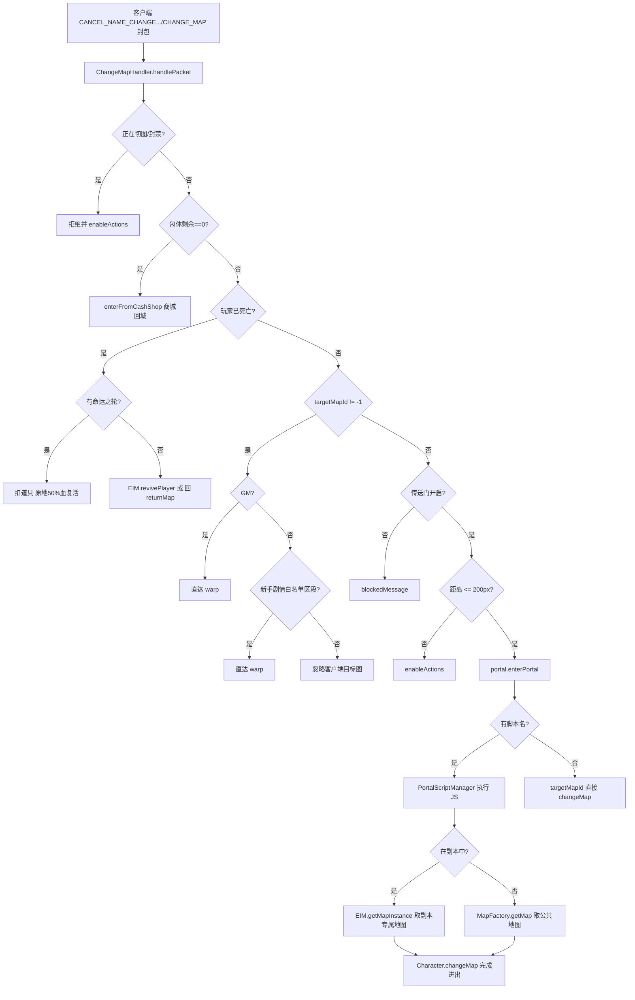
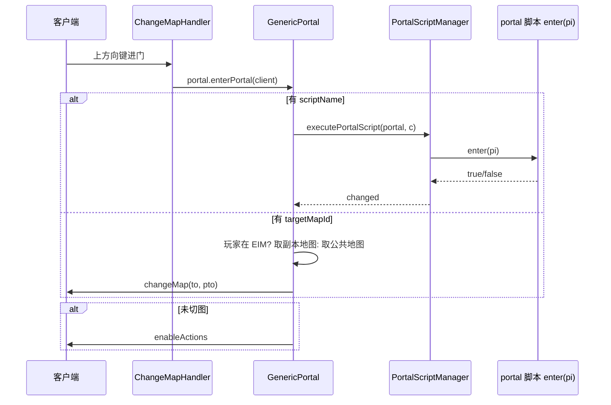
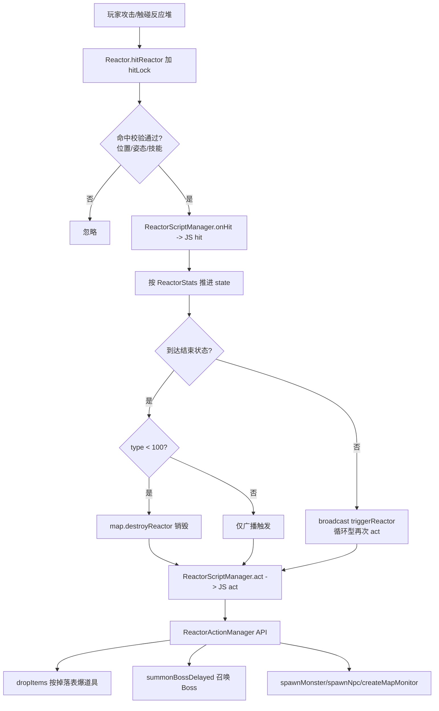
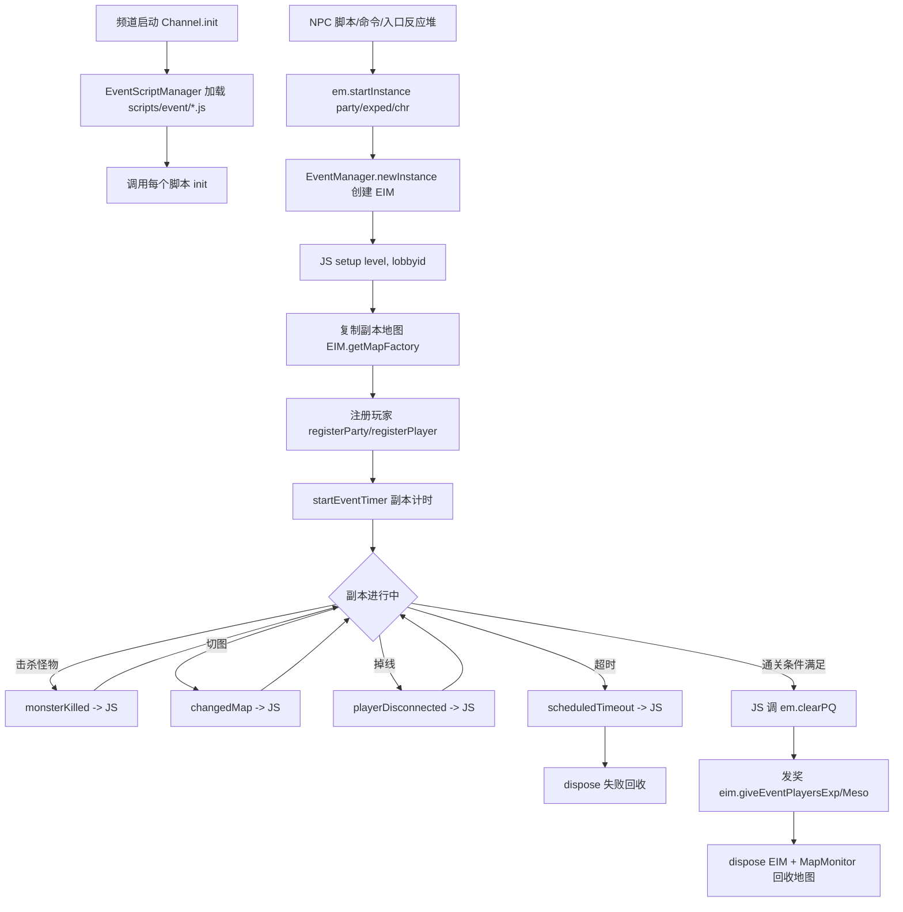

# 07 - 地图与副本

## 概述

地图（Map）是 BeiDou-Server 承载一切游戏玩法的空间容器：怪物刷新、道具掉落、传送门、反应堆、玩家商店/雇佣商店、迷你副本都在地图上发生。副本（Event/Instance）则是在普通地图体系之上"复制"出来的一套临时地图实例，由 JS 脚本驱动，涵盖 Boss 战、组队任务（PQ）、剧情任务、跨图交通工具（船/电梯）以及远征队玩法。本文覆盖：地图模型与玩家进出、传送门脚本、反应堆脚本、副本活动体系、远征队、小游戏。

---

## 1. 地图模型与玩家进出地图

### 业务规则

- 地图数据来自 WZ 文件（`Map.wz`），按 `channel + world` 维度懒加载缓存：第一次访问某地图时才解析 WZ 并构建 `MapleMap`，之后复用。
- 每张地图持有四类"地图对象"（MapObject）：玩家、怪物、NPC、道具掉落（MapItem），以及反应堆、门（Door）、召唤兽（Summon）、玩家商店、迷你游戏房间等特殊对象，统一按 `MapObjectType` 归类广播与检索。
- 玩家进图（`changeMap`）时：从旧图移除对象并广播消失包 → 写入新图对象表 → 广播生成包 → 触发进图回调（事件实例 `afterChangedMap`、地图时间限制计时等）。
- 玩家切图入口封包是 `ChangeMapHandler`：
  - 玩家处于"正在切图"或封禁状态时直接拒绝，并记录最近访问地图列表日志（防加速/瞬移外挂）；
  - 交易中切图自动取消交易；
  - 包体为空表示从点券商城返回（`enterFromCashShop`）；
  - 死亡状态下：有"命运之轮"道具则原地半血复活；否则先交给事件实例 `revivePlayer`（副本可自定义复活逻辑），默认回城（`returnMap`）；
  - GM 可无视校验直达任意地图；普通玩家只有在新手剧情图（冒险家/骑士团/战神/女巫塔等白名单 `divi` 区段）允许客户端指定的直达传送；
  - 传送门关闭（`getPortalStatus()==false`）时向客户端发送阻挡消息；
  - 距传送门位置超过平方距离 400000（约 200px）视为非法请求；
  - 最终统一走 `Portal.enterPortal(c)`（见第 2 节）。
- `MapleMap` 还负责：怪物重生（配合 `RespawnTask`）、掉落物生成与拾取（含队伍共享掉落）、地图所有权（`MapOwnershipTask`）、地图广播（含仅 GM 可见的 `broadcastGMPacket`）、时间限制（`timeLimit` 到期强制回 `forcedReturnMap`）、音乐/BGM 切换、雇佣商店与玩家商店摆放等。

### 负责类

| 职责 | 类 |
| --- | --- |
| 地图对象模型（38 类） | `gms-server/src/main/java/org/gms/server/maps/` 包：`MapleMap`（地图本体，4600+ 行）、`MapFactory`（WZ→MapleMap 构建）、`MapManager`（按 channel/EIM 缓存地图）、`MapObject`/`AbstractMapObject`/`MapObjectType`（对象基类）、`MapItem`（掉落物）、`MapPortal`/`GenericPortal`/`Portal`/`PortalFactory`（传送门）、`Door`/`DoorObject`（传送门技能门）、`Reactor`/`ReactorFactory`/`ReactorStats`/`ReactorDropEntry`（反应堆）、`HiredMerchant`（雇佣商店）、`PlayerShop`/`PlayerShopItem`（玩家商店）、`MiniGame`（小游戏房间）、`Mist`（烟雾）、`Summon`（召唤兽）、`MapEffect`/`MapleTVEffect`、`Foothold`/`FootholdTree`（地面碰撞）、`FieldLimit`（地图行为限制位）、`MapMonitor`（空副本地图回收）、`MiniDungeon`/`MiniDungeonInfo`、`SavedLocation`/`SavedLocationType`（回城点记录）、`Dragon`、`Kite` |
| 切图封包处理 | `ChangeMapHandler`、`ChangeMapSpecialHandler`（NPC/脚本触发的切图） |
| 玩家切图核心逻辑 | `Character.changeMap` / `warp` / `respawn`（`org.gms.client.Character`） |



### 关键源码路径

- `gms-server/src/main/java/org/gms/server/maps/MapleMap.java`
- `gms-server/src/main/java/org/gms/server/maps/MapFactory.java`（`loadMapFromWz`）
- `gms-server/src/main/java/org/gms/server/maps/MapManager.java`
- `gms-server/src/main/java/org/gms/net/server/channel/handlers/ChangeMapHandler.java`
- `gms-server/src/main/java/org/gms/server/maps/GenericPortal.java`（`enterPortal`）

---

## 2. 传送门（Portal 脚本）

### 业务规则

- 传送门分两类：
  1. **普通门**：WZ 中带 `targetMapId`/`target`（目标门名），无脚本，直接把玩家送过去；带粉笔板的玩家禁止进入自由市场。
  2. **脚本门**：WZ 中带 `script` 名，执行 `scripts/portal/<script>.js` 的全局函数 `enter(pi)`，返回 `true` 表示已处理切图，`false` 则保持原地。脚本通过 `PortalPlayerInteraction`（注入变量 `pi`）调用服务端能力：检查任务状态、检查道具、播放剧情、开关门、传送等。
- 若玩家处于副本（EIM），普通门的目标地图会改从 `EventInstanceManager.getMapFactory()` 取，保证副本队伍独享地图。
- 同图传送会记录 `setPetLootTeleportBeforePos`，用于宠物捡物传送的坐标补偿（BeiDou 自有优化）。
- 脚本支持热重载：GM 命令 `!reloadportals` / REST `/command/v1/reloadPortalsByGMCommand` 调用 `PortalScriptManager.reloadPortalScripts()` 清缓存重载（中英文脚本按 `scripts/` + `scripts-<lang>/` 覆盖合并）。

### 负责类

- `Portal`（接口）、`GenericPortal`（`enterPortal` 分派）、`MapPortal`、`PortalFactory`（按 WZ 属性产出普通门/脚本门）——`server/maps` 包。
- `PortalScriptManager`（加载/执行/重载 JS）、`PortalScript`（`enter(pi)` 约定）、`PortalPlayerInteraction`（脚本 API）——`scripting/portal` 包。
- 脚本目录：`gms-server/scripts/portal/`（英文基础）+ `gms-server/scripts-zh-CN/portal/`（中文覆盖）。



### 关键源码路径

- `gms-server/src/main/java/org/gms/scripting/portal/PortalScriptManager.java`
- `gms-server/src/main/java/org/gms/scripting/portal/PortalPlayerInteraction.java`
- `gms-server/src/main/java/org/gms/server/maps/GenericPortal.java`
- `gms-server/scripts/portal/`（如 `advice00.js`：进图教学提示）

---

## 3. 反应堆（Reactor）

### 业务规则

- 反应堆是地图上可被攻击/触碰的交互物：宝箱（掉道具）、机关门（打通才开路）、Boss 召唤祭坛（扎昆/闹钟等副本入口）、剧情必经障碍。
- 反应堆有 **状态机**：`ReactorStats` 记录每个 state 的可达下一状态、触发技能白名单、类型（如 type=2 只能从右侧攻击、type>=100 为"最终步骤物品触发"）。每次被攻击 `hitReactor`：
  1. `hitLock` 串行化；
  2. 校验攻击命中（角色位置/姿态/技能），GM debug 模式打印命中日志；
  3. `ReactorScriptManager.onHit(c, reactor)` 触发 JS 的 `hit` 回调；
  4. 按 WZ 状态表推进 state；到达结束状态时若类型 <100 则销毁（`map.destroyReactor`）并触发 `act` 回调；循环型反应堆（nextState==state）在原地重复触发。
- `ReactorScriptManager.act` 调用 `scripts/reactor/<id>.js` 的 `act(ra)`，`ReactorActionManager`（注入变量 `ra`）提供 `dropItems/sprayItems`（按 `ReactorDropEntry` 掉落表爆道具/金币）、`spawnMonster/summonBossDelayed`（Boss 召唤，如扎昆祭坛）、`createMapMonitor`（副本地图监控回收）、`spawnNpc` 等。
- 地图重置（`MapleMap.resetState/reactor` 重置）与 `RespawnTask` 周期协作，把死亡反应堆复活回初始状态。

### 负责类

- `Reactor`（状态机+击中流程）、`ReactorStats`、`ReactorFactory`、`ReactorDropEntry`——`server/maps`。
- `ReactorScriptManager`、`ReactorActionManager`——`scripting/reactor`。
- 脚本目录：`gms-server/scripts/reactor/`（以反应堆 ID 命名，如 `1002008.js`；`REACT Base.js` 为公共模板）。



### 关键源码路径

- `gms-server/src/main/java/org/gms/server/maps/Reactor.java`（`hitReactor`、`forceHitReactor`、`resetReactorActions`）
- `gms-server/src/main/java/org/gms/scripting/reactor/ReactorScriptManager.java`
- `gms-server/src/main/java/org/gms/scripting/reactor/ReactorActionManager.java`
- `gms-server/scripts/reactor/`

---

## 4. 副本活动（Event / EventInstanceManager）

### 业务规则

- 每个频道（`Channel`）持有一个 `EventScriptManager`，启动时按 `world.event_scripts` 配置批量加载 `scripts/event/*.js`（108 个脚本），调用每个脚本的 `init()`；加载失败或未注册的事件回落到 `0_EXAMPLE`（fallback）。
- 每个 JS 事件脚本对应一个 `EventManager`（脚本名 → 引擎绑定）。`EventManager` 提供：
  - `newInstance(name)`：创建 `EventInstanceManager`（EIM），即一次"副本实例"；同名实例占用期间抛 `EventInstanceInProgressException`，配合 **lobby（大厅）机制** 实现多队伍并行（`setup(level, lobbyid)` 中 `em.newInstance("Kerning"+lobbyid)`）。
  - `startInstance(...)` 一族重载：单人进入、队伍（Party）进入、远征队（Expedition）进入、公会排队（`addGuildToQueue`/`attemptStartGuildInstance`，用于 GuildQuest）、按难度进入。
  - `schedule(methodName, delay)`：定时回调 JS 的指定函数（如 `scheduledTimeout` 超时失败、`playerDisconnected` 掉线处理），返回 `EventScheduledFuture` 可取消。
  - `clearPQ(eim)`：通关结算（给奖励、释放大厅、回收实例）。
- **EIM 是副本的运行时容器**：持有专属 `MapManager`（副本地图与公共地图隔离）、玩家注册表、怪物击杀计数、副本属性（`setProperty/getProperty`）、副本计时器（`startEventTimer/restartEventTimer/stopEventTimer`）。玩家进图时若在副本中，`MapManager` 会复刻地图对象，`changedMap/afterChangedMap/monsterKilled/playerKilled/revivePlayer/leftParty/playerDisconnected` 等生命周期事件全部反射回调到 JS 脚本函数。
- 副本地图无人且脚本 dispose 后，由 `MapMonitor` 监控回收，防止地图泄漏。
- 脚本分类（`scripts/event/`）：
  - **PQ 组队任务**：`KerningPQ`、`LudiPQ`、`LudiMazePQ`、`OrbisPQ`、`HenesysPQ`、`EllinPQ`、`MagatiaPQ_A/Z`、`PiratePQ`、`CWKPQ`、`AmoriaPQ`、`BossRushPQ`、`TreasurePQ`、`CafePQ_1~6`、`HolidayPQ_1~3` 等；
  - **Boss 战**：`ZakumBattle`、`HorntailBattle`、`PinkBeanBattle`、`BalrogBattle(_Easy)`、`PapulatusBattle`、`ScargaBattle`、`ShowaBattle`、`LatanicaBattle`、`TD_Battle1~5`、`ElementalBattle`（女皇）等，配合 `ZakumPQ/HorntailPQ` 前置任务；
  - **剧情/转职**：`3rdJob_*`（五职业三转试炼）、`Cygnus_Magic_Library`、`Puppeteer`、`DollHouse`、`RescueGaga`；
  - **全服活动**：`2xEvent`（双倍）、`Ola/Ola2`（跑步）、`Fitness`（健身爬绳）、`SnowballEvent`、`Coconut`（见第 6 节小游戏）、`OxQuiz`；
  - **交通工具**：`Boats`、`Trains`、`Subway`、`Elevator`、`Genie`、`Hak`、`AirPlane`、`Cabin`、`4jship/4jaerial/4jsuper`。

### 负责类

- `EventScriptManager`（按频道加载全部事件脚本，`Channel.reloadEventScriptManager()` 支持热重载）
- `EventManager`（脚本网关：实例/调度/属性/大厅/排队）
- `EventInstanceManager`（副本实例运行时 + 生命周期事件反射回调）
- `EventScheduledFuture`、`scheduler/` 子包（副本计时调度）
- `MapMonitor`（空副本地图回收）、`MapManager`（EIM 专属地图工厂）
- 脚本目录：`gms-server/scripts/event/` + `gms-server/scripts-zh-CN/event/`



### 关键源码路径

- `gms-server/src/main/java/org/gms/scripting/event/EventManager.java`
- `gms-server/src/main/java/org/gms/scripting/event/EventInstanceManager.java`
- `gms-server/src/main/java/org/gms/scripting/event/EventScriptManager.java`
- `gms-server/src/main/java/org/gms/net/server/channel/Channel.java`（`reloadEventScriptManager`）
- `gms-server/scripts/event/KerningPQ.js`（代表性 PQ：`init/setup/scheduledTimeout` 结构）

---

## 5. 远征队（Expedition）

### 业务规则

- 远征队是超大队伍（最多 30 人、由多个 6 人小队组成）的 Boss 挑战组织形式，区别于普通 Party。
- `ExpeditionType` 预定义各 Boss 远征的规模门槛（人数上下限、等级上下限、报名等待分钟数），如 `ZAKUM(6,30,50,255,5)`、`HORNTAIL(6,30,100,255,5)`、`ARIANT(2,7,20,30,5)`、`PINKBEAN/CWKPQ` 等。
- 流程：
  1. 队长在报名 NPC 处 `beginRegistration()`（等待期，其他玩家可报名/退队，被踢出的进入黑名单 `ban`）；
  2. 等待期满 `finishRegistration()` → `start()`，通过 `EventManager.startInstance(exped)` 进入对应 Boss 副本（EIM `registerExpedition`）；
  3. 副本中击杀 Boss 时 `monsterKilled` 记入 `ExpeditionBossLog`（每日/每周 Boss 次数限制，`aaf3fd95a`、`1c9dbfa3c` 提交修复了周/日清理与刷新时间查询）；
  4. 结束 `dispose` 时从频道远征注册表移除并写 Boss 日志。
- `warpExpeditionTeam*` 系列方法支持整队传送（入口图 → 战斗图）。

### 负责类

- `Expedition`（报名/成员/黑名单/生命周期）、`ExpeditionType`（类型枚举）、`ExpeditionBossLog`（Boss 击杀日志）
- `EventManager.startInstance(Expedition)` / `EventInstanceManager.registerExpedition`
- 脚本侧：`scripts/event/ZakumBattle.js` 等通过 `em.startInstance(exped)` 衔接。

```mermaid
stateDiagram-vps
    [*] --> 报名中: 队长 beginRegistration
    报名中 --> 报名中: addMember/removeMember/ban
    报名中 --> 进行中: 等待期满 finishRegistration -> start
    进行中 --> 进行中: warpExpeditionTeam 整队传送
    进行中 --> 进行中: monsterKilled 写 BossLog
    进行中 --> [*]: 副本 dispose
```

### 关键源码路径

- `gms-server/src/main/java/org/gms/server/expeditions/Expedition.java`
- `gms-server/src/main/java/org/gms/server/expeditions/ExpeditionType.java`
- `gms-server/src/main/java/org/gms/server/expeditions/ExpeditionBossLog.java`

---

## 6. 小游戏（MonsterCarnival、Snowball、Coconut 等）

### 业务规则

- **怪物嘉年华 CPQ**（`MonsterCarnival`/`MonsterCarnivalParty`，`server/partyquest` 包）：两支队伍（红/蓝）在竞技场通过召唤怪物给对方"上压力"赚取 CP（Carnival Points），可用 CP 召唤（`summonR/summonB`）、部署守卫（`canGuardianR/canGuardianB`）、使用技能干扰；限时结束按 CP 判定胜负等级（A/B/C/D），`complete()` 结算奖励；掉线（`playerDisconnected`）与退队（`leftParty`）有各自的判负/重整规则；`cpq1` 标志区分 30/50 级两档场地。
- **雪球大战 Snowball**（`server/events/gm/Snowball`）：GM 活动玩法。两队各推一颗雪球（`hit(what, damage)`：打雪球推进位置、打对方雪人降低其 HP 干扰），先到终点获胜；`startEvent` 启动、`warpOut` 清场；配合事件脚本 `scripts/event/SnowballEvent.js` 驱动。
- **椰子大战 Coconut**（`server/events/gm/Coconuts`）：击打场地椰子（`hit()` 计数、`isHittable` 冷却控制），配合 `scripts/event/Coconut.js` 结算队伍得分。
- **通用小游戏房间**（`server/maps/MiniGame`）：玩家开设 OMOK（五子棋）/记忆配对房间，密码校验（`checkPassword`）、房主/挑战者（`addVisitor/isVisitor`）、开局与胜负结算（`MiniGameResult`），关闭房间（`closeRoom`）通知双方；入口是玩家互动 NPC（迷你游戏 NPC）。
- **猜拳 RockPaperScissor**（`server/minigame/RockPaperScissor`）：与 NPC 猜拳的小游戏，`answer/nextRound/timeOut/reward/dispose` 完成回合与奖励。

```mermaid
flowchart TD
    subgraph CPQ 怪物嘉年华
        A1[两队在 CPQ 地图报名] --> A2[MonsterCarnival 创建红蓝队]
        A2 --> A3[击杀对方召唤怪赚 CP]
        A3 --> A4[CP 消费: summonR/B 召唤 / Guardian 守卫 / 干扰]
        A4 --> A5{时间到}
        A5 --> A6[complete 按 CP 定胜负等级 A/B/C/D 发奖]
    end
    subgraph GM 活动
        B1[GM startevent/startmapevent] --> B2[Snowball.startEvent / Coconuts]
        B2 --> B3[hit 推进雪球/敲椰子]
        B3 --> B4[到终点/时间到 结算 warpOut]
    end
    subgraph 房间小游戏
        C1[玩家开 MiniGame 房间] --> C2{密码?}
        C2 --> C3[挑战者 addVisitor]
        C3 --> C4[OMOK/配对对局]
        C4 --> C5[MiniGameResult 结算 closeRoom]
        C5 --> C6[RPS: RockPaperScissor 与 NPC 猜拳]
    end
```



### 关键源码路径

- `gms-server/src/main/java/org/gms/server/partyquest/MonsterCarnival.java`、`MonsterCarnivalParty.java`
- `gms-server/src/main/java/org/gms/server/events/gm/Snowball.java`、`Coconuts.java`
- `gms-server/src/main/java/org/gms/server/maps/MiniGame.java`
- `gms-server/src/main/java/org/gms/server/minigame/RockPaperScissor.java`
- `gms-server/scripts/event/SnowballEvent.js` 等活动脚本
