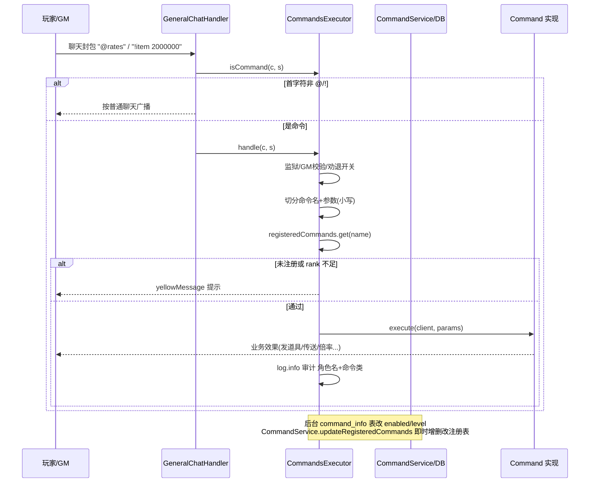
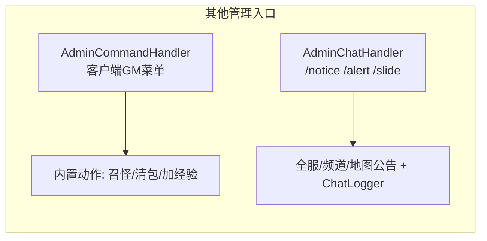

# 08 - 命令系统

## 概述

命令系统是玩家与 GM 在游戏内聊天框触发服务端能力的统一入口：玩家用 `@` 前缀触发玩家命令（查询倍率、排名、报告 Bug 等），GM 用 `!`（或 `@`）触发 GM 命令（发道具、封号、刷怪、调倍率、关服等）。系统采用「注册表 + 权限分级」模型：所有命令继承统一抽象基类 `Command`，由单例 `CommandsExecutor` 注册并按 gm0~gm6 七个权限等级分层；命令开关与等级持久化在数据库 `command_info` 表，可在管理后台（gms-ui 的"命令查询"页面）在线启停和调整等级，调整结果即时写回内存注册表。

---

## 1. 命令框架

### 业务规则

- **命令抽象**：`Command` 是抽象基类（Lombok `@Data`），携带 `rank`（所需 GM 等级）与 `description`（帮助文案），核心方法 `execute(Client client, String[] params)`；辅助方法 `joinStringFrom` 用于把参数拼回整句文本。
- **前缀识别**：`CommandsExecutor.isCommand(client, content)` —— 玩家命令前缀固定 `@`；GM 额外可用 `!`。
- **注册表**：`CommandsExecutor`（单例）维护 `registeredCommands: HashMap<String语法小写, Command实例>` 与 `commandsNameDesc: List<名称列表, 描述列表>`（按等级分组，供 `!help` 与后台查询）。注册时同名语法冲突打 warn 并跳过；命令实例只创建一次（避免早期版本每次调用重建实例的性能问题）。
- **等级分层**（gm0~gm6）：
  - **gm0（25 个类）玩家命令**：`help/commands`、`rates`、`showrates`、`online`、`ranks`、`str/dex/int/luk`（加属性点）、`gacha`、`joinevent/leaveevent`、`reportbug`、`dispose`（卡脚本自救）、`changel`（切语言）、`enableauth`、`toggleexp`、`mylawn`、`points`、`uptime`、`time`、`credits`、`droplimit`、`equiplv` 等；
  - **gm1（6）实习 GM 查询**：`bosshp`、`mobhp`、`whatdropsfrom`、`whodrops`、`buffme`、`goto`；
  - **gm2（39）基础 GM**：`item/drop`（发道具）、`level/levelpro`、`sp/ap/empowerme/maxstat/maxskill`、`warp/warphere(summon)/warpto(reach/follow)/warpmap/warparea`、`heal/buff/buffmap`、`jail/unjail`、`job`、`dc`、`cleardrops/clearslot`、`search/id`、`gmshop`、`hide/unhide`、`recharge`、`gachalist/loot`、`mobskill`、`bomb`、`setslot/setstat`、`unbug`、`whereami`、`resetskill`、`clearsavelocs`；
  - **gm3（57）管理 GM**：`ban/unban`、`givenx/givevp/givems/giverp`、`spawn`、`kill/killall/killmap`、`debuff`、`fly`、`mutemap`、`checkdmg`、`reload*`（events/drops/portals/map/shops 热重载）、`openportal/closeportal`、`notice`、`startevent/endevent`、`startmapevent/stopmapevent`、`startquest/completequest/resetquest`、`timer/timermap/timerall`、`fame`、`monitor/monitors/ignore/ignored`、`pe`、`seed`、`rip`、`night`、`npc`、`face/hair`、`expeds`、`online2`、`hpmp/maxhpmp/maxenergy`、`hurt/healmap/healperson`、`pos`、`inmap`、`music`、`togglecoupon`、`togglewhitechat`；
  - **gm4（25）运营级**：全服倍率 `exprate/mesorate/droprate/bossdroprate/questrate/travelrate/fishrate`、`servermessage`、`proitem/seteqstat`、`itemvac/forcevac`、Boss 直召 `zakum/horntail/pinkbean/pap/pianus/cake`、玩家 NPC `playernpc/pnpc/pmob` 系列、`warptolife`；
  - **gm5（6）调试级**：`debug`、`set`、`showpackets`、`showmovelife`、`showsessions`、`iplist`；
  - **gm6（17）超管级**：`setgmlevel`、`shutdown`、`saveall`、`dcall`、`getacc`、`warpworld`、`mapplayers`、`clearquest(cache)`、`supplyratecoupon`、`spawnallpnpcs/eraseallpnpcs`、动态频道/世界 `addchannel/addworld/removechannel/removeworld`、`devtest`。
  - 合计 **175 个命令类**、约 180 个可用语法（含别名，如 `help|commands`、`warphere|summon`、`warpto|reach|follow`）。
- **数据库化开关**：`Server.init()` 调 `CommandsExecutor.loadCommandsExecutor()` 时，实际命令清单从 `command_info` 表（`CommandService.loadCommands`）读取——只有表内 `enabled` 的语法才注册进内存，且 `level` 决定其权限等级。后台改库后 `CommandService.updateRegisteredCommands` 增量修正注册表与 `commandsNameDesc`，无需重启。

### 负责类

| 职责 | 类 / 目录 |
| --- | --- |
| 命令抽象 | `org.gms.client.command.Command` |
| 注册与执行 | `org.gms.client.command.CommandsExecutor`（单例；`registerLv0~Lv6Commands` 七段注册） |
| 命令实现 | `org.gms.client.command.commands.gm0` ~ `gm6` 七个包 |
| 命令持久化/后台同步 | `org.gms.service.CommandService`（`command_info` 表 ↔ 内存注册表双向同步） |
| 入口分发 | `GeneralChatHandler`（`@`/`!`）、`AdminCommandHandler`/`AdminChatHandler`（客户端管理菜单） |

### 关键源码路径

- `gms-server/src/main/java/org/gms/client/command/Command.java`
- `gms-server/src/main/java/org/gms/client/command/CommandsExecutor.java`
- `gms-server/src/main/java/org/gms/client/command/commands/gm0/` ~ `gm6/`
- `gms-server/src/main/java/org/gms/service/CommandService.java`

---

## 2. 聊天入口 → 命令的执行链

### 业务规则

- **普通聊天入口**：客户端发送聊天封包，`GeneralChatHandler.handlePacket` 读到文本后先调 `CommandsExecutor.isCommand(c, s)` 判断首字符：非命令则按普通聊天广播（含喇叭/粉笔板等逻辑）；是命令则 `CommandsExecutor.handle(c, s)`。
- **`handle` 内部（`handleInternal`）校验顺序**：
  1. 监狱地图（`MapId.JAIL`）内非 GM 禁用一切命令；
  2. 非GM 玩家使用 `@` 且配置 `deterred_player_command` 打开时，拒绝玩家命令（"劝退"开关）；
  3. 按首个空格切出命令名（转小写）与参数（参数整体转小写），整句后半段存入 `setLastCommandMessage`（供后续取证）；
  4. 查注册表：未注册提示"命令不存在"；`player.gmLevel() < command.getRank()` 提示权限不足；
  5. 执行 `command.execute(client, params)` 并以 `log.info` 记录「角色名 + 命令类名」审计日志。
- **管理菜单入口**：客户端自带的 GM 管理界面（右键玩家菜单等）走 `AdminCommandHandler`——只允许 `isGM()`，按 mode 分派：0x00 召唤怪包、0x01 清空背包格、0x02 加经验等内置管理动作（不走 `Command` 注册表）；`AdminChatHandler` 处理 `/noticeall`、`/alertch`、`/slidemap` 等系统公告模式（全服/本频道/本地图广播 `serverNotice`），并写 `ChatLogger` 审计。
- **权限获取**：`setgmlevel`（gm6 命令）与账号表 GM 等级决定 `player.gmLevel()`；隐藏 GM（`hide`）不影响权限。

### 关键源码路径

- `gms-server/src/main/java/org/gms/net/server/channel/handlers/GeneralChatHandler.java`
- `gms-server/src/main/java/org/gms/net/server/channel/handlers/AdminCommandHandler.java`
- `gms-server/src/main/java/org/gms/net/server/channel/handlers/AdminChatHandler.java`
- `gms-server/src/main/java/org/gms/client/command/CommandsExecutor.java`（`handleInternal`、`isCommand`）

---

## 3. 代表性命令举例

| 等级 | 命令 | 业务效果 |
| --- | --- | --- |
| gm0 | `@rates` / `@showrates` | 查看当前世界与个人经验/金币/掉落倍率 |
| gm0 | `@dispose` | 脚本/会话卡死自救（清理 NPC 会话锁） |
| gm0 | `@joinevent` / `@leaveevent` | 报名/退出 GM 开启的全服活动 |
| gm2 | `!item <id> [数量]` | 向自己背包发放道具（`ItemCommand`） |
| gm2 | `!warp <玩家/地图>` / `!warphere` | 传送自己 / 召唤玩家 |
| gm3 | `!ban <玩家> [理由]` / `!unban` | 封禁/解封账号（联动 `AccountService`、雇佣商店强制收店，见 10 篇） |
| gm3 | `!reloadevents` / `!reloadportals` / `!reloaddrops` | 热重载事件/传送门/掉落数据 |
| gm4 | `!exprate <倍率>` 等 7 个倍率命令 | 即时修改世界倍率（写 `World` 对象，全服生效） |
| gm4 | `!zakum` / `!horntail` / `!pinkbean` | 在当前位置直接召唤 Boss |
| gm6 | `!shutdown [分钟]` / `!dcall` / `!saveall` | 定时关服 / 全服断线 / 全服存档 |
| gm6 | `!addchannel` / `!addworld` | 运行期动态扩容频道/世界 |
