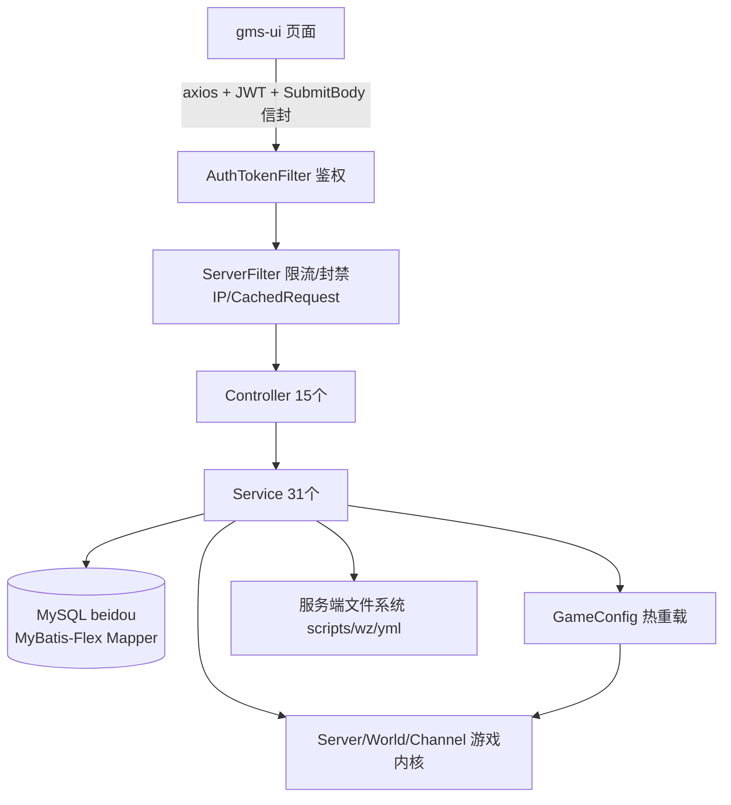
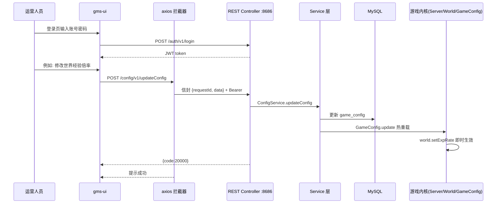

# 09 - GM 管理后台业务

## 概述

GM 管理后台由两部分组成：**gms-server 的 REST 层**（15 个 `controller` × 31 个 `service`，Spring Boot 3，端口 8686，JWT 鉴权，统一 `ResultBody`/`SubmitBody` 信封）与 **gms-ui 前端**（Vue 3 + Arco Design Pro，页面覆盖登录、仪表盘、账号管理、游戏运营九大模块）。后台让运营人员不进游戏即可完成：账号/角色管理、在线玩家干预、发放道具/点券/经验、物品栏增删改、掉落与全局掉落配置、NPC 商店与点券商城上下架、转蛋奖池配置、命令库开关、游戏参数热配置、自动封禁阈值调整、服务端脚本/配置文件在线编辑与服务器启停。

---

## 1. REST API 业务全景（15 Controller × 31 Service）

### 业务规则与接口清单

| Controller（路径前缀） | Service | 业务能力 |
| --- | --- | --- |
| `AuthController` `/auth` | `AuthService`、`UserDetailsServiceImpl` | JWT 登录/登出/刷新 token；`/auth/**` 免鉴权，其余经 `AuthTokenFilter` 校验 Bearer token |
| `ServerController` `/server` | `ServerService` | 服务器启停/重启/状态、大区与频道列表、版本号（详见第 10 篇） |
| `AccountController` `/account` | `AccountService` | 账号列表/注册/改资料（用户须验旧密码，GM 可改任意）、删除账号、重置在线状态、**封停/解封账号**（封停时联动强制收店雇佣商店） |
| `CharacterController` `/character` | `CharacterService` | **在线玩家列表**、账号下角色列表、删除角色、玩家个人倍率（expRate/mesoRate/dropRate）调整与重置 |
| `GiveController` `/give` | `GiveService` | 给玩家发放资源：type 0=nxCredit 点券、1=nxPrepaid 信用点、2=maplePoint 抵用券、3=mesos 金币、4=exp 经验、5=item 道具、6=equip 装备 |
| `InventoryController` `/inventory` | `InventoryService`、`ItemService` | 背包分类查询、按条件检索玩家、读取指定玩家背包物品、**修改/删除玩家背包物品**（在线走内存、离线走库） |
| `DropController` `/drop` | `DropService` | 怪物掉落与**全局掉落**的增删改查分页（热重载生效，配套命令 `!reloaddrops`） |
| `ShopController` `/shop` | `ShopService`、`NpcService` | NPC 商店列表、商品分页/详情/新增/更新/删除 |
| `CashShopController` `/cashShop` | `CashShopService`、`NxCodeService`、`NxCouponService`、`MtsService` | 点券商城分类树、分类分页商品、商品明细、**上架/下架/批量上架** |
| `GachaponController` `/gachapon` | `GachaponService`（配合 `server/gachapon`） | 转蛋奖池 CRUD、奖品 CRUD（`!gacha`/`@gacha` 玩家命令消费奖池） |
| `CommandController` `/command` | `CommandService` | 命令库（`command_info` 表）查询与启停/等级更新；复用 GM 命令代码做**事件/传送门/地图热重载** |
| `ConfigController` `/config` | `ConfigService` | `game_config` 参数：类型树、分页、增删改批量删、**从 yml 导入/导出 yml**；写库后经 `GameConfig` 热重载即时生效（世界倍率等直写 `World`） |
| `AutobanConfigController` `/autoban` | `AutobanConfigService` | 自动封禁检测项配置查询与更新（配合 `client/autoban` 检测引擎与 `AccountService` 封禁动作） |
| `FileController` `/file` | `FileTreeService` | 服务端文件树读取、单文件读写（编辑 JS 脚本、yml、wz xml 等），是"脚本在线改 + 命令热重载"闭环的基础 |
| `CommonController` `/common` | `CommonService`、`LangResourceService`、`MonsterBookService` 等 | 装备基础属性查询、全服在线人数、**资料查询**（按 id/名称查道具/怪物/NPC/地图/技能，供工作台搜索） |

其余 Service 为游戏内核直接使用、被上述业务复用：`FamilyService`、`HpMpAlertService`、`NameChangeService`、`NewYearCardService`、`NoteService`、`QuestService`、`WorldTransferService`（改名/转区/贺卡等异步业务在 `Server.init` 中批量落地）。

### 关键源码路径

- `gms-server/src/main/java/org/gms/controller/`（15 个 Controller）
- `gms-server/src/main/java/org/gms/service/`（31 个 Service）
- 通用层：`org/gms/model/dto/ResultBody.java`、`SubmitBody.java`、`org/gms/aop/`（鉴权/限流切面）、`config/SpringSecurityConfig.java`

---

## 2. gms-ui 页面业务

### 业务规则

前端路由（`src/router/routes/modules/`）与后端接口一一对应，API 封装在 `src/api/*.ts`，请求拦截器自动包 `{requestId, data}` 信封并附 Bearer token，响应码 `20000` 判成功，401 自动登出。

| 页面（`src/views/`） | 路由模块 | 业务 |
| --- | --- | --- |
| `login/index.vue` | — | 登录页：调 `/auth/v1/login` 换 JWT，语言切换（zh-CN/en-US） |
| `dashboard/workplace` | `dashboard.ts` | 工作台：服务在线状态（`/server/v1/online`）、启停/重启/自定义倒计时停服（`stopServerWithMsgAndInternal`）、版本号、世界/频道列表 |
| `dashboard/informationSearch` | `dashboard.ts` | 资料查询：`/common/v1/informationSearch` 按 id/名称查道具/怪物/NPC 等；装备基础属性、全服在线人数 |
| `account/list` | `account.ts` | 账号管理：列表/新增（`addForm`）/编辑（`updateForm`）/封停/解封/删除/重置在线状态；`charList` 展开账号下角色并支持删除、个人倍率调整（`player/index.vue` 为玩家详情视图） |
| `game/autoban` | `autoban.ts` | 自动封禁配置：检测项列表 + 更新阈值/开关（`/autoban/v1/getConfigList`、`updateConfig`） |
| `game/cashShop` | `cashShop.ts` | 点券商城：分类树浏览（`form/table` 组件）、商品上下架、批量上架 |
| `game/commandInfo` | `command.ts` | 命令查询：命令库列表、启停/改等级（即时生效），并触发事件/传送门/地图重载 |
| `game/config` | `config.ts` | 配置管理：`game_config` 类型树 + 分页编辑、新增/删除、yml 导入导出（Monaco 编辑器编辑 JSON 值） |
| `game/drop`（`index` + `global`） | `drop.ts` | 掉落配置：怪物掉落页与全局掉落页，增删改查 |
| `game/file` | `fileTree.ts` | 文件管理：服务端目录树、读取/保存文件内容（在线改脚本） |
| `game/gachapon` | `gachapon.ts` | 转蛋配置：奖池管理（`index/form`）+ 奖品管理（`reward`） |
| `game/inventory` | `inventory.ts` | 物品栏管理：`characterSelector` 选玩家 → `InventoryUI/table` 展示背包 → `inventoryEquipForm` 编辑装备属性，支持修改/删除 |
| `game/npcShop` | `npcShop.ts` | NPC 商店：商店列表 → 商品列表 → 商品增删改 |

### 关键源码路径

- `gms-ui/src/router/routes/modules/{account,dashboard,game}.ts`
- `gms-ui/src/api/*.ts`（与后端一一映射）、`gms-ui/src/api/interceptor.ts`（信封/鉴权/错误处理约定）
- `gms-ui/src/views/`（上表各页面）

---

## 3. 前后端对接流程

### 业务规则

- **部署模型**：开发态前端 8787 直连后端 8686（`CorsConfig` 放行）；生产态 `yarn build` 产出的 `dist/` 拷入 `gms-server/src/main/resources/static/`，由 8686 同源托管，`ServerManager` 启动时检测 `static/index.html` 打印前端地址。
- **调用约定**：POST 请求体 `{requestId: uuid, data: ...}`（`SubmitBody`），响应 `{code, message, requestId, data}`，成功码 `20000`；`responseType: blob` 走文件下载。
- 典型闭环示例——**在线改脚本并热生效**：`game/file` 页面读文件 → 改 JS → 保存（`/file/v1/tree/write`）→ `game/commandInfo` 页面点重载（`/command/v1/reloadEventsByGMCommand` 复用 `ReloadEventsCommand` 逻辑）→ 游戏内核 `EventScriptManager` 重载，无需重启。

### 关键源码路径

- `gms-ui/src/api/interceptor.ts`、`gms-server/src/main/java/org/gms/config/CorsConfig.java`
- `gms-server/src/main/java/org/gms/manager/ServerManager.java`（前端静态资源检测）
- `gms-server/src/main/java/org/gms/service/CommandService.java`（`reloadEventsByGMCommand` 等复用 GM 命令）
