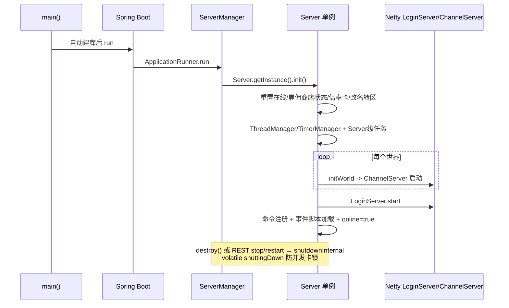
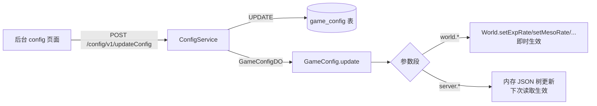
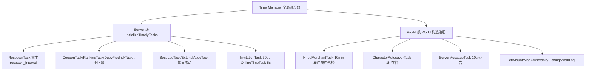
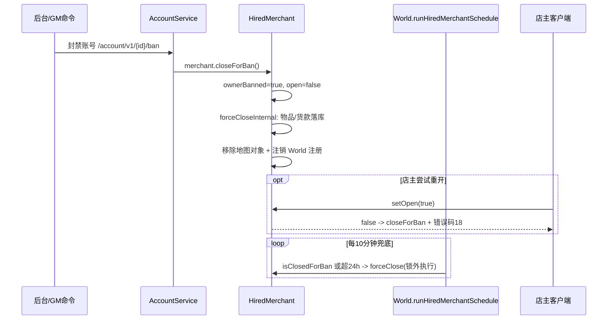

# 10 - 运维与生命周期

## 概述

BeiDou-Server 在一个 JVM 里同时运行 Spring Boot（REST 8686）与 Netty 游戏服（登录服 + 频道服），生命周期由 `ServerManager`（Spring 侧）与 `Server`（OdinMS 式单例，遗留侧）双向桥接：Spring 就绪后拉起游戏服，REST 又可在线控制游戏服启停/重启。运维相关的业务还包括：在线玩家管理、`game_config` 热重载（含世界倍率即时生效）、三层定时任务体系（Server 级 / World 级 / 事件级）、统一 i18n 日志，以及"账号封禁后雇佣商店必须立即停业"的营业类业务规则（commit `6c5a1c1f5`）。

---

## 1. 服务器启动 / 停止 / 重启

### 业务规则

- **启动**：`ServerApplication.main` 先手动解析 yml、自动建库（绕开库不存在时 Flyway 报错），再 `SpringApplication.run`。Spring 就绪后 `ServerManager.run()`（`ApplicationRunner`）调用 `Server.getInstance().init()`：
  1. 启动前重置脏状态：`accountService.resetAllLoggedIn()`（清在线标记）、`characterService.resetMerchant()`（清雇佣商店营业标记）；
  2. 清理过期现金物品、重载倍率卡（`nxCouponService`→`couponRates`）、落地挂起的改名/转区/新年贺卡；
  3. 加载玩家排名数据、自动封禁配置，主动跑一次每日清理（`BossLogTask`、`ExtendValueTask`）；
  4. 启动 `ThreadManager`、`TimerManager` 并注册 Server 级定时任务（见第 4 节）；
  5. 按配置世界数 `initWorld()`（每个 World 又启动自己的 Netty `ChannelServer` 与 World 级任务）；
  6. 启动 `LoginServer`（Netty，登录端口）、生成 opcode 名、`CommandsExecutor.loadCommandsExecutor()`（从 `command_info` 表注册命令）、各频道 `reloadEventScriptManager()` 加载副本脚本；最后置 `online = true` 并打印初始化耗时。
- **REST 控制**（`ServerController`）：
  - `GET /server/v1/startServer` → `Server.init()`（可在 stop 后再启）；
  - `GET /server/v1/stopServer` → `shutdownInternal(false)`：关各 World → 保存 HP/MP 告警数据 → 存档/踢人 → 重置 worlds → 停 `ThreadManager`、purge 定时任务（JVM 不退出，REST 仍可再 start）；
  - `GET /server/v1/restartServer` → `shutdownInternal(true)`：走完关停后 `instance = null; getInstance().init()` 原地重启；
  - `POST /server/v1/stopServerWithMsgAndInternal` → `shutdownWithMsgAndInternal`：向全服公告自定义消息并按倒计时（分钟）延迟关停；
  - `GET /server/v1/shutdown` → `SpringApplication.exit` + `System.exit(0)` 整个 JVM 退出；
  - `GET /server/v1/online` 查询游戏服状态。
- **并发关停保护**（BeiDou 关键修复）：`shutdownInternal` 可能被 `ShutdownCommand` 定时调度、`ConfigService` 虚拟线程 restart、Spring 关闭钩子 `ServerManager.destroy()`、REST stop/restart 并发调用。用 `volatile shuttingDown` 标志在 `synchronized` **外**快速返回，避免 Spring 关闭钩子卡锁导致"关了起不来"（端口不释放、JVM 退出超时）；restart 路径在末尾重置标志以便再次响应关停。
- `ServerManager.destroy()`（`DisposableBean`）保证 JVM 正常退出时也走一次优雅关停。

### 负责类

- `org.gms.manager.ServerManager`（Spring 侧桥接、静态持有 ApplicationContext 供遗留代码取 Bean）
- `org.gms.net.server.Server`（单例：`init()` / `shutdownInternal(boolean)` / `shutdownWithMsgAndInternal`）
- `org.gms.controller.ServerController` + `org.gms.service.ServerService`
- `org.gms.ServerApplication`（建库引导）

### 关键源码路径

- `gms-server/src/main/java/org/gms/manager/ServerManager.java`
- `gms-server/src/main/java/org/gms/net/server/Server.java`（`init` 约 L700-760、`shutdownInternal` 约 L1649-1720，含并发注释）
- `gms-server/src/main/java/org/gms/controller/ServerController.java`

---

## 2. 在线玩家管理

### 业务规则

- `Server` 维护 World 列表，`World` 内 `PlayerStorage` 按角色 ID 缓存在线角色；`Channel.getPlayerStorage()` 提供频道级检索。
- 后台查询：`POST /character/v1/online/list` → `CharacterService` 聚合各 World/Channel 的 `PlayerStorage` 输出在线名单（角色/账号/地图/等级等）。
- 干预手段：
  - REST：`/account/v1/{id}/ban` 封停（联动雇佣商店收店，见第 6 节）、`/give/v1/resource` 向在线玩家发点券/金币/经验/道具、`/inventory` 改在线玩家背包、`/character/v1/updateRate` 调个人倍率；
  - 命令：`!dc` 踢单人、`!dcall` 全服断线、`!online/!online2` 查在线、`!saveall` 全服存档。
- 掉线/登录清理由 `LoginCoordinatorTask`、`LoginStorageTask`、`disconnectIdlesOnLoginTask` 等周期任务兜底；角色保存生效路径是 `Character` 的 `saveCharToDB`（UPDATE 版本）。

### 关键源码路径

- `gms-server/src/main/java/org/gms/net/server/PlayerStorage.java`
- `gms-server/src/main/java/org/gms/service/CharacterService.java`、`controller/CharacterController.java`

---

## 3. GameConfig 热重载（含世界倍率即时生效）

### 业务规则

- `GameConfig` 为非 Spring 单例，启动时把 `game_config` 表加载为 JSON 树：`type → subType → code → {value, clazz}`（如 `world.0.exp_rate`、`server.global.WORLDS`），提供 `getServerXxx(key)` / `getWorldXxx(worldId, key)` 类型化取值。
- 热重载三入口：`add` / `remove` / `update`（均接收 `GameConfigDO`），由 `ConfigService`（后台 `/config/v1/*`）触发，先改内存树再同步语义：
  - **world 段的运营参数即时写回 `World` 对象**：`exp_rate`→`world.setExpRate`、`meso_rate`、`drop_rate`、`boss_drop_rate`、`quest_rate`、`travel_rate`、`fishing_rate`、`server_message`、`event_message`、`recommend_message`、`flag`（世界开闭状态）等——全服在线玩家立刻感知，无需重启或踢人；
  - 非 world 段参数在下次读取时自然生效（`getServerXxx` 每次查内存树）。
- 新增可热重载的运营参数走 `game_config`（可从 yml 导入，`/config/v1/importYml`），而不是加 `application.yml`。

### 关键源码路径

- `gms-server/src/main/java/org/gms/config/GameConfig.java`（`add/remove/update`，world 段 switch 写回 `World`）
- `gms-server/src/main/java/org/gms/service/ConfigService.java`

---

## 4. 定时任务体系（net/server/task 27 类 + TimerManager）

### 业务规则

- **TimerManager**（`server/TimerManager.java`）：基于 `ScheduledExecutorService` 的全局调度器，`register(task, delay, period)` 周期执行、`registerWithFixedDelay` 固定延迟执行、`purge()` 清理；`Server.init` 里每 5 分钟 purge 一次。
- **三层任务注册**：
  1. **Server 级**（`Server.initializeTimelyTasks()`）：`CharacterDiseaseTask`（状态更新，`update_interval`）、`CouponTask`（每小时倍率卡结算）、`RankingCommandTask`（5 分钟排名）、`RankingLoginTask`/`LoginCoordinatorTask`/`EventRecallCoordinatorTask`（小时级协调清理）、`LoginStorageTask`（2 分钟登录暂存）、`DueyFredrickTask`（每小时雇佣商人 Fredrick/快递结算）、`InvitationTask`（30 秒组队/交易邀请超时）、`RespawnTask`（怪物/反应堆重生，`respawn_interval`）、`OnlineTimeTask`（5 秒在线时长统计）、`BossLogTask`/`ExtendValueTask`（每日零点 Boss 日志与扩展值清理，首跑在 `init` 里主动执行一次）。
  2. **World 级**（`World` 构造时注册）：`PetFullnessTask`（1 分钟宠物饱食度）、`ServerMessageTask`（10 秒滚动公告）、`MountTirednessTask`（1 分钟坐骑疲劳）、`HiredMerchantTask`（10 分钟雇佣商店巡检/24 小时强制收店）、`TimedMapObjectTask`（1 分钟限时地图对象，烟雾/召唤过期）、`CharacterAutosaverTask`（1 小时自动存档）、`WeddingReservationTask`（婚礼预约，`wedding_reservation_interval`）、`MapOwnershipTask`（20 秒地图所有权判定）、`CharacterHpDecreaseTask`（中毒/Hp 扣减）、`FamilyDailyResetTask`（家族每日重置）、`FishingTask`（钓鱼结算）、`PartySearchTask`（组队搜索同步）。
  3. **事件/地图级**：`scripting/event/scheduler` 与 EIM 内部 `schedule` 回调 JS（见第 07 篇）。
- 27 个任务类均实现 `Runnable`，部分继承 `BaseTask`；任务内部通过 `ServerManager.getApplicationContext().getBean(...)` 取 Spring Bean（如 HpMpAlertService），避免遗留层与 Spring 强耦合。
- 关停时 `TimerManager.purge()` 与 `ThreadManager.stop()` 停掉全部周期任务。

### 关键源码路径

- `gms-server/src/main/java/org/gms/net/server/task/`（27 个任务类）
- `gms-server/src/main/java/org/gms/server/TimerManager.java`
- 注册点：`net/server/Server.java`（`initializeTimelyTasks`）、`net/server/world/World.java`（约 L254-261）

---

## 5. 日志与 i18n

### 业务规则

- **日志框架**：log4j2（排除 spring-boot 默认日志）；游戏服与 REST 层统一 SLF4J API，日志目录 `gms-server/logs/`。
- **i18n 强制**：面向人的日志/异常/提示文案一律走 `src/main/resources/i18n/{exception,log,message}_{en_US,zh_CN}.properties`，通过 `I18nUtil.getLogMessage/getExceptionMessage/getMessage` 取值，禁止硬编码中英文字面量（新增运维类文案要同时补两份资源文件，如 `6c5a1c1f5` 同时改了 `log_en_US/zh_CN.properties` 各 8 条）。
- 异常统一 `BizExceptionEnum` + 全局异常处理，REST 错误码随 `ResultBody` 返回前端展示；Jackson 时区固定 `Asia/Shanghai`。
- 审计类日志：GM 命令执行（`CommandsExecutor` 记录角色+命令类）、GM 公告（`ChatLogger`）、切图外挂嫌疑（`ChangeMapHandler` 最近访问地图列表）。

### 关键源码路径

- `gms-server/src/main/java/org/gms/util/I18nUtil.java`
- `gms-server/src/main/resources/i18n/`
- `gms-server/src/main/java/org/gms/config/I18nConfig.java`

---

## 6. 账号封禁后的雇佣商店停业（commit `6c5a1c1f5`）

### 业务规则

**问题**：封禁账号后，其线下"雇佣商店"（HiredMerchant，店主离线仍摆摊营业的 NPC 商店）仍继续营业，可被其他玩家购买，违反封禁语义。

**业务规则（修复后）**：

1. **封禁即收店**：`AccountService` 封禁账号时遍历该账号所有角色，若存在营业中的雇佣商店则调 `HiredMerchant.closeForBan()`——置 `ownerBanned = true`、`open = false`，并在**店主客户端锁 + 物品锁**保护下 `forceCloseInternal()`：把店内物品/金币结算落库、从地图移除商店对象、从 World 注册表注销。
2. **重开拦截**：店主尝试重新开店（`PlayerInteractionHandler` 或 `Character` 交互入口 `setOpen(true)`）时，若账号已封禁则开店失败返回 `getMiniRoomError(18)` 并再次 `closeForBan()`；已有 `isClosedForBan()` 标记的商店，交互入口直接收店并断开与店主关联。
3. **定时兜底**：`World.runHiredMerchantSchedule()`（`HiredMerchantTask` 每 10 分钟驱动）巡检所有在册商店：`isClosedForBan() || 营业超过 144 个巡检周期（24 小时）` 的统一收集后 `forceClose()`；收店动作放在**注册表锁外**执行，避免"持注册表锁等待客户端/物品锁"与店主操作互锁。
4. **结算语义**：封禁收店（`ownerBanned=true`）不做"归还店主"分支，商品与货款走落库结算，店主后续解封后按 Fredrick（雇佣商人）流程取回；`closing` CAS 标志保证收店幂等，保存失败时保留注册由定时任务重试。
5. 正常营业（非封禁）仍按原规则：店主离线摆摊 24 小时上限、`Character.visitHiredMerchant` 店主回访自动续开（未封禁时）。

### 关键源码路径

- `gms-server/src/main/java/org/gms/service/AccountService.java`（封禁联动收店）
- `gms-server/src/main/java/org/gms/server/maps/HiredMerchant.java`（`closeForBan/forceClose/forceCloseInternal/setOpen`）
- `gms-server/src/main/java/org/gms/net/server/world/World.java`（`runHiredMerchantSchedule`）
- `gms-server/src/main/java/org/gms/client/Character.java`（`visitHiredMerchant` 封禁分支）
- `gms-server/src/main/java/org/gms/net/server/channel/handlers/PlayerInteractionHandler.java`（开店拦截）
