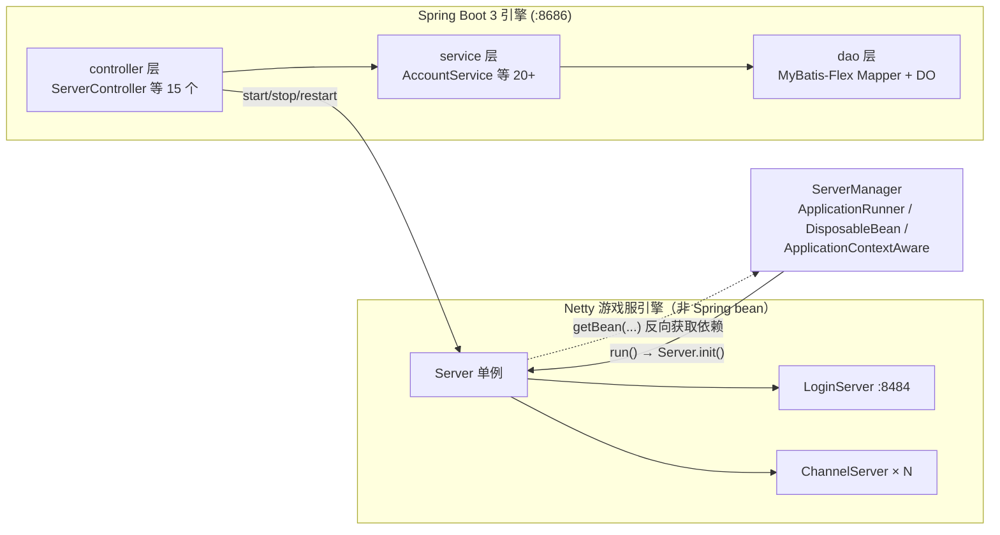
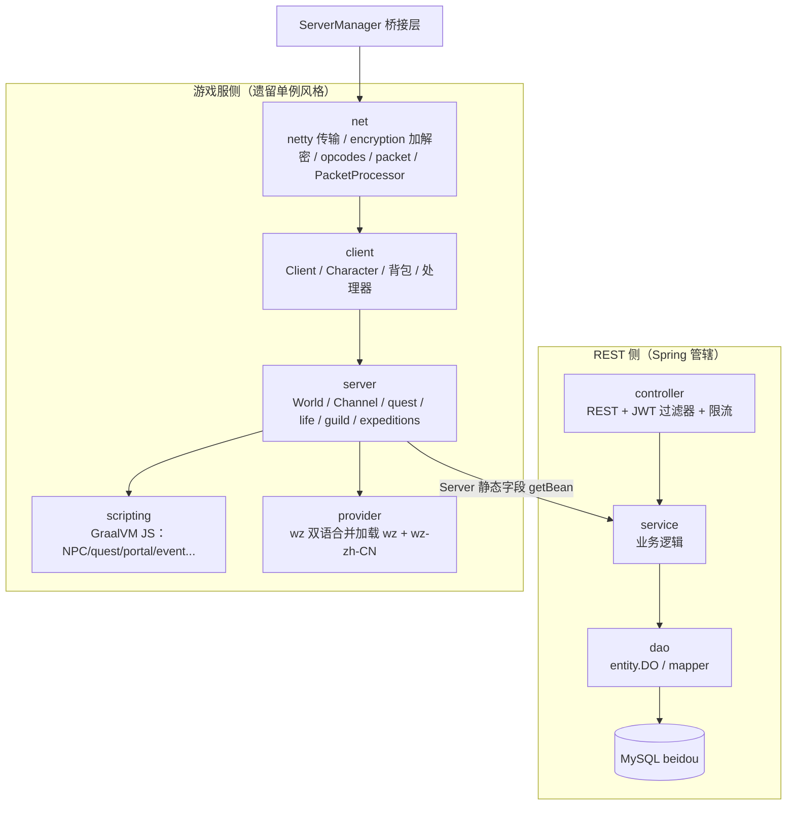
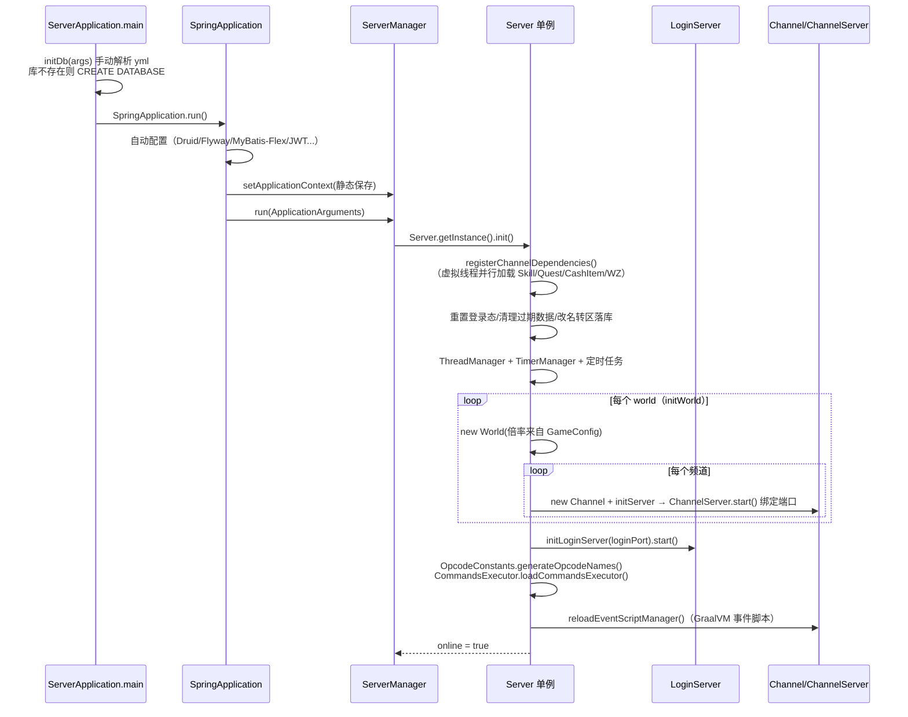
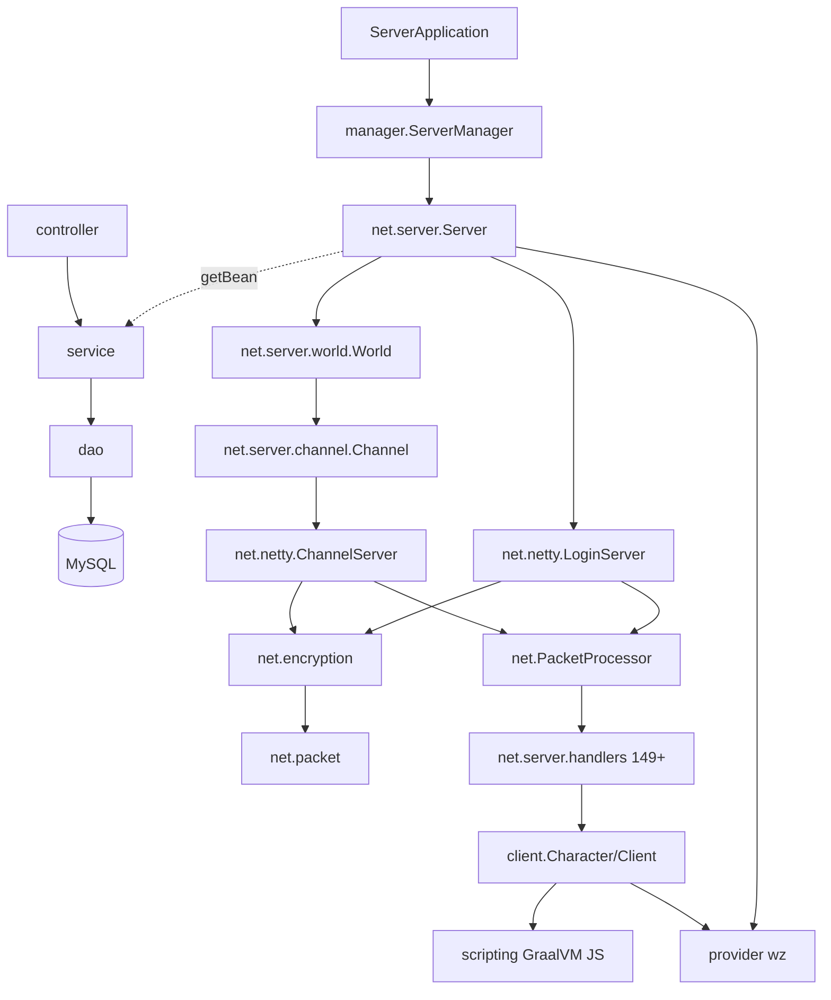

# 01 总体架构

> 模块路径：`org.gms`（入口）、`org.gms.manager`、`org.gms.net.server`、`org.gms.net.netty`、`org.gms.controller/service/dao`、`org.gms.scripting`、`org.gms.provider`
> 涉及类数：核心 5 类（`ServerApplication`、`ServerManager`、`Server`、`LoginServer`、`ChannelServer`），关联 controller 15 / service 20+ / 整个 `net.server` 树
> 依赖模块：Spring Boot 3（Web/JWT/SpringDoc）、MyBatis-Flex + Druid + MySQL 8、Flyway、Netty 4、GraalVM JS、Fastjson2、Lombok

## 1. 双引擎同进程架构

BeiDou-Server 在**同一个 JVM 进程**内同时运行两个"引擎"：

1. **Spring Boot 3 引擎**（端口 8686）：REST API、JWT 鉴权、MyBatis-Flex 持久层、Flyway 迁移、Swagger，以及托管 `gms-ui` 构建产物的静态资源。
2. **Netty 游戏服引擎**（端口 8484 登录 + 每频道一个端口）：OdinMS/Cosmic 血统的遗留游戏逻辑（`net/server/client/scripting/provider` 各包）。

两个引擎之间靠 [`org.gms.manager.ServerManager`](../../../gms-server/src/main/java/org/gms/manager/ServerManager.java) 单向桥接：

- **Spring → 遗留**：`ServerManager` 实现 `ApplicationRunner`，在 Spring 容器就绪后调用 `Server.getInstance().init()` 拉起 Netty 游戏服；实现 `DisposableBean.destroy()` 调用 `Server.getInstance().shutdownInternal(false)` 关服。
- **遗留 → Spring**：`ServerManager` 同时实现 `ApplicationContextAware`，把 `ApplicationContext` 存进**静态字段**。`org.gms.net.server.Server` 不是 Spring bean，它的静态字段直接通过 `ServerManager.getApplicationContext().getBean(...)` 反向抓取 13 个 Spring service（`NpcService`、`AccountService`、`CharacterService` 等），见 `Server.java` 第 163–175 行。
- **REST 在线控制**：`ServerController` 暴露 `/server/v1/startServer`、`/stopServer`、`/restartServer`、`/online`，可以不重启 JVM 地控制游戏服生命周期。

这种"双引擎 + 静态上下文反向取 bean"的设计是历史包袱与现实需求的折中：遗留代码（`net/server/client/scripting`）保持 OdinMS 单例风格不做注入改造，而新运营功能（账号、充值、后台管理）全部走 Spring 栈。

## 2. 整体分层

要点：

- **REST 侧**遵循标准 `controller → service → dao` 三层，接口路径带版本段（`/{controller}/{ApiConstant.LATEST}/{action}`），响应统一 `ResultBody<T>`（成功码 20000）。
- **游戏服侧**保持 OdinMS 的 `net → client → server` 调用链：网络层解出 `InPacket` 后由 `Client.channelRead` 分发给 handler，handler 操作 `Character`/`Map` 等领域对象，再经 `PacketWriter` 系列回写响应。
- 两层共享的持久化只有 `dao` 层和 JDBC 遗留 SQL；游戏运行时数据（公会、好友、排名、频道拓扑）缓存在 `Server`/`World` 内存结构中，由 `net/server/task` 定时任务落地。

## 3. 启动流程

关键细节（均出自源码）：

1. **自动建库**（`ServerApplication.initDb`）：在 `SpringApplication.run` **之前**用 SnakeYAML 手动解析 `application.yml`（优先级：JVM 参数 > `--spring.config.location` 等启动参数 > 环境变量 > jar 内 yml），连 `mysql` 系统库执行 `SHOW DATABASES LIKE 'beidou'`，不存在则 `CREATE DATABASE ... utf8mb4`。原因是 `FlywayAutoConfiguration`/`HibernateJpaAutoConfiguration` 会在拿到数据源时立刻要连接，库名不存在会启动失败——只能抢在自动配置之前建库。
2. **Spring 就绪回调**：`ServerManager.run()` 调 `Server.getInstance().init()`，随后打印 BeiDou 版本号，并根据 Swagger 开关、`static/index.html` 是否存在决定打印哪些访问地址提示。
3. **`Server.init()`**（`Server.java` 第 671 行起）：先 `registerChannelDependencies()` 把 `NoteService`/`FredrickProcessor` 注入 `PacketProcessor`；再用 `Executors.newVirtualThreadPerTaskExecutor()`（JDK21 虚拟线程）并行加载技能、商城物品、任务、技能书信息；随后做一串数据修复（重置登录态、清空过期兑换码、执行改名/转区、加载排名与自动封禁配置）；启动 `ThreadManager` 与 `initializeTimelyTasks()`；按 `GameConfig` 里的 world 数量循环 `initWorld()`；最后 `initLoginServer(loginPort)` 拉起登录服，生成 opcode 名称表，加载管理员命令与事件脚本，置 `online = true`。
4. **频道端口绑定**：`Server.initWorld()` 只创建 `Channel` 对象；`Channel` 构造中通过 `initServer(port, world, channel)` 创建 `org.gms.net.netty.ChannelServer` 并 `start()` 绑定该频道端口。即 **Netty ChannelServer 是由 Channel（游戏领域对象）持有并启动的**。
5. **关停重入保护**：`Server` 用 `volatile boolean shuttingDown` 保护 `shutdownInternal(boolean restart)`，因为它可能被 TimerManager 延时关服、`ConfigService` 虚拟线程 restart、`ServerManager.destroy()`（Spring 关闭钩子）、`ServerController.stopServer` 四条路径并发调用——注释明确指出这是"关了起不来"问题的根因修复。

## 4. 模块划分与依赖关系

| 模块（包） | 职责 | 依赖方向 |
|---|---|---|
| `org.gms`（`ServerApplication`） | 启动入口、自动建库 | → Spring 全家桶 |
| `org.gms.controller` | REST 接口（15 个 Controller） | → service |
| `org.gms.service` | 运营业务逻辑（20+ Service） | → dao、util |
| `org.gms.dao` | MyBatis-Flex 实体（`DO`）与 Mapper | → MySQL |
| `org.gms.config / aop / manager / property` | `GameConfig` 热更配置、过滤器、`ServerManager` 桥接 | manager → net.server |
| `org.gms.net.netty` | Netty 传输（登录/频道服务器与 Initializer，7 类） | → encryption、client、net |
| `org.gms.net.encryption` | Shanda + AES-OFB 加解密（11 类） | → packet |
| `org.gms.net.opcodes / constants.net` | `RecvOpcode`/`SendOpcode`/`OpcodeConstants` 反查表 | 被所有网络层引用 |
| `org.gms.net.packet` | `Packet`/`InPacket`/`OutPacket` 接口与 ByteBuf 实现、日志 | 最底层，无内部依赖 |
| `org.gms.net`（`PacketProcessor` 等） | opcode → handler 注册与分发 | → handlers、client |
| `org.gms.net.server` | `Server`/`World`/`Channel`/guild/task/handlers | → service（经 ServerManager 反向）、client、scripting |
| `org.gms.client` | `Client`/`Character`/背包/技能/处理器 | → net.packet、server |
| `org.gms.scripting` | GraalVM JS 脚本引擎（NPC/quest/portal/event/item/map） | → client、server |
| `org.gms.provider` | WZ 数据加载（`wz/` + `wz-zh-CN/` 双语合并） | 被 client/server 消费 |

## 5. 相关源码索引

- 入口与建库：`gms-server/src/main/java/org/gms/ServerApplication.java`
- Spring↔游戏服桥接：`gms-server/src/main/java/org/gms/manager/ServerManager.java`
- 游戏服单例（init/关停/世界频道管理）：`gms-server/src/main/java/org/gms/net/server/Server.java`
- Netty 服务器：`gms-server/src/main/java/org/gms/net/netty/LoginServer.java`、`gms-server/src/main/java/org/gms/net/netty/ChannelServer.java`
- 频道领域对象（持有并启动 Netty ChannelServer）：`gms-server/src/main/java/org/gms/net/server/channel/Channel.java`
- REST 生命周期控制：`gms-server/src/main/java/org/gms/controller/ServerController.java`
