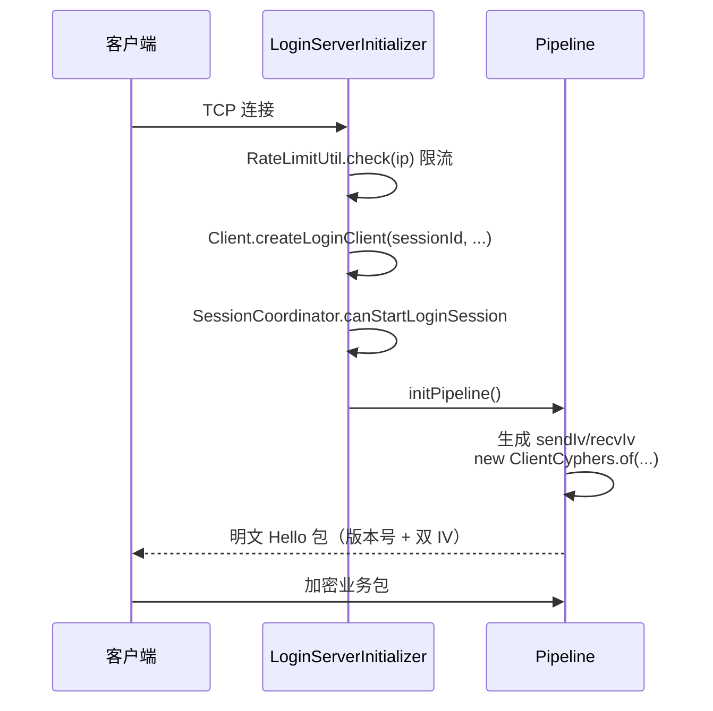
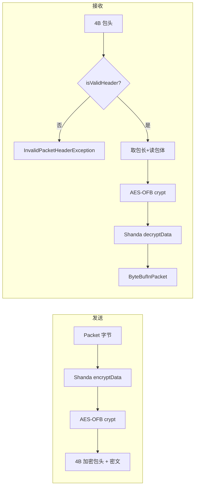
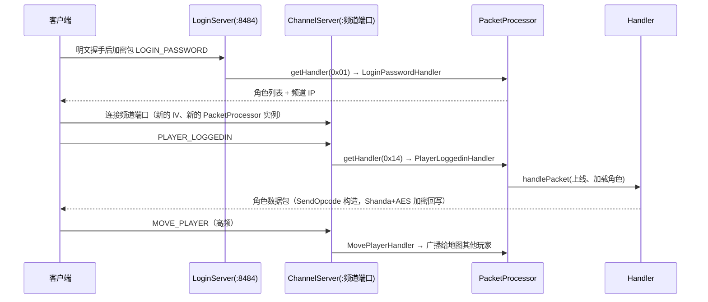

# 02 网络与协议架构

> 模块路径：`org.gms.net.netty`（7 类）、`org.gms.net.encryption`（7 类 + `protocol` 4 类）、`org.gms.net.opcodes`（3 类）+ `org.gms.constants.net.OpcodeConstants`、`org.gms.net`（`PacketProcessor`）、`org.gms.net.packet`（6 类 + `logging` 5 类 + `out` 2 类）、`org.gms.net.server.handlers`（149 个频道 handler + 21 个登录 handler + 3 个公共）
> 涉及类数：约 180+ 类
> 依赖模块：Netty 4（NIO）、JCE（AES）、`org.gms.client.Client`、`GameConfig`、`SessionCoordinator`/`RateLimitUtil`

## 1. Netty 传输层（`net.netty`，7 个类）

| 类 | 职责 |
|---|---|
| [`AbstractServer`](../../../gms-server/src/main/java/org/gms/net/netty/AbstractServer.java) | 抽象基类，仅持 `port`，声明 `start()`/`stop()` |
| [`LoginServer`](../../../gms-server/src/main/java/org/gms/net/netty/LoginServer.java) | 登录服。常量 `WORLD_ID = -1`、`CHANNEL_ID = -1`（作为 `PacketProcessor` 的实例键）；`start()` 用 `ServerBootstrap` + 双 `NioEventLoopGroup` + `NioServerSocketChannel` 绑定端口（默认 8484，来自 `ServiceProperty.getLoginPort()`） |
| [`ChannelServer`](../../../gms-server/src/main/java/org/gms/net/netty/ChannelServer.java) | 频道服，构造携带 `(port, world, channel)`，`childHandler(new ChannelServerInitializer(world, channel))`；由领域对象 `Channel.initServer()` 创建启动 |
| [`ServerChannelInitializer`](../../../gms-server/src/main/java/org/gms/net/netty/ServerChannelInitializer.java) | 抽象初始化器，公共逻辑：静态 `AtomicLong sessionId`（初值 7777）生成会话 ID；`initPipeline()` 生成收发 IV → `ProtocolFactory` → 先发**未加密 Hello 包** → 装配 pipeline |
| [`LoginServerInitializer`](../../../gms-server/src/main/java/org/gms/net/netty/LoginServerInitializer.java) | `initChannel`：`RateLimitUtil` IP 限流 → `Client.createLoginClient(...)`（绑定 `PacketProcessor.getLoginServerProcessor()`）→ `SessionCoordinator.canStartLoginSession` 防并发登录 → `initPipeline` |
| [`ChannelServerInitializer`](../../../gms-server/src/main/java/org/gms/net/netty/ChannelServerInitializer.java) | 同上，绑定 `PacketProcessor.getChannelServerProcessor(world, channel)`；若 `Server.getChannel(world, channel) == null` 直接 `closeSession` 断开 |
| [`InvalidPacketHeaderException`](../../../gms-server/src/main/java/org/gms/net/netty/InvalidPacketHeaderException.java) | 解码时包头校验失败抛出，携带非法 `header` |

每个连接的 Netty pipeline（`ServerChannelInitializer.setUpHandlers`）：

```
SocketChannel
 └─ IdleStateHandler(30s 空闲检测)
 └─ PacketCodec（CombinedChannelDuplexHandler = PacketDecoder + PacketEncoder）
 └─ InPacketLogger / OutPacketLogger（@Sharable，按 GameConfig 开关打印收发包）
 └─ Client（业务处理器，本身是 Netty handler）
```

连接建立时序：



## 2. 包加解密（`net.encryption`，11 个类）

加密栈从外到内为 **包头混淆（IV 异或）→ Shanda 自定义位运算 → AES-OFB 流加密**，双向对称：

| 类 | 职责 |
|---|---|
| [`InitializationVector`](../../../gms-server/src/main/java/org/gms/net/encryption/InitializationVector.java) | 生成 4 字节初始 IV：发送 `{82,48,120,随机}`、接收 `{70,114,122,随机}` |
| [`ClientCyphers`](../../../gms-server/src/main/java/org/gms/net/encryption/ClientCyphers.java) | 收发一对 `MapleAESOFB` 的持有者。注意版本号的取反技巧：发送密钥用 `(short)(0xFFFF - VERSION)`，接收用 `VERSION` |
| [`MapleAESOFB`](../../../gms-server/src/main/java/org/gms/net/encryption/MapleAESOFB.java) | 核心 AES-OFB：硬编码 256 位 `skey`（GMS 密钥）+ `funnyBytes` 表做 IV 滚动（`getNewIv`/`funnyShit`）；`crypt()` 按 0x5B0/0x5B4 分块异或流；`getPacketHeader()` 生成 4 字节加密包头（长度高低字节交换后与 IV+版本异或）；`isValidHeader()`/`getPacketLength()` 用于解码侧校验与取长 |
| [`MapleCustomEncryption`](../../../gms-server/src/main/java/org/gms/net/encryption/MapleCustomEncryption.java) | 即 **Shanda 加密**：6 轮正反交替的 `rollLeft/rollRight` 循环移位 + 加长度 + 异或记忆字节 + 取反/加 0x48/异或 0x13 |
| [`PacketCodec`](../../../gms-server/src/main/java/org/gms/net/encryption/PacketCodec.java) | `CombinedChannelDuplexHandler`，组合下面的 Decoder/Encoder |
| [`PacketDecoder`](../../../gms-server/src/main/java/org/gms/net/encryption/PacketDecoder.java) | `ReplayingDecoder<Void>`，委托给 `ProtocolFactory.getProtocol(VERSION).decode()` |
| [`PacketEncoder`](../../../gms-server/src/main/java/org/gms/net/encryption/PacketEncoder.java) | `MessageToByteEncoder<Packet>`，委托给 protocol 的 `encode()` |
| `protocol/ProtocolFactory` | 注册 `版本号 → PacketProtocol`（当前仅 `GMS_V83 = 83`），`getProtocol` 未命中抛 `UnsupportedOperationException` |
| `protocol/PacketProtocol` | 接口：`decode` / `encode` / `writeInitialUnencryptedHelloPacket` |
| `protocol/GMSV83PacketProtocol` | v83 具体实现（见下方流程） |
| `protocol/ProtocolConstants` | 常量 `GMS_V83 = 83` |

**解码**（`GMSV83PacketProtocol.decode`）：读 4 字节 int 头 → `receiveCypher.isValidHeader(header)` 校验（头两字节与 IV/版本异或是否匹配），失败抛 `InvalidPacketHeaderException` → `decodePacketLength`（高低 16 位异或再字节交换）→ 读包体 → `receiveCypher.crypt()`（AES-OFB）→ `MapleCustomEncryption.decryptData()`（Shanda）→ 包装为 `ByteBufInPacket` 交给后续 handler。

**编码**（`encode`）：`sendCypher.getPacketHeader(len)` 写 4 字节头 → 包体先 Shanda `encryptData` 再 `sendCypher.crypt()`（**顺序与解码相反**）→ 写出。



每处理一个包后 AES 的 IV 会通过 `getNewIv`（基于 `funnyBytes` 表的四轮混合 + 循环移位）滚动更新，因此收发双方的 `MapleAESOFB` 状态必须严格同步。

## 3. Opcode 体系（`net.opcodes` + `constants.net.OpcodeConstants`）

- [`Opcode`](../../../gms-server/src/main/java/org/gms/net/opcodes/Opcode.java)：最小接口 `int getValue()` / `String getName()`。
- [`RecvOpcode`](../../../gms-server/src/main/java/org/gms/net/opcodes/RecvOpcode.java)：**客户端 → 服务端**枚举，约 150 个值（如 `LOGIN_PASSWORD(0x01)`、`PLAYER_LOGGEDIN(0x14)`、`CHANGE_MAP(0x26)`），每个常量带中文注释说明用途。
- [`SendOpcode`](../../../gms-server/src/main/java/org/gms/net/opcodes/SendOpcode.java)：**服务端 → 客户端**枚举（约 300 个值），供 `PacketCreator` 构造响应包时写包头。
- [`OpcodeConstants`](../../../gms-server/src/main/java/org/gms/constants/net/OpcodeConstants.java)：**反查表**。`Server.init()` 末尾调用 `generateOpcodeNames()`，把两个枚举按 `value → name` 灌入 `sendOpcodeNames` / `recvOpcodeNames` 两个静态 `Map<Integer, String>`，供 `InPacketLogger` 等调试日志把 opcode 数字翻译成可读名。

分发用的是**数组下标直查**而非 Map：`PacketProcessor` 构造时按 `RecvOpcode` 最大 value 建 `PacketHandler[]`，`registerHandler` 直接 `handlers[code.getValue()] = handler`，`getHandler(short packetId)` O(1) 取用。

## 4. 包处理分发链（`PacketProcessor` → handlers）

[`PacketProcessor`](../../../gms-server/src/main/java/org/gms/net/PacketProcessor.java) 是分发中枢，按 `(world, channel)` 维度维护多实例（`instances` Map，键 `"world channel"`）：

- **登录处理器**：`getLoginServerProcessor()` 固定取 `(-1, -1)` 实例。
- **频道处理器**：`getChannelServerProcessor(world, channel)`，前提是 `registerGameHandlerDependencies()` 已注入 `ChannelDependencies`（含 `NoteService`、`FredrickProcessor`），否则抛 `IllegalStateException`。
- `reset(int channel)` 按 `ServerConstants.VERSION == 83` 分支注册：`channel < 0` 注册登录 handler，否则注册频道 handler。

注册的 handler 分布在三个包，共 **173 个 handler 类 / 约 180 条注册**：

| 位置 | 数量 | 示例 |
|---|---|---|
| `net/server/handlers/login/` | 21 | `LoginPasswordHandler`、`CharlistRequestHandler`、`CreateCharHandler`、`CharSelectedWithPicHandler` |
| `net/server/channel/handlers/` | 149 | `PlayerLoggedinHandler`、`ChangeMapHandler`、`MovePlayerHandler`、`GuildOperationHandler`、`AdminCommandHandler` |
| `net/server/handlers/`（公共） | 3 | `KeepAliveHandler`（PONG）、`CustomPacketHandler`、`LoginRequiringNoOpHandler`（单例） |

实际执行在 [`Client.channelRead`](../../../gms-server/src/main/java/org/gms/client/Client.java)（`Client` 本身是 pipeline 末端的 handler）：

```mermaid
flowchart TB
    A[PacketDecoder 解出 ByteBufInPacket] --> B["Client.channelRead<br/>opcode = packet.readShort()"]
    B --> C["packetProcessor.getHandler(opcode)<br/>数组下标直查"]
    C --> D{handler != null &&<br/>validateState(client)?}
    D -- 否 --> Z[丢弃]
    D -- 是 --> E[ThreadLocalUtil.setCurrentClient]
    E --> F[MonitoredChrLogger 监控审计]
    F --> G[handler.handlePacket]
    G --> H[catch Throwable<br/>log.warn + enableActions 防假死]
    H --> I[finally 清 ThreadLocal<br/>updateLastPacket 心跳时间]
```

设计细节：

- `validateState` 由各 handler 实现登录态/频道态校验，未登录阶段的频道包直接被 `LoginRequiringNoOpHandler` 吞掉。
- `handlePacket` 抛出的任何异常都被捕获并记录（含玩家名、地图、原始包 hex），随后 `enableActions()` 解除客户端假死——单个坏包不会断开或拖垮连接。
- `ThreadLocalUtil.setCurrentClient` 让深层调用链（含 GraalVM JS 脚本）能取回当前 `Client` 上下文。

## 5. Packet 抽象（`net.packet`，13 个类）

| 类 | 职责 |
|---|---|
| [`Packet`](../../../gms-server/src/main/java/org/gms/net/packet/Packet.java) | 顶层接口：`getBytes()` |
| `InPacket` / `OutPacket` | 收/发包标记接口，`InPacket` 声明 `readByte/readShort/readInt/...` 系列读取方法 |
| [`ByteBufInPacket`](../../../gms-server/src/main/java/org/gms/net/packet/ByteBufInPacket.java) | 基于 Netty `ByteBuf` 的实现，数值字段按 Maple 协议**小端序**读取（如 `readShort()` 内部是 `readShortLE()`） |
| `ByteBufOutPacket` | 写侧实现，配合 `PacketCreator`（`util` 包）构造各类响应 |
| `logging/InPacketLogger`、`OutPacketLogger` | `@Sharable` 的 pipeline 日志 handler，受 `GameConfig` 的 `use_debug_show_packet` 开关控制，超 3000 字节截断内容 |
| `logging/LoggingUtil` | 判断心跳等高频包是否忽略打印 |
| `logging/MonitoredChrLogger` | 被监控角色的封包审计（配合封包头 2 字节 opcode + `OpcodeConstants` 反查名） |
| `logging/PacketLogger` | 日志接口 |
| `out/SendNoteSuccessPacket`、`ShowNotesPacket` | 具体出站包构造器示例 |

## 6. 一次完整请求的端到端链路

以"玩家登录后进入频道移动"为例：



## 7. 相关源码索引

- 传输与 pipeline：`gms-server/src/main/java/org/gms/net/netty/`（7 文件）
- 加解密：`gms-server/src/main/java/org/gms/net/encryption/`（含 `protocol/` 子包）
- Opcode：`gms-server/src/main/java/org/gms/net/opcodes/`、`gms-server/src/main/java/org/gms/constants/net/OpcodeConstants.java`
- 分发中枢：`gms-server/src/main/java/org/gms/net/PacketProcessor.java`
- 业务分发入口：`gms-server/src/main/java/org/gms/client/Client.java`（`channelRead`）
- 包抽象与日志：`gms-server/src/main/java/org/gms/net/packet/`
