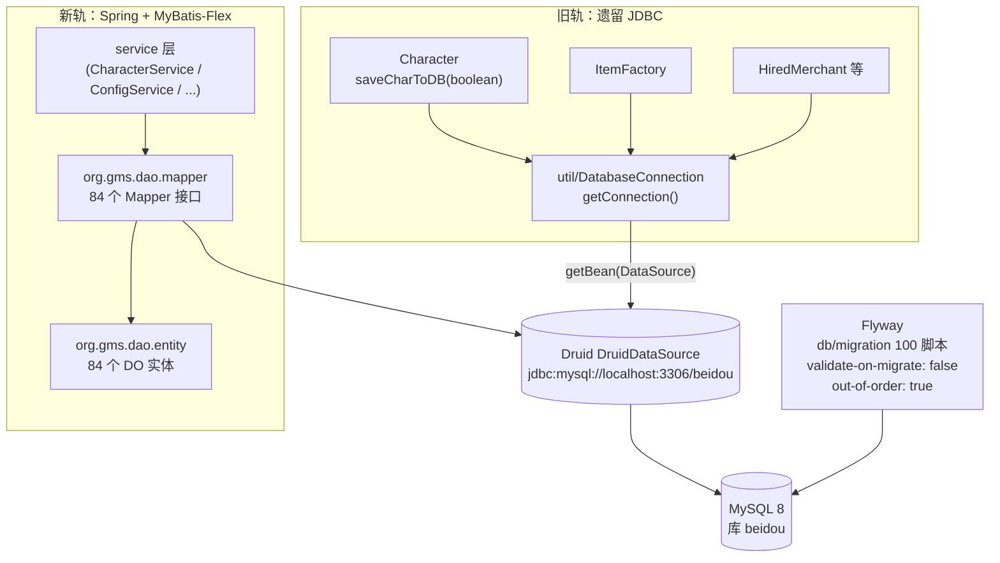

# 03 数据架构

> 模块路径：`gms-server/src/main/resources/db/migration`（100 个 Flyway 迁移脚本）、`gms-server/src/main/java/org/gms/dao`（entity 84 个 DO + mapper 84 个 Mapper）、`gms-server/src/main/java/org/gms/util/DatabaseConnection.java`、`gms-server/src/main/resources/application.yml`
>
> 涉及类数：DO 实体 84、Mapper 84、`DatabaseConnection` 1、`CharacterService`/`ItemFactory` 等遗留 JDBC 写入类若干
>
> 依赖模块：Spring Boot 3（`ServerApplication` 的 `@MapperScan`）、MyBatis-Flex（`com.mybatisflex`）、Druid（`DruidDataSource`）、Flyway、MySQL 8 驱动 `com.mysql.cj`

## 1. 总览

BeiDou 的持久层是「**双轨并行**」结构：

1. **新轨（Spring 体系）**：MyBatis-Flex + Druid，`DO` 实体 + `Mapper` 接口，由 `service` 层调用，承载管理后台/新业务（账号、配置、抽奖、商城等）。
2. **旧轨（OdinMS 遗留体系）**：`Character`、`ItemFactory`、`HiredMerchant` 等直接通过 `DatabaseConnection.getConnection()` 拿 JDBC 连接手写 SQL，承载角色存档、背包物品、任务、技能等核心游戏数据的读写。

两条轨共用同一个 Druid `DataSource`（Spring 容器内的 bean），因此事务隔离级别、连接池参数是统一的，但**事务边界不同**：新轨走 Spring `@Transactional`，旧轨在方法内手动 `setAutoCommit(false)` / `commit()`。



## 2. MySQL 8 + Flyway

- 库名固定 `beidou`，连接串见 `application.yml`（`useSSL=false&serverTimezone=Asia/Shanghai`）。库不存在时 `ServerApplication.main` 在 Spring 启动前先手动解析 yml 自动建库，再交给 Flyway。
- Flyway 关键配置（`application.yml` → `spring.flyway`）：
  - `validate-on-migrate: false`：不校验已执行脚本的 checksum（历史脚本允许被改动）。
  - `out-of-order: true`：允许补跑版本号小于已执行最大版本的漏掉脚本。

### 2.1 迁移脚本分类清单（`src/main/resources/db/migration`，共 100 个）

| 分类 | 版本段 | 代表脚本 | 说明 |
|---|---|---|---|
| 建表：账号/角色/社交 | V1.0.0 ~ V1.0.5、V1.0.6 等 | `V1.0.0__create_accounts.sql`、`V1.0.6__create_characters.sql`、`V1.0.4__create_bbs.sql`、`V1.0.5__create_buddies.sql` | 账号、角色、公会 BBS、好友 |
| 建表：角色关联数据 | V1.0.7 ~ V1.0.48 | `V1.0.17__create_inventory.sql`、`V1.0.19__create_keymap.sql`、`V1.0.33__create_quest.sql`、`V1.0.43__create_skill.sql`、`V1.0.23__create_monster.sql` | 冷却、背包、键位、任务、技能、宠物、婚姻、戒指、传送点坐标（trocklocations）、愿望单等，绝大多数以 `characterid` 为外键逻辑关联 |
| 建表：运营/日志 | V1.0.3、V1.0.10 等 | `V1.0.3__create_bosslog.sql`、`V1.0.10__create_eventstats.sql`、`V1.0.36__create_reports.sql`、`V1.0.27__create_notes.sql` | BOSS 击杀日志、事件统计、举报、留言 |
| 建表：掉落/商城/NX | V1.0.8、V1.0.24、V1.0.41/42 | `V1.0.8__create_drop_data.sql`、`V1.0.24__create_mts.sql`、`V1.0.41__create_shopitems.sql`、`V1.0.42__create_shops.sql` | 怪物掉落、交易市场、商店 |
| 建表：封禁/安全 | V1.0.16、V1.0.18 | `V1.0.16__create_hwid.sql`、`V1.0.18__create_ban.sql`（含 `ipbans`/`macbans`/`macfilters`） | HWID、IP/MAC 封禁 |
| 初始数据灌入 | V1.0.49 ~ V1.0.67 | `V1.0.50__drop_data_global_insert_old_data.sql`（单条大 INSERT）、`V1.0.51__drop_data_insert_old_data.sql`（43 条 INSERT）、`V1.0.55__create` 系列 `*_insert_data.sql`、`V1.0.67__admin.sql` | 从旧库导出的掉落表、商店、兑换券、管理员账号 |
| 掉落表运维修订 | V1.0.59 ~ V1.0.65 | `V1.0.65__reactordrops_delete_all_unused_content.sql` 等 | 反应堆掉落的多轮增删改 |
| BeiDou 新增功能表 | V1.1.x ~ V1.11.x | `V1.1.2__create_extend_value.sql`（扩展值表，会被角色级联删除复用）、`V1.3.0/1__create_world_prop/server_prop.sql`、`V1.3.3__create_gachapon.sql` + `V1.4.x`（抽奖与奖池）、`V1.4.3__create_characterexplogs.sql`、`V1.5.1__create_command_info.sql`、`V1.7.0__create_game_config.sql`、`V1.7.1__create_lang_resources.sql`、`V1.8.x`/`V1.11.x` 参数与索引调整 | 运营参数、i18n 资源、经验日志等北斗自研表 |

版本号不是严格递增建表（`V1.0.10` 与 `V1.0.1` 并存是 Flyway 的版本语义排序），整体节奏是「V1.0.x 遗留建表+数据 → V1.1.x 起北斗逐步追加」。

## 3. MyBatis-Flex 持久层

- 实体：`org.gms.dao.entity` 下 84 个 `XxxDO`，统一 `@Table("表名")` + Lombok `@Data/@Builder/@NoArgsConstructor/@AllArgsConstructor`，实现 `Serializable`。抽样示例 `CharactersDO.java`：

  ```java
  @Table("characters")
  public class CharactersDO implements Serializable { ... }
  ```

- Mapper：`org.gms.dao.mapper` 下 84 个接口，统一 `extends BaseMapper<XxxDO>`，`ServerApplication` 上 `@MapperScan("org.gms.dao.mapper")` 扫描。除基座 CRUD 外可加注解 SQL，如 `CharactersMapper`：

  ```java
  public interface CharactersMapper extends BaseMapper<CharactersDO> {
      @Update("UPDATE characters SET HasMerchant = #{value}")
      void updateAllHasMerchant(Integer value);

      @Select("SELECT id, world FROM characters WHERE accountid = #{accountId}")
      List<CharactersDO> selectIdAndWorldListByAccountId(int accountId);
  }
  ```

- 代码生成：不手写 DO/Mapper，用 test 作用域的 `CodeGen#genMapperAndEntity`（mybatis-flex-codegen）连本地 `beidou` 库生成，改 `globalConfig.setGenerateTable(...)` 指定表名。
- 84 个 DO 的分组概览（按前缀）：
  - 账号/角色主体：`AccountsDO`、`CharactersDO`
  - 角色关联：`InventoryitemsDO`/`InventoryequipmentDO`/`InventorymerchantDO`、`KeymapDO`、`QuickslotkeymappedDO`、`SkillsDO`、`SkillmacrosDO`、`CooldownsDO`、`QueststatusDO`/`QuestprogressDO`/`QuestactionsDO`/`QuestrequirementsDO`、`PetsDO`、`RingsDO`、`MarriagesDO`、`BuddiesDO`、`PartySearch` 相关、`SavedlocationsDO`、`TrocklocationsDO`、`WishlistsDO`、`AreaInfoDO`、`PlayerdiseasesDO`、`MonsterbookDO`、`FamelogDO`、`Family*DO`
  - 社交/公会：`GuildsDO`、`AllianceDO`、`AllianceguildsDO`、`BbsThreadsDO`/`BbsRepliesDO`
  - 经济/商店：`ShopsDO`/`ShopitemsDO`、`DropDataDO`/`DropDataGlobalDO`/`ReactordropsDO`、`StoragesDO`/`FredstorageDO`、`MtsItemsDO`/`MtsCartDO`、`NxcodeDO`/`NxcodeItemsDO`/`NxcouponsDO`、`DueyitemsDO`/`DueypackagesDO`、`GiftsDO`、`GachaponRewardDO`/`GachaponRewardPoolDO`、`SpecialcashitemsDO`、`ModifiedCashItemDO`
  - 运营/系统：`GameConfigDO`、`LangResourcesDO`、`CommandInfoDO`、`AutobanConfigDO`、`HpMpAlertDO`、`ServerQueueDO`、`WorldtransfersDO`、`NamechangesDO`、`NewyearDO`、`NotesDO`、`ReportsDO`、`ResponsesDO`、`EventstatsDO`、`BosslogDailyDO`/`BosslogWeeklyDO`、`Characterexplogs`（无 DO，见下）
  - NPC/玩家镜像：`PlayernpcsDO` 系列、`PlifeDO`、`Maker*DO`、`MonstercarddataDO`
  - 基础设施：`FlywaySchemaHistoryDO`（Flyway 元数据表也被生成了实体）

## 4. Druid 连接池与 DatabaseConnection

- 数据源由 MyBatis-Flex 的 `mybatis-flex.datasource.mysql` 配置段创建，`type: com.alibaba.druid.pool.DruidDataSource`，驱动 `com.mysql.cj.jdbc.Driver`（`application.yml`）。
- 遗留代码入口 `util/DatabaseConnection.java`，全文仅一个方法，**反向从 Spring 容器取 DataSource**，保证双轨同池：

  ```java
  public static Connection getConnection() throws SQLException {
      return ServerManager.getApplicationContext().getBean(DataSource.class).getConnection();
  }
  ```

  遗留代码通过 `ServerManager.getApplicationContext()`（Spring `ApplicationRunner` 桥）绕开 IoC 注入直接拿 bean，这是旧轨能与新轨共享 Druid 的关键。

## 5. 遗留角色存档写入路径：认准 UPDATE 版本

`CLAUDE.md` 提示 `saveCharToDB` 有两个版本，源码确认如下：

**实际生效：`Character.saveCharToDB(boolean)`（UPDATE 版本）**，位于 `src/main/java/org/gms/client/Character.java:7617`：

- `Character.saveCharToDB()`（无参，:7601）先按 `GameConfig.getServerBoolean("use_autosave")` 决定走 `CharacterSaveService.registerSaveCharacter`（串行存档队列）还是直接调 `saveCharToDB(true)`。
- `saveCharToDB(boolean)` 是 `synchronized` 方法，`con.setTransactionIsolation(Connection.TRANSACTION_READ_UNCOMMITTED)` + 手动 `commit/rollback`，主体是一条 50+ 列的巨型 `UPDATE characters SET ... WHERE id = ?`（:7634），随后级联写 `quickslotkeymapped`（`INSERT ... ON DUPLICATE KEY UPDATE`，:7792）以及 `ItemFactory.saveItems`、monsterbook、技能等关联表。
- 调用方覆盖：`Client`（登出 :1066/:1078/:1545）、`CharacterAutosaverTask`（每小时自动存档）、`SaveAllCommand`/`WarpWorldCommand`（GM 命令）、`EnterCashShopHandler`/`EnterMTSHandler`/`WeddingHandler`/`PlayerInteractionHandler`、`HiredMerchant`。

**未生效：`CharacterService.saveCharToDB(Character, boolean)`（insertSelective 版本）**，位于 `src/main/java/org/gms/service/CharacterService.java:347`：走 `@Transactional` + `charactersMapper.insertSelective(Character.toCharactersDO(player))`。全仓 grep 不到任何调用方，属于**保留但当前无人调用的 Spring 化改写雏形**——若未来启用它，注意它只 `insertSelective` 主表，不级联写背包/技能等关联表，不能直接替换 UPDATE 版本。

> 排查角色存档问题（掉档、回档、字段不更新）时，唯一要读的写入路径就是 `Character.saveCharToDB(boolean)` 及其内部的 `ItemFactory` 调用链。

## 6. 双轨并存的注意事项

1. **改表结构必须走新 Flyway 版本号**（如 `V1.12.x__*.sql`），禁止改历史脚本（虽然 `validate-on-migrate: false` 不会报错，但已部署库不会重跑）。
2. **旧轨 SQL 是字符串硬编码**，改列名时 `grep` 遗留代码里的 SQL 字符串（`UPDATE characters`、`DELETE FROM characterexplogs` 等），Mapper 侧的编译期检查覆盖不到它们。`characterexplogs` 就是一例：有表无 DO，仅由 `ExpLogger`/`CharacterService` 原生 JDBC 读写。
3. **事务语义差异**：新轨 Spring 事务 vs 旧轨手动 commit + `READ_UNCOMMITTED`，跨轨组合操作不保证原子性。
