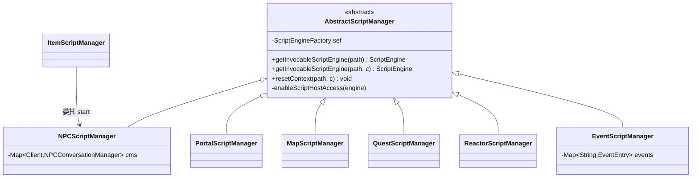
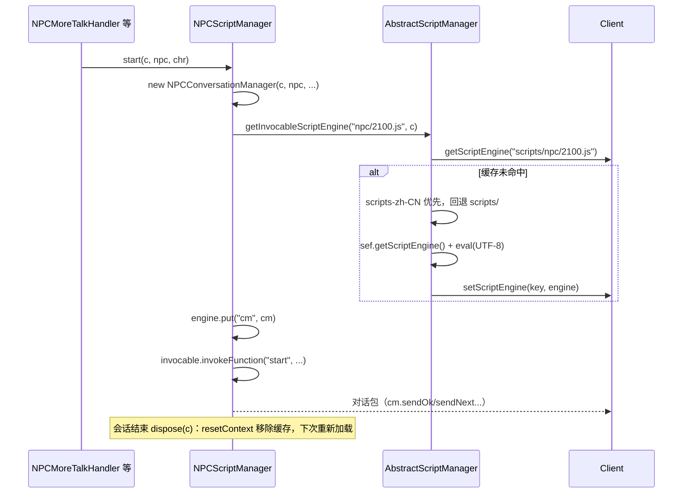
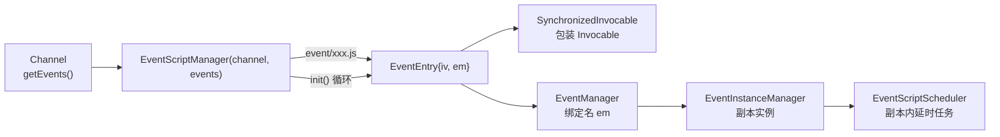
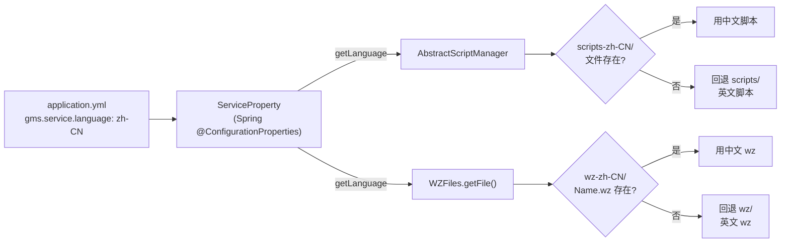

# 04 脚本引擎架构

> 模块路径：`gms-server/src/main/java/org/gms/scripting`（18 个类）、`gms-server/src/main/java/org/gms/provider/wz`（双语资源入口）、`gms-server/scripts/` 与 `gms-server/scripts-zh-CN/`（脚本资源目录）
>
> 涉及类数：`org.gms.scripting` 共 18 个类（AbstractScriptManager 1、npc 2、portal 3、quest 2、reactor 2、map 2、item 2、event 4）
>
> 依赖模块：GraalVM JS（`com.oracle.truffle.js.scriptengine.GraalJSScriptEngine`，javax.script 桥接）、`org.gms.manager.ServerManager`（取 `ServiceProperty`）、`org.gms.property.ServiceProperty`（`gms.service.language`）、`org.gms.client.Client`（脚本引擎缓存）、`org.gms.util.I18nUtil`（脚本加载告警 i18n）

## 1. GraalVM JS 引擎接入方式

- 项目使用 **GraalVM JS**（非 Nashorn），通过 `javax.script`（JSR-223）桥接使用。
- `org.gms.net.server.Server` 的**静态块**（`src/main/java/org/gms/net/server/Server.java:90`）在类加载时设置系统属性，抑制解释模式告警：

  ```java
  static {
      System.setProperty("polyglot.engine.WarnInterpreterOnly", "false");
  }
  ```

- 引擎获取统一收敛在 `AbstractScriptManager` 构造器：`new ScriptEngineManager().getEngineByName("graal.js").getFactory()`，每次加载脚本时用 `sef.getScriptEngine()` 新建实例，并断言其类型为 `GraalJSScriptEngine`（不是则抛 `IllegalStateException`）。
- **宿主访问开关**：`enableScriptHostAccess(GraalJSScriptEngine)` 向 `ENGINE_SCOPE` Bindings 写入 `polyglot.js.allowHostAccess=true` 与 `polyglot.js.allowHostClassLookup=true`，使脚本内 `Java.type(...)` 调用服务端 Java 类可用（如 `Java.type(org.gms.client.inventory.Equip)`）。

## 2. AbstractScriptManager 体系（18 个类的骨架）

`AbstractScriptManager`（`scripting/AbstractScriptManager.java`）是全部 6 个「真正有脚本加载逻辑」的管理器的公共基类，职责只有三件事：

1. **双语选路** `getInvocableScriptEngine(String path)`：
   - 从 Spring 容器取 `ServiceProperty`（`gms.service.language`，如 `zh-CN`）；
   - 先探测 `scripts-<lang>/<path>`（如 `scripts-zh-CN/npc/2100.js`），存在则用之；否则回退英文基础 `scripts/<path>`；都不存在返回 `null`；
   - 每次调用都 `sef.getScriptEngine()` 新建独立引擎，UTF-8 读文件 `engine.eval(br)`；`ScriptException/IOException` 时记 warn 日志并返回 `null`（调用方按「无脚本」处理）。
2. **客户端级缓存** `getInvocableScriptEngine(String path, Client c)`：缓存 key 统一为 `scripts/<path>`（用默认前缀，避免读写 key 不一致），未命中才加载并 `c.setScriptEngine(scriptKey, engine)`。
3. **缓存失效** `resetContext(String path, Client c)`：`c.removeScriptEngine("scripts/" + path)`，用于会话结束（如 NPC 对话 dispose）后强制下次重新加载脚本——这也是**脚本热重载的底层机制**：改完磁盘上的 `.js`，当前会话 dispose 后即生效，无需重启。



注：`ItemScriptManager` **不继承** `AbstractScriptManager`，它只把 `ScriptedItem` 委托给 `NPCScriptManager.getInstance().start(c, scriptItem, chr)`，用 `im` 作为脚本绑定名。

## 3. 七类脚本的管理器与调用链

| 脚本类型 | 目录 | 管理器 | 脚本绑定对象 | 入口函数 |
|---|---|---|---|---|
| npc | `scripts/npc/` | `NPCScriptManager` | `cm`（`NPCConversationManager`，物品脚本为 `im`） | `start(mode/type/selection)`、`end` |
| portal | `scripts/portal/` | `PortalScriptManager` | 脚本自身实现 `PortalScript` 接口 | `enter(c)` |
| map | `scripts/map/` | `MapScriptManager` | `start(new MapScriptMethods(c))` 直传参 | `start` |
| quest | `scripts/quest/` | `QuestScriptManager` | `qm`（`QuestActionManager`） | `start`/`end`/`raiseOpen`/自定义函数 |
| reactor | `scripts/reactor/` | `ReactorScriptManager` | `rm`（`ReactorActionManager`） | `hit`/`act` 等 |
| item | `scripts/item/` | `ItemScriptManager` → NPC 链 | `im` | `start` |
| event | `scripts/event/` | `EventScriptManager` + `EventManager` | `em`（`EventManager`） | `init(null)` |

### 3.1 NPC（对话脚本，量最大）

`NPCScriptManager`（单例）核心链路 `start(c, npc, oid, fileName, chr, itemScript, engineName)`：



管理器自身维护 `Map<Client, NPCConversationManager> cms` 与 `Map<Client, Invocable> scripts`，按客户端（会话）隔离并发对话。

### 3.2 Portal（传送门）

`PortalScriptManager.enter(MapleMap map, Portal portal, Client c)`：用 `getInvocableScriptEngine("portal/" + portal.getScriptName() + ".js")`（不落 Client 缓存），强转 `PortalScript` 接口后调 `enter(c)`。脚本文件实现 Java 接口（`PortalPlayerInteraction` 提供上下文）。

### 3.3 Map（进图脚本）

`MapScriptManager.runMapScript(c, mapScriptPath, lastVisited)`：加载 `map/<path>.js`，`iv.invokeFunction("start", new MapScriptMethods(c))`——不设全局绑定，直接把 `MapScriptMethods` 作为参数传入。

### 3.4 Quest（任务脚本）

`QuestScriptManager.start/end(c, npc, questId...)`：加载 `quest/<questid>.js`（找不到回退通用 `quest/medalQuest.js`），绑定 `QuestActionManager` 为 `qm`，调 `start(mode, type, selection)` / `end(...)` / `raiseOpen()`。`dispose(qm, c)` 后 `resetContext("quest/<id>.js", c)`；还提供 `hasQuestCheckFunction` 探测脚本内 `checkFunction`。

### 3.5 Reactor（反应堆）

`ReactorScriptManager`：绑定 `ReactorActionManager` 为 `rm`，按事件类型调 `hit()` / `act()`（以及 `ReactorDropEntry` 相关函数）。同样按客户端缓存引擎。

### 3.6 Item（物品使用脚本）

`ItemScriptManager.getItemEffect`/物品使用链最终委托 `NPCScriptManager.getInstance().start(c, scriptItem, null)`，以 `scriptItem.getScript()` 为文件名、`im` 为绑定名复用 NPC 对话机制（`ScriptedItem` 来自 `ItemInformationProvider`）。

### 3.7 Event（频道事件脚本）

`EventScriptManager`（每 `Channel` 一个实例，`Channel.java:147` 构造）是最复杂的一类：



- 构造时对每个事件脚本 `initializeEventEntry(script, channel)`：加载引擎、`new EventManager(channel, iv, em)`、`engine.put("em", em)`，并把 `Invocable` 用 **`SynchronizedInvocable.of(...)`** 包装（`scripting/SynchronizedInvocable.java`：对所有 `invokeMethod/invokeFunction/getInterface` 加 `synchronized`），使同一事件脚本的调用线程安全。
- `init()` 对所有 `EventEntry` 调 `iv.invokeFunction("init", null)`，脚本在 `init` 里注册计时器/怪物刷新等（`EventManager` 内部用 `EventScheduledFuture`/`EventScriptScheduler` 调度）。
- **重载**：`reload()` → `reloadScripts()`（清空 `events`，重新加载全部脚本）→ 再 `init()`。事件脚本因此支持频道级热重载。

## 4. 脚本缓存与重载机制小结

| 层级 | 缓存/生命周期 | 重载方式 |
|---|---|---|
| 引擎实例 | 每次未命中缓存即新建 GraalJS 引擎，eval 后常驻 | 不可变，重载=换实例 |
| 会话级（npc/quest/reactor） | `Client.engines`（`Map<String, ScriptEngine>`，`Client.java:129`） | `dispose` → `resetContext` 移除；下次触发重新读盘（**文件级热重载**） |
| 无缓存（portal/map） | 每次调用重新加载 | 天然热 |
| 频道级（event） | `EventScriptManager.events`（`ConcurrentHashMap`） | `reload()` 全量重建 + `init()` |

## 5. 双语覆盖加载（wz + scripts 的语言覆盖层）

同一套「**英文基础目录 + 语言覆盖目录**」机制在两处独立实现，入口分别是：

- **脚本侧**：`scripting/AbstractScriptManager#getInvocableScriptEngine`（见上），`scripts/` + `scripts-<language>/`。
- **wz 数据侧**：`provider/wz/WZFiles.java` 枚举（Quest/Etc/Item/Character/String/List/Mob/Map/Npc/Reactor/Skill/Sound/UI 共 12 个 `.wz` 文件），`getFile()` 先看 `wz-<language>/<Name>.wz`（`getLanguageFile()`，language 取 `ServiceProperty`），存在则覆盖，否则用 `wz/<Name>.wz`（`getBaseFile()`）。



文件级覆盖而非整目录替换：语言目录只放已本地化的文件，缺失项自动落回英文，`scripts-zh-CN/` 因此比 `scripts/` 小得多。该机制与客户端侧「`Data/` 中文基础 + `EN/` 英文覆盖」是镜像关系（详见根目录 `CLAUDE.md` 的 wz 补丁工作流）。

## 6. gms-server/scripts 目录概况（脚本数量统计）

英文基础 `scripts/`（共约 1975 个文件）：

| 目录 | 数量 | 语言覆盖 `scripts-zh-CN/` 数量 |
|---|---|---|
| npc/ | 717 | 764 |
| portal/ | 463 | 464 |
| quest/ | 295 | 303 |
| reactor/ | 292 | 292 |
| map/ | 93 | 94 |
| event/ | 108 | 110 |
| item/ | 3 | 3 |
| 根目录公共库 | `NPC Base.js`、`QUEST Base.js`、`REACT Base.js`、`devtest.js` | 同名 4 个 |
| BeiDou 自研 | — | `BeiDouSpecial/` 18 个（北斗特有内容脚本，仅中文目录有） |

中文目录各类型数量略多于英文目录，说明部分新脚本只落在 `scripts-zh-CN/`（英文档为空时文件级回退仍能命中中文文件，机制不受影响）。

## 7. 注意事项

1. 新增可本地化脚本时，英文版放 `scripts/`，中文版放 `scripts-zh-CN/` 同相对路径；只写一份时可直接放语言目录。
2. 脚本内 `Java.type` 依赖 `enableScriptHostAccess` 打开的两个 polyglot 开关，若自建引擎需复用该方法。
3. NPC/quest 会话未 `dispose` 就换脚本会导致 `Client.engines` 泄漏；新增对话流程务必走 `NPCScriptManager.dispose(c)`。
4. 脚本加载失败的日志/异常文案走 `I18nUtil`（`AbstractScriptManager.getInvocableScriptEngine.warn1/exception1`），遵循 i18n 强制规范。
