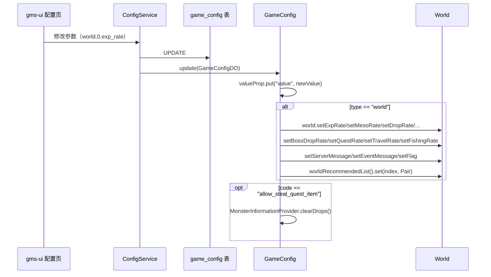
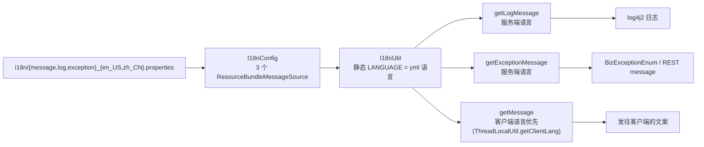

# 05 配置与热重载架构

> 模块路径：`gms-server/src/main/java/org/gms/config`（GameConfig、I18nConfig 等 5 类）、`gms-server/src/main/java/org/gms/property/ServiceProperty.java`、`gms-server/src/main/java/org/gms/util/I18nUtil.java`、`gms-server/src/main/resources/application.yml`、`gms-server/src/main/resources/i18n/`
>
> 涉及类数：`org.gms.config` 5 个（`GameConfig`、`I18nConfig`、`ServerConfig`、`CorsConfig`、`SpringSecurityConfig`）、`property` 1 个（含内嵌 `RateLimitProperty`）、`util/I18nUtil` 1 个，另关联 `service/ConfigService` 与 `net/server/world/World`
>
> 依赖模块：fastjson2（`JSONObject`）、`org.gms.manager.ServerManager`（取 Spring bean）、`org.gms.dao`（`GameConfigMapper`/`GameConfigDO`）、Spring `MessageSource`（`ResourceBundleMessageSource`）

## 1. 三层配置体系总览

```mermaid
flowchart TB
    subgraph 静态层["application.yml（重启生效）"]
        YML["server.port=8686<br/>jwt.secret/duration<br/>mybatis-flex 数据源<br/>gms.service.*"]
    end
    subgraph 动态层["game_config 表（热重载）"]
        GC["GameConfig 单例<br/>type → subType → code → {value, clazz}"]
    end
    subgraph 文案层["i18n/*.properties"]
        I18N["I18nUtil<br/>message/log/exception 三套 MessageSource"]
    end
    YML -->|@ConfigurationProperties| SP["ServiceProperty"]
    GC -->|getWorldXxx 即时读| W["World 对象<br/>（倍率等已物化字段）"]
    GC -->|update() 写回| W
    I18N -->|getExceptionMessage 等| BIZ["日志/异常/前端文案"]
```

三层分工：**连接、鉴权、端口等基础设施**放 `application.yml`；**运营参数（倍率、开关、大区配置）**放 `game_config` 表走 `GameConfig` 热重载；**一切面向人的输出文案**放 i18n 资源文件。

## 2. GameConfig：动态游戏配置单例

源码：`src/main/java/org/gms/config/GameConfig.java`（505 行）。**普通单例（非 Spring bean）**，懒加载：首次被引用时构造器通过 `ServerManager.getApplicationContext().getBean(ConfigService.class)` 反向取 Spring 依赖，`configService.loadGameConfigs()`（内部即 `gameConfigMapper.selectAll()`）读全表 `game_config`，逐条 `add` 进内存 JSON 树。

### 2.1 数据结构

表 `game_config`（`V1.7.0__create_game_config.sql`）字段：`config_type` / `config_sub_type` / `config_code` / `config_value` / `config_clazz`（值的全限定类名）/ `config_desc`（关联 i18n 表 `lang_resources`）。内存结构为 fastjson2 `JSONObject`：

```
properties = {
  "world": { "0": { "exp_rate": {"value":"1.0","clazz":"java.lang.Float"}, ... } },
  "server": { "global": { "WORLDS": {"value":"1","clazz":"java.lang.Integer"} },
              "npc":   { "NPCS_SCRIPTABLE": {"value":"{9001105:\"Rescue Gaga!\"}","clazz":"java.util.Map"} } }
}
```

即 **`type → subType → code → {value, clazz}`** 四级树：`type` 区分参数大类（`world`/`server`），`world` 的 `subType` 是大区号（`"0"`、`"1"`…），`server` 的 `subType` 是功能域（`Core`/`npc`/…）；`clazz` 决定取值时如何反序列化。

### 2.2 取值 API（两套语义）

1. **按库表 clazz 反序列化**（`get/getObject`，泛型返回）：`get(type, key)` 遍历该 type 下所有 subType 找第一个命中 code 的；`get(type, subType, key)` 精确定位。`getValue` 先 `Class.forName(clazz)` 再 `valueProp.getObject("value", clz)`，失败回退 `JSONObject.parseObject(...)`。
2. **按调用方声明的类型取值**（`getInteger/getBoolean/getString/...` 系列）：`getValue(key, default, mapper)` 按传入类型直接读 `value`，不做 clazz 反序列化。

为避免「同名参数、不同大区」取错，提供了**类型化便捷族**（`GameConfig.java:305` 起）：

- `getServerXxx(key)`（Xxx = Int/Byte/Long/Short/Float/Double/String/Boolean）：在 `server` 大类下扫全部 subType。
- `getWorldXxx(worldId, key)`：精确定位 `world/<worldId>/<code>`。
- 复杂类型用 `getServerObject(key, Class/TypeReference/T defaultVal)` / `getWorldObject(...)`。

### 2.3 热重载：add / update / remove

三个静态方法对应管理后台（gms-ui 配置页 → REST → `ConfigService`）对 `game_config` 表的增改删，改库后同步内存树：



- `add`：逐级建缺失的 JSONObject 节点后写入 `value/clazz`。
- `remove`：摘除 code 节点并向上清理空 subType / 空 type。
- `update`：节点不存在时自动转 `add`；存在则仅覆盖 `value`。**物化字段即时写回**：`world` 大类的 `exp_rate/meso_rate/drop_rate/boss_drop_rate/quest_rate/travel_rate/fishing_rate`、三种消息文案与 `flag` 会立刻调用 `Server.getInstance().getWorld(index)` 的 setter，运行中的 `World` 对象**无需重启**即生效；`recommend_message` 直接改 `worldRecommendedList` 列表项。注释中标注的「手动重载不能重载的部分」即指这些——它们已被 update 显式处理。此外 `allow_steal_quest_item` 变更会 `MonsterInformationProvider.clearDrops()` 重建掉落缓存。

> 新增可热重载的运营参数走本通道（建表数据 + `GameConfig` 取值），**不要**加 `application.yml`。若新参数也被物化进 `World` 等运行时对象，需在 `update` 的 switch 中补写回逻辑，否则只有重启才生效。

## 3. application.yml 关键配置

`src/main/resources/application.yml`（单文件，无 profile 拆分）：

| 配置段 | 关键项 | 说明 |
|---|---|---|
| `server.port` | `8686` | REST 端口 |
| `app.vue` | `http://localhost:8787` | 前端开发地址（`CorsConfig` 放行） |
| `jwt` | `secret`、`duration`（默认 30min） | REST 鉴权 |
| `mybatis-flex.datasource.mysql` | `DruidDataSource`、`jdbc:mysql://localhost:3306/beidou`、账号 `root/root` | 双轨共用的数据源（见 03-数据架构） |
| `springdoc` | `api-docs.enabled`、`swagger-ui.enabled`（均 false） | Swagger 默认关闭，生产必须保持关闭（`swagger` token 越权口子） |
| `spring.flyway` | `validate-on-migrate: false`、`out-of-order: true` | 见 03-数据架构 |
| `spring.jackson` | `time-zone: Asia/Shanghai` | REST 序列化时区 |
| **`gms.service`** | **`language: zh-CN`** | **双语覆盖核心开关**（见下） |
| `gms.service.rate-limit` | `enabled/limit/duration/auto-ban` | REST 限流（`ServerFilter`） |
| `gms.service` | `wan-host/lan-host/localhost/login-port(8484)` | Netty 登录服监听相关 |

`gms.service.*` 由 `ServiceProperty`（`@ConfigurationProperties(prefix = "gms.service")` + `@Component`，Lombok `@Data`）承接，含内嵌 `RateLimitProperty`（enabled/limit/duration/autoBan）。它的 `getLanguage()` 是**静态 yml 配置，不支持热重载**，被两处消费：

- `provider/wz/WZFiles.getLanguageFile()`：决定 `wz/` vs `wz-zh-CN/`；
- `scripting/AbstractScriptManager`：决定 `scripts/` vs `scripts-zh-CN/`。

## 4. i18n 体系

### 4.1 资源与装配

- 资源文件：`src/main/resources/i18n/{exception,log,message}_{en_US,zh_CN}.properties`，共 6 个 bundle。
- 装配：`config/I18nConfig.java` 定义三个 `ResourceBundleMessageSource` bean——`messageSource`（`i18n/message`）、`logSource`（`i18n/log`）、`exceptionSource`（`i18n/exception`），`setBasenames` 精确到文件名。**拆三个 bean 的原因**（源码注释）：`getMessage` 底层按 basename 遍历文件，分开定义可直接命中目标文件、少扫描无关 bundle。
- 编码统一 UTF-8。

### 4.2 I18nUtil 门面

`src/main/java/org/gms/util/I18nUtil.java`（67 行），静态工具类，字段在类加载时经 `ServerManager.getApplicationContext()` 抓取三个 `MessageSource` 与 `LANGUAGE`（`Locale.forLanguageTag(serviceProperty.getLanguage())`，即服务端语言，随 yml 定死）：

| 方法 | Locale 选择 | 用途 |
|---|---|---|
| `getMessage(code, args)` | **客户端语言优先**：`CharsetConstants.getLanguageLocale(ThreadLocalUtil.getClientLang())`，无客户端上下文时回退服务端语言 | 发给玩家的包文案（服务端主动推送时以服务端语言为准，源码注释） |
| `getMessage(locale, code, args)` | 显式指定 | 特殊场景 |
| `getLogMessage(code, args)` | 固定 `LANGUAGE` | 日志（`{0} {1}` MessageFormat 占位） |
| `getExceptionMessage(code, args)` | 固定 `LANGUAGE` | 异常文案（配合 `BizExceptionEnum`） |

`getMessage` 会先把所有 args `String.valueOf` 成字符串数组，避免数字参数被 MessageFormat 加千分符。



### 4.3 与数据库 i18n 的关系

`game_config.config_desc` 及部分运营文案关联表 `lang_resources`（`V1.7.1__create_lang_resources.sql`，对应 `LangResourcesDO`），由 `LangResourceService` 读取，用于管理后台展示参数描述；运行时日志/异常/消息文案仍以 classpath 下的 properties 为准。两层 i18n 并存：**给运维看的描述**在库里（可随配置热改），**给运行时输出的文案**在 properties（随版本发布）。

## 5. 设计要点与注意事项

1. **配置分层纪律**：基础设施（端口/数据源/JWT）→ yml；运营参数 → `game_config` + `GameConfig`；展示文案 → i18n。新需求先判断属于哪层，禁止把运营参数写死进代码或 yml。
2. **GameConfig 非线程安全但实践安全**：`properties` 的读写依赖 fastjson2 JSONObject 内部结构，热重载与游戏线程并发读之间没有锁；update 频率极低（管理后台操作）是隐含前提。
3. **物化字段清单要维护**：`GameConfig.update` 的两个 switch（`world` 大类写回 `World`、`allow_steal_quest_item` 清缓存）是「内存树之外还有副本」的显式登记表，新增此类参数必须同步登记。
4. **语言切换需重启**：`ServiceProperty.getLanguage()` 静态绑定启动时刻，`I18nUtil.LANGUAGE`、`WZFiles`、`AbstractScriptManager` 都在类加载/文件级使用它；切换 `gms.service.language` 后需重启服务端。
5. **i18n 强制**：新增日志/异常/前端文案必须走 `I18nUtil`（日志 `getLogMessage`、异常 `BizExceptionEnum` + `getExceptionMessage`），禁止硬编码字面量（编码规范第 2 条）。
