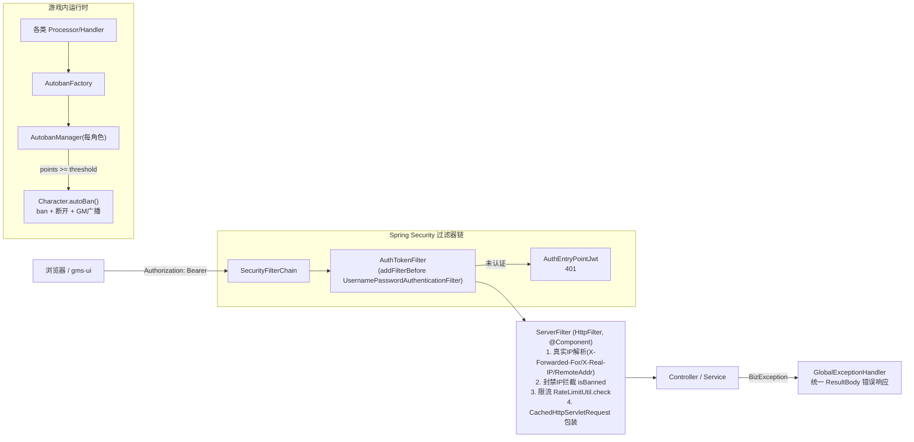
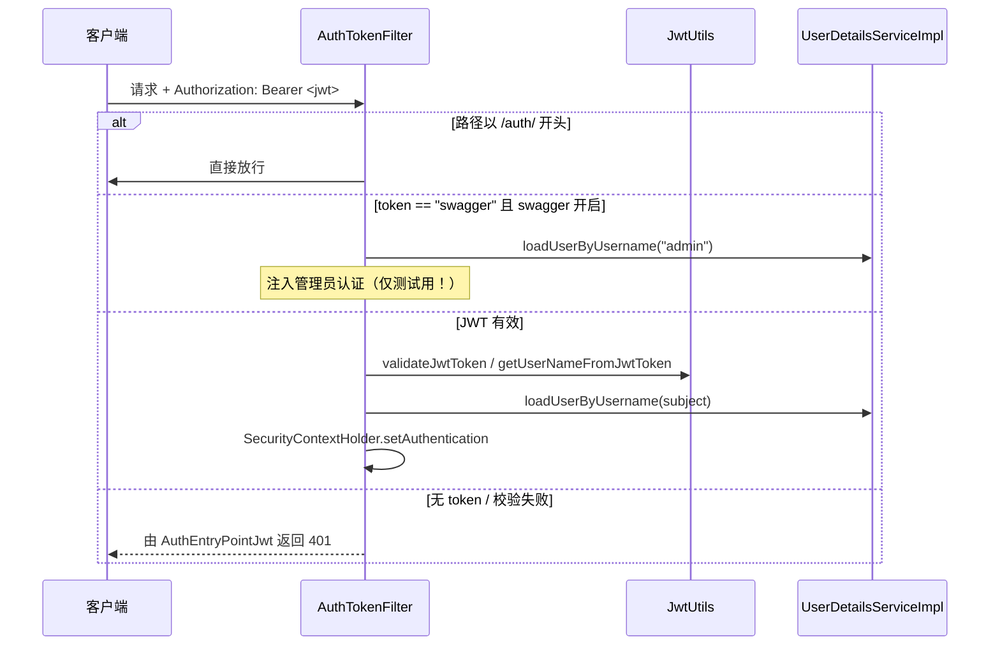
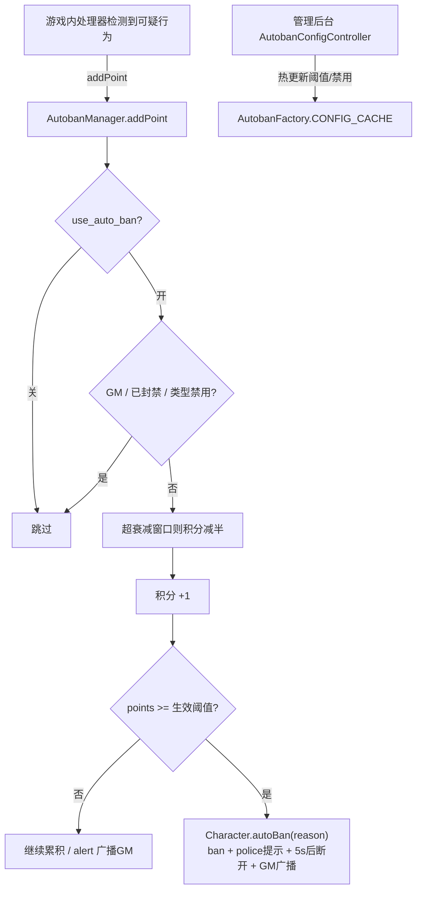

# 06 安全架构

> 模块路径：`gms-server/src/main/java/org/gms`（`aop`、`util`、`config`、`exception`、`service`、`client/autoban`）
> 涉及文件数：约 15 个核心类
> 依赖模块：Spring Security 6、jjwt、Spring Web（`HttpFilter`）、`manager/ServerManager`（ApplicationContext 桥）、`service/AccountService`、`config/GameConfig`、`dao`（`AccountsMapper`、`AutobanConfigMapper`）

---

## 1. 安全体系总览

BeiDou 的安全能力分两层，均在同一个 8686 端口的 Spring Boot 进程内生效：

1. **REST 管理面**：JWT 无状态鉴权（Spring Security 过滤器链）+ `ServerFilter` 业务前置过滤（真实 IP 解析、封禁 IP 拦截、限流、请求体缓存）+ 统一异常兜底（`GlobalExceptionHandler`）。
2. **游戏内运行时反作弊**：`client/autoban` 积分制自动封禁，配置存库（`autoban_config` 表）可热更新，总开关由 `GameConfig` 控制。



---

## 2. JWT 鉴权

### 2.1 参与组件

| 类 | 路径 | 职责 |
|---|---|---|
| `AuthTokenFilter` | `aop/AuthTokenFilter.java` | 每请求解析 `Authorization: Bearer <token>`，校验通过后向 `SecurityContextHolder` 写入认证信息 |
| `AuthEntryPointJwt` | `aop/AuthEntryPointJwt.java` | 认证失败入口，`response.sendError(401)` |
| `JwtUtils` | `util/JwtUtils.java` | token 生成 / 解析 / 校验（jjwt，HS512） |
| `UserDetailsImpl` | `service/UserDetailsImpl.java` | Spring Security `UserDetails` 适配 `AccountsDO`（password 加 `@JsonIgnore`） |
| `UserDetailsServiceImpl` | `service/UserDetailsServiceImpl.java` | 按用户名查 `accounts` 表，**仅 `webadmin == 1` 的账号**授予 `ROLE_ADMIN`，否则返回 `null` |
| `SpringSecurityConfig` | `config/SpringSecurityConfig.java` | 过滤器链、`DaoAuthenticationProvider`、`BCryptPasswordEncoder`、无状态会话 |

### 2.2 Spring Security 配置要点（`SpringSecurityConfig#filterChain`）

- `csrf` 关闭、`SessionCreationPolicy.STATELESS`（纯 token，无 session）。
- `cors(Customizer.withDefaults())` 接入 `CorsConfig`（dev 放行 `http://localhost:8787`）。
- 放行清单：`/auth/**`（登录登出）、`/swagger-ui/**`、`/v3/api-docs/**`（Swagger 文档）、`/`、`/static/**`、`/index.html`、`/assets/**`（托管的前端静态资源）；其余 `anyRequest().authenticated()`。
- `@EnableMethodSecurity` 开启方法级注解（如 `@PreAuthorize`）。
- 密码编码 `BCryptPasswordEncoder`；登录校验走 `DaoAuthenticationProvider` + `UserDetailsServiceImpl`。

### 2.3 `AuthTokenFilter` 流程

`AuthTokenFilter` 继承 `OncePerRequestFilter`，注册在 `UsernamePasswordAuthenticationFilter` 之前：

1. **`/auth/**` 直接放行**（授权接口不做身份校验）。
2. 解析 `Authorization` 头取 JWT。
3. **Swagger 越权口令风险**：当 token 恰为字符串 `"swagger"` 且 `springdoc` 与 `swagger-ui` 均启用时，直接 `loadUserByUsername("admin")` 注入管理员认证——这是为开发调试留的后门。源码注释明确警告「测试 token，生产环境一定要把 swagger 关掉，否则裸奔」。默认 `application.yml` 中 `springdoc.api-docs.enabled` 与 `swagger-ui.enabled` 均为 `false`，**生产绝不可开启**，否则任何人以 `Authorization: Bearer swagger` 即可取得管理员全部权限。
4. 正常路径：`jwtUtils.validateJwtToken(jwt)` 校验签名/过期 → 取 subject 用户名 → `loadUserByUsername` → 构造 `UsernamePasswordAuthenticationToken` 写入 `SecurityContextHolder`。
5. 异常时关闭请求/响应流防内存泄漏，请求终止（不下发 `chain.doFilter`）。

### 2.4 `JwtUtils`

- 密钥与有效期来自 `application.yml`：`jwt.secret`（默认内置 UUID，生产应自行生成）、`jwt.duration`（默认 1800000ms = 30 分钟）。
- `generateJwtToken`：subject=用户名，HS512 签名。
- `validateJwtToken`：分别捕获 `SignatureException`/`MalformedJwtException`/`ExpiredJwtException`/`UnsupportedJwtException`/`IllegalArgumentException` 记录错误日志并返回 false（不打断请求，只是不设认证，最终由 `AuthEntryPointJwt` 返回 401）。



---

## 3. `ServerFilter`：限流、封禁与请求体缓存

`aop/ServerFilter.java`，继承 `HttpFilter`、`@Component`，作用于**已通过 Security 过滤的请求**（Spring Security 过滤器先于 servlet `Filter` bean 执行）。核心步骤：

1. **真实 IP 解析**：优先 `X-Forwarded-For`，其次 `X-Real-IP`，最后 `getRemoteAddr()`；为空则抛出非法参数异常。
2. **封禁 IP 拦截**：`accountService.isBanned(remoteAddr)` 命中则关闭输入流并抛 `BizException`，请求终止。
3. **限流**：`RateLimitUtil.getInstance().check(remoteAddr)` 失败即抛 `BizException`。
4. **放行静态资源**：`shouldNotFilter` 对 `/assets`、`/swagger-ui`、`/v3/api-docs`、`/` 跳过包装（注意：IP 校验和限流在此之前已执行，静态资源同样受这两道约束）。
5. **请求体可重复读**：`multipart/form-data` 或无 Content-Type 直接透传；否则把请求体整体读入字节数组，用内部类 `CachedHttpServletRequest`（`HttpServletRequestWrapper`）+ `CachedServletInputStream` 替换原请求，使 Controller 与后续过滤器/日志可多次读取 body。

### 3.1 `RateLimitUtil`（`util/RateLimitUtil.java`）

- **非 Spring bean 的懒加载单例**（`getInstance()`），内部经 `ServerManager.getApplicationContext().getBean(...)` 反取 `ServiceProperty` 与 `AccountService`——典型的遗留代码桥接 Spring 模式。
- 固定窗口计数算法：`contextMap: Map<ip, RateLimitContext{AtomicInteger curr, long expire}>`。
  - 首次访问或窗口（`duration`）过期则重置计数。
  - 窗口内 `incrementAndGet() > limit` 判定超限。
- 参数来自 `ServiceProperty.RateLimitProperty`（`gms.service.rate-limit.*`）：`enabled`、`limit`、`duration`、`autoBan`。
- **联动自动封禁**：超限且 `autoBan=true` 时调用 `accountService.ban(ip, "Auto banned by rate limit", true)` 把该 IP 拉黑，之后由本过滤器第 2 步持续拦截。
- 注意：`contextMap` 为普通 `HashMap` 且窗口不清理旧 IP 条目，超限异常时返回 `false`（宁可误伤不放过），高频扫描场景存在内存与误伤权衡，属已知取舍。

```mermaid
flowchart TD
    Req[请求进入 ServerFilter] --> IP[解析真实IP<br/>X-Forwarded-For > X-Real-IP > RemoteAddr]
    IP --> Banned{isBanned?}
    Banned -- 是 --> Reject[抛 BizException 终止]
    Banned -- 否 --> RL{RateLimitUtil.check}
    RL -- 超限 --> Reject
    RL -- 通过且超限且 autoBan --> Ban[AccountService.ban 拉黑IP]
    RL -- 通过 --> SNF{shouldNotFilter / multipart?}
    SNF -- 是 --> Pass[原样 doFilter]
    SNF -- 否 --> Wrap[包装为 CachedHttpServletRequest<br/>body 缓存为 byte[] 可重复读] --> Ctrl[Controller]
```

---

## 4. 异常体系

### 4.1 组成

| 类 | 路径 | 说明 |
|---|---|---|
| `BaseErrorInfoInterface` | `exception/BaseErrorInfoInterface.java` | 错误码接口：`getResultCode()` / `getResultMsg()` |
| `BizExceptionEnum` | `exception/BizExceptionEnum.java` | 错误码枚举，文案经 `I18nUtil.getExceptionMessage(...)` 国际化 |
| `BizException` | `exception/BizException.java` | 业务异常，携带 `errorCode`/`errorMsg`；重写 `fillInStackTrace()` 返回 `this`（不采集堆栈，减少异常构造开销） |
| `GlobalExceptionHandler` | `exception/GlobalExceptionHandler.java` | `@ControllerAdvice` 统一转 `ResultBody.error(...)` |

### 4.2 错误码表（`BizExceptionEnum`）

| 枚举 | code | 含义 |
|---|---|---|
| `SUCCESS` | 20000 | 成功（前端 `interceptor.ts` 判定的成功码） |
| `BODY_NOT_MATCH` | 40000 | 请求体不匹配（运行时异常兜底也用它） |
| `REQUEST_METHOD_SUPPORT` | 40001 | 请求方法不支持 |
| `ILLEGAL_PARAMETERS` | 40002 | 非法参数（`BizException.illegalArgument(...)` 系列工厂） |
| `NOT_FOUND` | 40004 | 资源不存在 |
| `INTERNAL_SERVER_ERROR` | 50000 | 未知异常兜底 |
| `SERVER_BUSY` | 50003 | 服务繁忙 |

### 4.3 `GlobalExceptionHandler` 分发

- `BizException`：取 `errorCode/errorMsg` 返回 `ResultBody.error(req, code, msg)`。
- `RuntimeException`：日志记录完整堆栈，对前端只回 `BODY_NOT_MATCH`（不泄露内部细节）。
- `ServletException`：回 `REQUEST_METHOD_SUPPORT`。
- `Exception`：兜底 `INTERNAL_SERVER_ERROR`。

安全相关性：`ServerFilter` 与业务层的拦截动作均以 `BizException` 表达，最终统一以 `ResultBody` 信封（HTTP 200 + 业务码）返回前端；HTTP 401 仅出现在 Spring Security 认证失败（`AuthEntryPointJwt`）时——前端据此触发登出。

---

## 5. 游戏内自动封禁（`client/autoban`）

### 5.1 组件

- **`AutobanFactory`**（`client/autoban/AutobanFactory.java`）：枚举式违规类型清单，每类带默认 `points`（阈值）与 `expiretime`（积分衰减窗口，-1 表示不过期）。内置类型包括 `MOB_COUNT`、`DAMAGE_HACK(15 分/1min)`、`DISTANCE_HACK(10 分/2min)`、`PORTAL_DISTANCE`、`PACKET_EDIT`、`HIGH_HP_HEALING`、`FAST_HP_HEALING(15)`、`FAST_MP_HEALING(20 分/30s)`、`TUBI(20 分/15s)`、`ITEM_VAC`/`PET_ITEM_VAC`(10 分/2min)、`FAST_ATTACK(10 分/30s)`、`MPCON(25 分/30s)`、`ATTACK_INTERVAL(60 分/60s)` 等，名称经 i18n（`autoban.name.*`）。
- **`AutobanManager`**（`client/autoban/AutobanManager.java`）：**每角色一份**（`Character` 持有，`Character.java` 中 `setAutoBanManager(new AutobanManager(chr))`），维护 `points`/`lastTime` 积分与时间戳、miss 检测（miss godmode）、`spam[]` 防刷时间戳、`setTimestamp` 重复时间戳断连。
- **配置层**：`dao/entity/AutobanConfigDO` + `AutobanConfigMapper` + `service/AutobanConfigService` + `controller/AutobanConfigController`（`/autoban/v1/getConfigList` 等接口），运营可在管理后台按类型覆盖默认阈值/窗口/禁用状态，`AutobanFactory.CONFIG_CACHE` 内存缓存支持热更新（`initConfig`/`updateConfig`）。

### 5.2 工作机制

1. 各处理器（如 `AssignSPProcessor`、`AssignAPProcessor`、`DueyProcessor`、`StorageProcessor`、`PetLootHandler`、`MapleMap` 等）发现可疑行为时调用 `AutobanFactory.XXX.addPoint(chr.getAutoBanManager(), reason)` 或 `alert`/`autoban`。
2. `AutobanManager.addPoint`（受 `GameConfig` 总开关 `use_auto_ban` 控制）：
   - GM 或已封禁角色直接跳过；`fac.isDisabled()`（数据库配置禁用）跳过。
   - 积分衰减：距上次记录超过 `effectiveExpire` 时积分减半。
   - 累计 `points >= effectivePoints` 时调用 `chr.autoBan(reason)`。
   - `use_auto_ban_log` 开启时逐条记日志。
3. `Character.autoBan`（`client/Character.java`）：非 GM 且未封禁时执行 `ban(reason)`、向客户端发 police 警告包、延迟 5 秒断开连接、并向本世界 GM 广播封禁公告。
4. `AutobanFactory.alert`：未达封禁条件时广播黄字提示给 GM（`use_auto_ban` 开启时），`toggleIgnored(chrId)` 可将特定角色加入忽略名单（`IgnoreCommand`/`IgnoredCommand` GM 命令）。



---

## 6. 风险与注意事项清单

1. **Swagger 后门**：`AuthTokenFilter` 的 `"swagger"` 万能 token 只被 `springdoc`/`swagger-ui` 开关保护，生产必须保持两者 `false`（默认即关）。
2. **JWT 密钥**：`jwt.secret` 默认值随源码分发，生产部署务必替换为随机 UUID，否则 token 可被伪造。
3. **限流单例**：`RateLimitUtil` 是非线程安全 `HashMap` 的进程内单例，重启即清零；多实例部署时各实例独立计数。
4. **`UserDetailsServiceImpl` 仅认 `webadmin == 1`**：普通游戏账号无法登录管理后台，即使拿到有效 token 也查不到 `UserDetails`（返回 `null`）。
5. **HTTP 层错误码语义**：业务失败走 200 + `ResultBody.code`，仅认证失败是真实 401；新增接口要遵守该约定，前端 `interceptor.ts` 依赖它。
